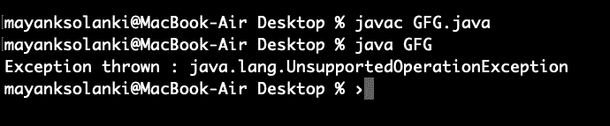

# Java 中的数组 asList()方法，示例

> 原文:[https://www . geesforgeks . org/arrays-as list-method-in-Java-with-examples/](https://www.geeksforgeeks.org/arrays-aslist-method-in-java-with-examples/)

[**java.util.Arrays**](https://www.geeksforgeeks.org/array-class-in-java/) 类的 **asList()** 方法用于返回由指定数组支持的固定大小列表。该方法与 Collection.toArray()相结合，充当基于数组和基于集合的 API 之间的桥梁。返回的列表是可序列化的，并实现了随机访问。

> **提示:**这在 O(1)时间内运行。

**语法:**

```
public static List asList(T... a)
```

**参数:**该方法取**数组 a** ，需要转换为 List。这里…被称为 [**varargs**](https://www.geeksforgeeks.org/variable-arguments-varargs-in-java/) ，它是一个参数数组，工作方式类似于对象数组参数。

> **特别说明:**在基元数据类型(int、float 等)的情况下，数组的类型必须是 Wrapper Class(Integer、Float 等)，即不能传递 int a[]，但可以传递 Integer a[]。如果传递 int a[]，这个函数将返回一个 List < int a[] >而不是 List < Integer >，因为在这种情况下不会发生“自动装箱”，int a[]本身被标识为一个对象，并且返回一个 int 数组的 List，而不是整数的 List，这将在各种 Collection 函数中给出错误。

**返回值:**该方法返回指定数组的**列表视图**。

**例 1:**

## Java 语言(一种计算机语言，尤用于创建网站)

```
// Java program to Demonstrate asList() method
// of Arrays class for a string value

// Importing utility classes
import java.util.*;

// Main class
public class GFG {

    // Main driver method
    public static void main(String[] argv) throws Exception
    {

        // Try block to check for exceptions
        try {

            // Creating Arrays of String type
            String a[]
                = new String[] { "A", "B", "C", "D" };

            // Getting the list view of Array
            List<String> list = Arrays.asList(a);

            // Printing all the elements in list object
            System.out.println("The list is: " + list);
        }

        // Catch block to handle exceptions
        catch (NullPointerException e) {

            // Print statement
            System.out.println("Exception thrown : " + e);
        }
    }
}
```

**Output**

```
The list is: [A, B, C, D]
```

**例 2:**

## Java 语言(一种计算机语言，尤用于创建网站)

```
// Java program to Demonstrate asList() method
// of Arrays class For an integer value

// Importing utility classes
import java.util.*;

// Main class
public class GFG {

    // Main driver method
    public static void main(String[] argv) throws Exception
    {
        // Try block to check for exceptions
        try {

            // Creating Arrays of Integer type
            Integer a[] = new Integer[] { 10, 20, 30, 40 };

            // Getting the list view of Array
            List<Integer> list = Arrays.asList(a);

            // Printing all the elements inside list object
            System.out.println("The list is: " + list);
        }

        // Catch block to handle exceptions
        catch (NullPointerException e) {

            // Print statements
            System.out.println("Exception thrown : " + e);
        }
    }
}
```

**Output**

```
The list is: [10, 20, 30, 40]
```

**例 3:**

## Java 语言(一种计算机语言，尤用于创建网站)

```
// Java Program to demonstrate asList() method
// Which returns fixed size list and
// throws UnsupportedOperationException
// if any element is added using add() method

// Importing required classes
import java.util.*;

// Main class
public class GFG {

    // Main driver method
    public static void main(String[] argv) throws Exception
    {
        // Try block to check for exceptions
        try {

            // Creating Arrays of Integer type
            Integer a[] = new Integer[] { 10, 20, 30, 40 };

            // Getting the list view of Array
            List<Integer> list = Arrays.asList(a);

            // Adding another int to the list
            // As Arrays.asList() returns fixed size
            // list, we'll get
            // java.lang.UnsupportedOperationException
            list.add(50);

            // Printing all the elements of list
            System.out.println("The list is: " + list);
        }

        // Catch block to handle exceptions
        catch (UnsupportedOperationException e) {

            // Display message when exception occurs
            System.out.println("Exception thrown : " + e);
        }
    }
}
```

**输出:**

