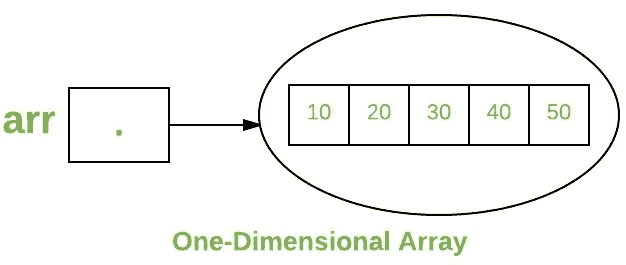
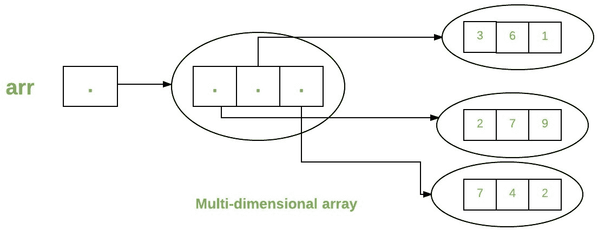
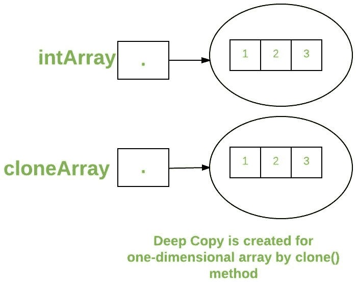
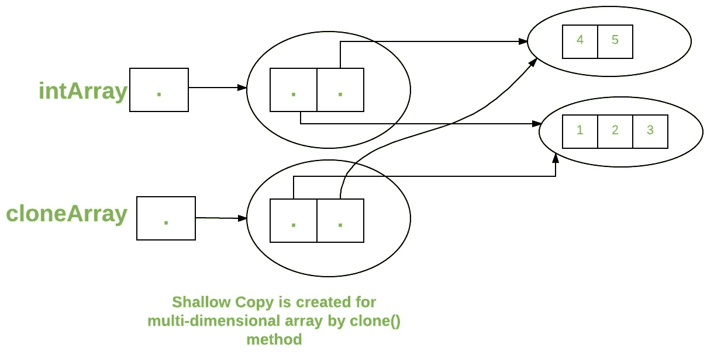

# Java 中的数组

> 原文:[https://www.geeksforgeeks.org/arrays-in-java/](https://www.geeksforgeeks.org/arrays-in-java/)

Java 中的数组是一组相似类型的变量，由一个通用名称引用。Java 中的数组与 C/C++中的不同。以下是关于 Java 数组的一些要点。

*   在 Java 中，所有数组都是动态分配的。(下面讨论)
*   由于数组在 Java 中是对象，所以我们可以使用对象属性 *length* 来找到它们的长度。这与 C/C++不同，在 C/c++中，我们使用 sizeof 来查找长度。
*   Java 数组变量也可以像其他变量一样，在数据类型后用[]声明。
*   数组中的变量是有序的，每个变量都有一个从 0 开始的索引。
*   Java 数组也可以用作静态字段、局部变量或方法参数。
*   数组的**大小**必须由 int 或 short 值指定，而不是 long。
*   数组类型的直接超类是[对象](https://www.geeksforgeeks.org/object-class-in-java/)。
*   每个数组类型都实现了接口[可克隆](https://www.geeksforgeeks.org/marker-interface-java/)和 [java.io.Serializable](https://www.geeksforgeeks.org/serialization-in-java/) 。

数组可以包含原语(int、char 等)。)和对象(或非基元)引用，具体取决于数组的定义。在原始数据类型的情况下，实际值存储在连续的内存位置。在类对象的情况下，[实际对象存储在堆段](https://www.geeksforgeeks.org/g-fact-46/)中。


### 创建、初始化和访问阵列

**一维数组:**

一维数组声明的一般形式是

```
type var-name[];
OR
type[] var-name;
```

数组声明有两个组成部分:类型和名称。*类型*声明数组的元素类型。元素类型决定了组成数组的每个元素的数据类型。像整数数组一样，我们也可以创建其他原始数据类型的数组，如 char、float、double 等。、或用户定义的数据类型(类的对象)。因此，数组的元素类型决定了数组将保存的数据类型。

**示例:**

```
// both are valid declarations
int intArray[]; 
or int[] intArray; 

byte byteArray[];
short shortsArray[];
boolean booleanArray[];
long longArray[];
float floatArray[];
double doubleArray[];
char charArray[];

// an array of references to objects of
// the class MyClass (a class created by
// user)
MyClass myClassArray[]; 

Object[]  ao,        // array of Object
Collection[] ca;  // array of Collection
                     // of unknown type
```

虽然第一个声明确定了 intArray 是一个数组变量，但是**没有实际的数组存在**。它只是告诉编译器这个变量(intArray)将保存一个整数类型的数组。要将数组与实际的物理整数数组链接，必须使用**新的**分配一个，并将其分配给数组。

### 用 Java 实例化一个数组

声明数组时，只创建数组的引用。要创建数组或给数组分配内存，您可以这样创建一个数组:应用于一维数组的 *new* 的一般形式如下所示:

```
var-name = new type [size];
```

这里，*类型*指定正在分配的数据类型，*大小*确定数组中的元素数量， *var-name* 是链接到数组的数组变量的名称。要使用*新建*来分配数组，**必须指定要分配的元素类型和数量。**

**示例:**

```
int intArray[];    //declaring array
intArray = new int[20];  // allocating memory to array
```

运筹学

```
int[] intArray = new int[20]; // combining both statements in one
```

**注:**

1.  由 *new* 分配的数组中的元素将自动初始化为**零**(对于数字类型)、 **false** (对于布尔类型)或 **null** (对于引用类型)。请参考 Java 中的[默认数组值](https://www.geeksforgeeks.org/default-array-values-in-java/)
2.  获取数组是一个两步的过程。首先，必须声明所需数组类型的变量。其次，您必须使用 new 分配内存来保存数组，并将其分配给数组变量。因此，Java 中的****所有数组都是动态分配的。****

### **数组文字**

**在已知数组大小和数组变量的情况下，可以使用数组文字。**

```
 int[] intArray = new int[]{ 1,2,3,4,5,6,7,8,9,10 }; 
 // Declaring array literal
```

*   **这个数组的长度决定了创建的数组的长度。**
*   **没有必要在最新版本的 Java 中编写新的 int[]部分。**

### **使用 for 循环访问 Java 数组元素**

**数组中的每个元素都是通过其索引来访问的。索引以 0 开始，以(总数组大小)-1 结束。使用 Java for Loop 可以访问数组的所有元素。**

```
 // accessing the elements of the specified array
for (int i = 0; i < arr.length; i++)
  System.out.println("Element at index " + i + 
                                " : "+ arr[i]);
```

****实施:****

## **Java 语言(一种计算机语言，尤用于创建网站)**

```
// Java program to illustrate creating an array
// of integers,  puts some values in the array,
// and prints each value to standard output.

class GFG
{
    public static void main (String[] args)
    {        
      // declares an Array of integers.
      int[] arr;

      // allocating memory for 5 integers.
      arr = new int[5];

      // initialize the first elements of the array
      arr[0] = 10;

      // initialize the second elements of the array
      arr[1] = 20;

      //so on...
      arr[2] = 30;
      arr[3] = 40;
      arr[4] = 50;

      // accessing the elements of the specified array
      for (int i = 0; i < arr.length; i++)
         System.out.println("Element at index " + i +
                                      " : "+ arr[i]);         
    }
}
```

****Output**

```
Element at index 0 : 10
Element at index 1 : 20
Element at index 2 : 30
Element at index 3 : 40
Element at index 4 : 50
```** 

**您也可以使用 [foreach 循环](https://www.geeksforgeeks.org/for-each-loop-in-java/)访问 java 数组。** 

****

### **对象数组**

**对象数组的创建方式类似于基本类型数据项的数组。**

```
 Student[] arr = new Student[7]; //student is a user-defined class
```

**studentArray 包含七个学生类大小的内存空间，其中可以存储七个学生对象的地址。必须使用 Student 类的构造函数实例化 Student 对象，并且应该以下列方式将它们的引用分配给数组元素。**

```
Student[] arr = new Student[5];
```

## **Java 语言(一种计算机语言，尤用于创建网站)**

```
// Java program to illustrate creating
//  an array of objects

class Student
{
    public int roll_no;
    public String name;
    Student(int roll_no, String name)
    {
        this.roll_no = roll_no;
        this.name = name;
    }
}

// Elements of the array are objects of a class Student.
public class GFG
{
    public static void main (String[] args)
    {
        // declares an Array of integers.
        Student[] arr;

        // allocating memory for 5 objects of type Student.
        arr = new Student[5];

        // initialize the first elements of the array
        arr[0] = new Student(1,"aman");

        // initialize the second elements of the array
        arr[1] = new Student(2,"vaibhav");

        // so on...
        arr[2] = new Student(3,"shikar");
        arr[3] = new Student(4,"dharmesh");
        arr[4] = new Student(5,"mohit");

        // accessing the elements of the specified array
        for (int i = 0; i < arr.length; i++)
            System.out.println("Element at " + i + " : " +
                        arr[i].roll_no +" "+ arr[i].name);
    }
}
```

****Output**

```
Element at 0 : 1 aman
Element at 1 : 2 vaibhav
Element at 2 : 3 shikar
Element at 3 : 4 dharmesh
Element at 4 : 5 mohit
```** 

### **如果我们试图访问数组大小之外的元素会发生什么？**

**JVM 抛出**arrayindextofboundsexception**来指示数组已经被非法索引访问。索引为负，或者大于或等于数组的大小。**

## **Java 语言(一种计算机语言，尤用于创建网站)**

```
public class GFG
{
    public static void main (String[] args)
    {
        int[] arr = new int[2];
        arr[0] = 10;
        arr[1] = 20;

        for (int i = 0; i <= arr.length; i++)
            System.out.println(arr[i]);
    }
}
```

****运行时错误****

```
Exception in thread "main" java.lang.ArrayIndexOutOfBoundsException: 2
    at GFG.main(File.java:12)
```

****输出****

```
10
20
```

### **多维数组**

**多维数组是**数组的数组**，数组的每个元素保存其他数组的引用。这些也被称为[锯齿状阵列](https://www.geeksforgeeks.org/jagged-array-in-java/)。多维数组是通过每个维度附加一组方括号([])来创建的。示例:**

```
int[][] intArray = new int[10][20]; //a 2D array or matrix
int[][][] intArray = new int[10][20][10]; //a 3D array
```

## **Java 语言(一种计算机语言，尤用于创建网站)**

```
public class multiDimensional
{
    public static void main(String args[])
    {
        // declaring and initializing 2D array
        int arr[][] = { {2,7,9},{3,6,1},{7,4,2} };

        // printing 2D array
        for (int i=0; i< 3 ; i++)
        {
            for (int j=0; j < 3 ; j++)
                System.out.print(arr[i][j] + " ");

            System.out.println();
        }
    }
}
```

****Output**

```
2 7 9 
3 6 1 
7 4 2 
```** 

****

### **将数组传递给方法**

**像变量一样，我们也可以将数组传递给方法。例如，下面的程序将数组传递给方法 *sum* 来计算数组值的总和。**

## **Java 语言(一种计算机语言，尤用于创建网站)**

```
// Java program to demonstrate
// passing of array to method

public class Test
{   
    // Driver method
    public static void main(String args[])
    {
        int arr[] = {3, 1, 2, 5, 4};

        // passing array to method m1
        sum(arr);

    }

    public static void sum(int[] arr)
    {
        // getting sum of array values
        int sum = 0;

        for (int i = 0; i < arr.length; i++)
            sum+=arr[i];

        System.out.println("sum of array values : " + sum);
    }
}
```

****Output**

```
sum of array values : 15
```** 

### **从方法返回数组**

**通常，一个方法也可以返回一个数组。例如，下面的程序从方法 *m1* 返回一个数组。**

## **Java 语言(一种计算机语言，尤用于创建网站)**

```
// Java program to demonstrate
// return of array from method

class Test
{   
    // Driver method
    public static void main(String args[])
    {
        int arr[] = m1();

        for (int i = 0; i < arr.length; i++)
            System.out.print(arr[i]+" ");

    }

    public static int[] m1()
    {
        // returning  array
        return new int[]{1,2,3};
    }
}
```

****Output**

```
1 2 3 
```** 

### **数组的类对象**

**每个数组都有一个关联的 Class 对象，与所有其他具有相同组件类型的数组共享。**

## **Java 语言(一种计算机语言，尤用于创建网站)**

```
// Java program to demonstrate
// Class Objects for Arrays

class Test
{
    public static void main(String args[])
    {
        int intArray[] = new int[3];
        byte byteArray[] = new byte[3];
        short shortsArray[] = new short[3];

        // array of Strings
        String[] strArray = new String[3];

        System.out.println(intArray.getClass());
        System.out.println(intArray.getClass().getSuperclass());
        System.out.println(byteArray.getClass());
        System.out.println(shortsArray.getClass());
        System.out.println(strArray.getClass());
    }
}
```

****Output**

```
class [I
class java.lang.Object
class [B
class [S
class [Ljava.lang.String;
```** 

****说明:****

1.  **字符串“[I]”是类对象“组件类型为 *int* 的数组”的运行时类型签名**
2.  **数组类型的唯一直接超类是 [java.lang.Object](https://www.geeksforgeeks.org/object-class-in-java/) 。**
3.  **字符串“[B]”是类对象“组件类型为*字节*的数组”的运行时类型签名**
4.  **字符串“[S]”是类对象“组件类型为*简称为*的数组”的运行时类型签名**
5.  **字符串“[L]”是类对象“组件类型为类的数组”的运行时类型签名然后是类名。**

### **数组成员**

**现在，正如你所知道的，数组是一个类的对象，数组的直接超类是一个类对象。数组类型的成员包括以下所有成员:**

*   **公共最终字段*长度*，包含数组的组件数量。长度可以是正数或零。**
*   **从类对象继承的所有成员；Object 唯一没有被继承的方法就是它的[克隆](https://www.geeksforgeeks.org/clone-method-in-java-2/)方法。**
*   **公共方法*克隆()*，覆盖类对象中的克隆方法，不抛出[检查的异常](https://www.geeksforgeeks.org/checked-vs-unchecked-exceptions-in-java/)。**

### **数组类型及其允许的元素类型**

<figure class="table">

| 数组类型 | 允许的元素类型 |
| --- | --- |
| 基本类型数组 | 任何可以隐式提升为声明类型的类型。 |
| 对象类型数组 | 声明的类型对象或其子类对象。 |
| 抽象类类型数组 | 它的子类对象是允许的。 |
| 接口类型数组 | 它的实现类对象是允许的。 |

</figure>

### **阵列的克隆**

**克隆一维数组(如对象[])时，会对包含原始数组元素副本的新数组执行“深度复制”，而不是引用。**

## **Java 语言(一种计算机语言，尤用于创建网站)**

```
// Java program to demonstrate
// cloning of one-dimensional arrays

class Test
{   
    public static void main(String args[])
    {
        int intArray[] = {1,2,3};

        int cloneArray[] = intArray.clone();

        // will print false as deep copy is created
        // for one-dimensional array
        System.out.println(intArray == cloneArray);

        for (int i = 0; i < cloneArray.length; i++) {
            System.out.print(cloneArray[i]+" ");
        }
    }
}
```

****Output**

```
false
1 2 3 
```** 

****

**然而，多维数组的克隆(如 Object[][])是一个“浅拷贝”，也就是说，它只创建一个新数组，每个元素数组引用一个原始元素数组，但子数组是共享的。**

## **Java 语言(一种计算机语言，尤用于创建网站)**

```
// Java program to demonstrate
// cloning of multi-dimensional arrays

class Test
{   
    public static void main(String args[])
    {
        int intArray[][] = {{1,2,3},{4,5}};

        int cloneArray[][] = intArray.clone();

        // will print false
        System.out.println(intArray == cloneArray);

        // will print true as shallow copy is created
        // i.e. sub-arrays are shared
        System.out.println(intArray[0] == cloneArray[0]);
        System.out.println(intArray[1] == cloneArray[1]);

    }
}
```

****Output**

```
false
true
true
```** 

****

****相关文章:****

*   **[Java 中的锯齿状数组](https://www.geeksforgeeks.org/jagged-array-in-java/)**
*   **[对于 Java 中的每个循环](https://www.geeksforgeeks.org/for-each-loop-in-java/)**
*   **[Java 中的数组类](https://www.geeksforgeeks.org/array-class-in-java/)**

**本文由 **Nitsdheerendra 和 Gaurav migrani**供稿。如果你喜欢 GeeksforGeeks 并想投稿，你也可以使用[write.geeksforgeeks.org](http://www.write.geeksforgeeks.org)写一篇文章或者把你的文章邮寄到 review-team@geeksforgeeks.org。看到你的文章出现在极客博客主页上，帮助其他极客。如果你发现任何不正确的地方，或者你想分享更多关于上面讨论的话题的信息，请写评论。**