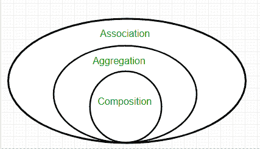

# Java 中的关联、组合和聚合

> 原文:[https://www . geesforgeks . org/association-composition-aggregation-Java/](https://www.geeksforgeeks.org/association-composition-aggregation-java/)

关联是两个独立的类之间通过它们的对象建立的关系。关联可以是一对一、一对多、多对一、多对多。在面向对象编程中，一个对象与另一个对象通信，以使用该对象提供的功能和服务。**成分**和**聚集**是两种结合形式。



**示例:**

## Java 语言(一种计算机语言，尤用于创建网站)

```
// Java Program to illustrate the
// Concept of Association

// Importing required classes
import java.io.*;

// Class 1
// Bank class
class Bank {

    // Attribures of bank
    private String name;

    // Constructor of this class
    Bank(String name)
    {
        // this keyword refers to current instance itself
        this.name = name;
    }

    // Method of Bank class
    public String getBankName()
    {
        // Returning name of bank
        return this.name;
    }
}

// Class 2
// Employee class
class Employee {
    // Attribures of employee
    private String name;
    // Employee name
    Employee(String name)
    {
        // This keyword refwrs to current insytance itself
        this.name = name;
    }

    // Method of Employee class
    public String getEmployeeName()
    {
        // returning the name of employee
        return this.name;
    }
}

// Class 3
// Association between both the
// classes in main method
class GFG {

    // Main driver mmethod
    public static void main(String[] args)
    {

        // Creating objects of bank and Employee class
        Bank bank = new Bank("ICICI");
        Employee emp = new Employee("Ridhi");

        // Print and display name and
        // corresponding bank of employee
        System.out.println(emp.getEmployeeName()
                           + " is employee of "
                           + bank.getBankName());
    }
}
```

**Output**

```
Ridhi is employee of ICICI
```