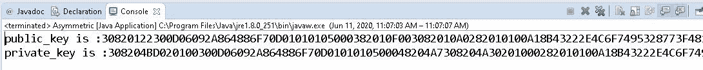
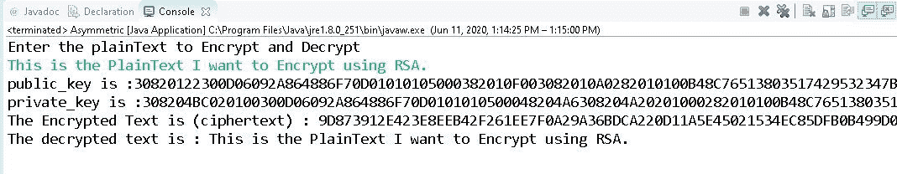

# Java 中的非对称加密密码

> 原文:[https://www . geesforgeks . org/不对称-加密-java 中的密码学/](https://www.geeksforgeeks.org/asymmetric-encryption-cryptography-in-java/)

[密码学](https://www.geeksforgeeks.org/cryptography-and-its-types/)是对不同技术的研究，以保护来自未授权实体的数据。在计算机科学中，我们试图开发保护敏感数据的策略和实践。大多数密码学都涉及到用于保护数据的非常先进的数学函数。为密码学开发的算法的唯一目的是对攻击者或中间人隐藏数据。
在前面的文章中，我们已经研究了执行对称加密和解密的不同方法、类和方法。在本文中，我们将了解非对称加密。
非对称加密又称私钥/公钥加密是两个密钥之间的数学关系，一个用于加密，另一个用于解密。例如，如果有两个密钥“K1”和“K2”，那么如果密钥“K1”用于加密，“K2”用于解密。如果“K1”用于解密，那么“K2”用于加密。

在使用 [RSA 算法](https://www.geeksforgeeks.org/rsa-algorithm-cryptography/)实现非对称加密之前，我们将首先了解如何生成密钥空气(公共的、私有的)。为了生成非对称密钥，可以遵循以下步骤:

*   我们需要首先使用*安全对象类*生成公钥和私钥。SecureRandom 类用于生成随机数。

> securerandom = new securerandom()：

*   密钥生成器类将提供 *getInstance()* 方法，该方法可用于传递表示密钥生成算法的字符串变量。它返回密钥生成器对象。我们使用 RSA 算法来生成密钥。

> KeyPairGenerator KPGenerator = KeyPairGenerator . getinstance(Key _ Generation _ Algorithm _ string _ variable)；

*   用 2048 位密钥大小初始化密钥生成器对象，并传递随机数。

> key pair generator . initialize(2048，secureRandom)：

*   现在，生成了密钥，如果我们希望看到生成的密钥是一个对象，我们可以使用 DatatypeConverter 将其转换为六进制格式。

以下是上述方法的实现:

## Java 语言(一种计算机语言，尤用于创建网站)

```java
// Java program to create a
// asymmetric key

package java_cryptography;
import java.security.KeyPair;
import java.security
    .KeyPairGenerator;
import java.security
    .SecureRandom;
import javax.xml.bind
    .DatatypeConverter;

// Class to create an asymmetric key
public class Asymmetric {

    private static final String RSA
        = "RSA";

    // Generating public and private keys
    // using RSA algorithm.
    public static KeyPair generateRSAKkeyPair()
        throws Exception
    {
        SecureRandom secureRandom
            = new SecureRandom();

        KeyPairGenerator keyPairGenerator
            = KeyPairGenerator.getInstance(RSA);

        keyPairGenerator.initialize(
            2048, secureRandom);

        return keyPairGenerator
            .generateKeyPair();
    }

    // Driver code
    public static void main(String args[])
        throws Exception
    {
        KeyPair keypair
            = generateRSAKkeyPair();

        System.out.println(
            "Public Key is: "
            + DatatypeConverter.printHexBinary(
                  keypair.getPublic().getEncoded()));

        System.out.println(
            "Private Key is: "
            + DatatypeConverter.printHexBinary(
                  keypair.getPrivate().getEncoded()));
    }
}
```

**输出:**



**使用非对称密钥进行加密和解密:**在上述步骤中，我们已经创建了用于加密和解密的公共&私钥。现在，让我们使用 RSA 算法实现非对称加密。为了实现加密和解密，可以遵循以下步骤。

*   密码类用于加密和解密两种不同的模式。由于非对称加密使用不同的密钥，我们使用私钥进行加密，使用公钥进行解密。

> 密码初始化(密码。ENCRYPT_MODE，private key)；
> 密码初始化(密码。DECRYPT_MODE，public key)；

*   在密码上调用 *doFinal()* 方法，该方法在单部分操作中加密/解密数据，或者完成多部分操作并返回字节数组。
*   最后得到加密后的密文。

以下是上述方法的实现:

## Java 语言(一种计算机语言，尤用于创建网站)

```java
// Java program to perform the
// encryption and decryption
// using asymmetric key

package java_cryptography;
import java.security.KeyPair;
import java.security.KeyPairGenerator;
import java.security.PrivateKey;
import java.security.PublicKey;
import java.security.SecureRandom;
import java.util.Scanner;

import javax.crypto.Cipher;
import javax.xml.bind
    .DatatypeConverter;

public class Asymmetric {

    private static final String RSA
        = "RSA";
    private static Scanner sc;

    // Generating public & private keys
    // using RSA algorithm.
    public static KeyPair generateRSAKkeyPair()
        throws Exception
    {
        SecureRandom secureRandom
            = new SecureRandom();
        KeyPairGenerator keyPairGenerator
            = KeyPairGenerator.getInstance(RSA);

        keyPairGenerator.initialize(
            2048, secureRandom);
        return keyPairGenerator
            .generateKeyPair();
    }

    // Encryption function which converts
    // the plainText into a cipherText
    // using private Key.
    public static byte[] do_RSAEncryption(
        String plainText,
        PrivateKey privateKey)
        throws Exception
    {
        Cipher cipher
            = Cipher.getInstance(RSA);

        cipher.init(
            Cipher.ENCRYPT_MODE, privateKey);

        return cipher.doFinal(
            plainText.getBytes());
    }

    // Decryption function which converts
    // the ciphertext back to the
    // original plaintext.
    public static String do_RSADecryption(
        byte[] cipherText,
        PublicKey publicKey)
        throws Exception
    {
        Cipher cipher
            = Cipher.getInstance(RSA);

        cipher.init(Cipher.DECRYPT_MODE,
                    publicKey);
        byte[] result
            = cipher.doFinal(cipherText);

        return new String(result);
    }

    // Driver code
    public static void main(String args[])
        throws Exception
    {
        KeyPair keypair
            = generateRSAKkeyPair();

        String plainText = "This is the PlainText "
                           + "I want to Encrypt using RSA.";

        byte[] cipherText
            = do_RSAEncryption(
                plainText,
                keypair.getPrivate());

        System.out.println(
            "The Public Key is: "
            + DatatypeConverter.printHexBinary(
                  keypair.getPublic().getEncoded()));

        System.out.println(
            "The Private Key is: "
            + DatatypeConverter.printHexBinary(
                  keypair.getPrivate().getEncoded()));

        System.out.print("The Encrypted Text is: ");

        System.out.println(
            DatatypeConverter.printHexBinary(
                cipherText));

        String decryptedText
            = do_RSADecryption(
                cipherText,
                keypair.getPublic());

        System.out.println(
            "The decrypted text is: "
            + decryptedText);
    }
}
```

**输出:**

