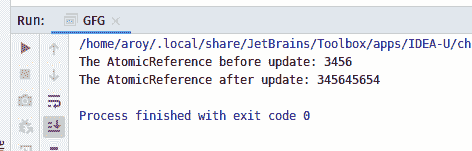
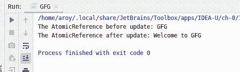

# Java 中的 AtomicReference accumulateAndGet()方法，示例

> 原文:[https://www . geeksforgeeks . org/atomic reference-accumulatedget-method-in-Java-with-examples/](https://www.geeksforgeeks.org/atomicreference-accumulateandget-method-in-java-with-examples/)

一个**原子引用**类的**累计数()**方法被用来自动更新原子引用的当前值，将给定的累计函数应用于当前值和给定值，并返回更新后的值。累积函数应该没有副作用，因为当尝试的更新由于线程之间的争用而失败时，它可以被重新应用。

**语法:**

```java
public final E accumulateAndGet(E x,
     BinaryOperator<E> accumulatorFunction)

```

**参数:**该方法接受:

*   **x** 是更新后的值
*   **累积函数**是两个自变量的无副作用函数。

**返回值:**此方法返回更新后的值。

下面的程序说明了累计数()方法:
**程序 1:**

```java
// Java program to demonstrate
// AtomicReference.accumulateAndGet() method

import java.util.concurrent.atomic.AtomicReference;
import java.util.function.BinaryOperator;

public class GFG {
    public static void main(String args[])
    {

        // AtomicReference with value
        AtomicReference<Integer> ref
            = new AtomicReference<>(3456);

        // Print AtomicReference
        System.out.println(
            "The AtomicReference before update: "
            + ref);

        // Value to apply accumulateAndGet
        int x = 45654;

        // Declaring the accumulatorFunction
        // applying function to add value as string
        BinaryOperator add
            = (u, v) -> u.toString() + v.toString();

        // apply accumulateAndGet()
        ref.accumulateAndGet(x, add);

        // print AtomicReference
        System.out.println(
            "The AtomicReference after update: "
            + ref);
    }
}
```

**Output:**

**程序 2:**

```java
// Java program to demonstrate
// AtomicReference.accumulateAndGet() method

import java.util.concurrent.atomic.AtomicReference;
import java.util.function.BinaryOperator;

public class GFG {
    public static void main(String args[])
    {
        // AtomicReference with value
        AtomicReference<String> ref
            = new AtomicReference<String>("GFG ");

        // Print AtomicReference
        System.out.println("The AtomicReference before update: "
                           + ref);

        // Value to apply accumulateAndGet
        String x = "Welcome";

        // Declaring the accumulatorFunction
        // applying function to add value as string
        BinaryOperator add
            = (u, v) -> v + " to " + u;

        // apply accumulateAndGet()
        ref.accumulateAndGet(x, add);

        // print AtomicReference
        System.out.println(
            "The AtomicReference after update: "
            + ref);
    }
}
```

**Output:**

**参考文献:**[https://docs . Oracle . com/javase/10/docs/API/Java/util/concurrent/atomic/atomic reference . html # accumulated gett(V，Java . util . function . binaryoperator)](https://docs.oracle.com/javase/10/docs/api/java/util/concurrent/atomic/AtomicReference.html#accumulateAndGet(V, java.util.function.BinaryOperator))