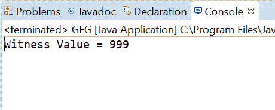

# Java 中的 atomic reference compareAndExchange()方法，带示例

> 原文:[https://www . geeksforgeeks . org/atomic reference-compareandexchange-method-in-Java-with-examples/](https://www.geeksforgeeks.org/atomicreference-compareandexchange-method-in-java-with-examples/)

如果被称为见证值的原子引用对象的当前值等于预期值，则使用**原子引用**类的 **compareAndExchange()** 方法将该值自动设置为原子引用对象的新值。此方法将返回见证值，该值将与预期值相同。这个方法处理带有内存读取语义的操作，就像变量被声明为 volatile 一样。

**语法:**

```
public final V compareAndExchange(V expectedValue,
                                  V newValue)

```

**参数:**该方法接受**期望值**为期望值，**新值**为新设定值。

**返回值:**该方法返回**见证值**，如果成功则与期望值相同。

下面的程序说明了 compareAndExchange()方法:
**程序 1:**

```
// Java program to demonstrate
// AtomicReference.compareAndExchange() method

import java.util.concurrent.atomic.AtomicReference;

public class GFG {
    public static void main(String[] args)
    {

        // create an atomic reference object
        // which stores Integer.
        AtomicReference<Integer> ref
            = new AtomicReference<Integer>();

        // set some value
        ref.set(999);

        // apply compareAndExchange()
        Integer oldValue
            = ref.compareAndExchange(
                999,
                999999);

        // print value
        System.out.println("Witness Value= "
                           + oldValue);
    }
}
```

**Output:**

**程序 2:**

```
// Java program to demonstrate
// AtomicReference.compareAndExchange() method

import java.util.concurrent.atomic.AtomicReference;

public class GFG {
    public static void main(String[] args)
    {

        // create an atomic reference object.
        AtomicReference<String> ref
            // = new AtomicReference<String>();

            // set some value
            ref.set("GFG");

        // apply compareAndExchange()
        String oldValue
            = ref.compareAndExchange(
                "GFG",
                "Geeks for Geeks");

        // print value
        System.out.println("Witness Value= "
                           + oldValue);
    }
}
```

**Output:**

**参考文献:**T2