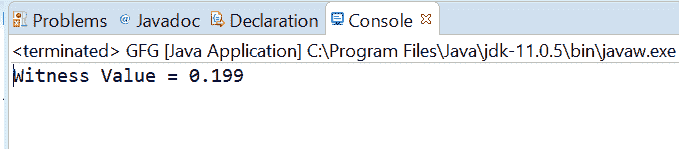
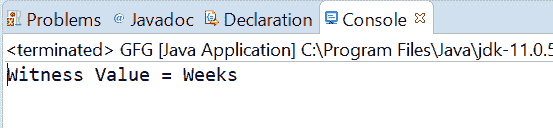

# Java 中的 atomic reference compareAndExchangeAcquire()方法，带示例

> 原文:[https://www . geeksforgeeks . org/atomic reference-compareandexchangeacquire-method-in-Java-with-examples/](https://www.geeksforgeeks.org/atomicreference-compareandexchangeacquire-method-in-java-with-examples/)

如果被称为见证值的原子引用对象的当前值等于预期值并返回见证值，则使用**原子引用**类的**compareAndExchangeAcquire()**方法自动将该值设置为原子引用对象的新值。该方法用与 memory_order_acquire 排序兼容的内存排序效果交换该值。

**语法:**

```
public final V compareAndExchangeAcquire(V expectedValue,
                                         V newValue)

```

**参数:**该方法接受**期望值**为期望值，**新值**为新设定值。

**返回值:**该方法返回**见证值**，如果成功则与期望值相同。

下面的程序说明了 compareAndExchangeAcquire()方法:
**程序 1:**

```
// Java program to demonstrate
// AtomicReference.compareAndExchangeAcquire() method

import java.util.concurrent.atomic.AtomicReference;

public class GFG {
    public static void main(String[] args)
    {

        // create an atomic reference object
        // which stores Integer.
        AtomicReference<Double> ref
            = new AtomicReference<Double>();

        // set some value
        ref.set(0.199);

        // apply compareAndExchangeAcquire()
        double oldValue
            = ref.compareAndExchangeAcquire(
                0.199,
                999.999);

        // print value
        System.out.println("Witness Value = "
                           + oldValue);
    }
}
```

**Output:**

**程序 2:**

```
// Java program to demonstrate
// AtomicReference.compareAndExchangeAcquire() method

import java.util.concurrent.atomic.AtomicReference;

public class GFG {
    public static void main(String[] args)
    {

        // create an atomic reference object.
        AtomicReference<String> ref
            = new AtomicReference<String>();

        // set some value
        ref.set("Weeks");

        // apply compareAndExchangeAcquire()
        String oldValue
            = ref.compareAndExchangeAcquire(
                "Weeks",
                "Days");

        // print value
        System.out.println("Witness Value = "
                           + oldValue);
    }
}
```

**Output:**

**参考文献:**[https://docs . Oracle . com/javase/10/docs/API/Java/util/concurrent/atomic/atomic reference . html # compareAndExchangeAcquire(V，V)](https://docs.oracle.com/javase/10/docs/api/java/util/concurrent/atomic/AtomicReference.html#compareAndExchangeAcquire(V, V))