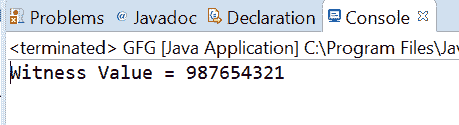
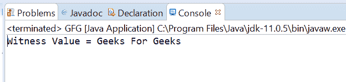

# Java 中的 atomic reference compareAndExchangeRelease()方法，带示例

> 原文:[https://www . geeksforgeeks . org/atomic reference-compareandexchangerelease-method-in-Java-with-examples/](https://www.geeksforgeeks.org/atomicreference-compareandexchangerelease-method-in-java-with-examples/)

如果被称为见证值的原子引用对象的当前值等于预期值并返回见证值，则使用**原子引用**类的**compareAndExchangeRelease()**方法将该值自动设置为原子引用对象的新值。此方法更新该值，并确保先前的加载和存储在此访问后不会重新排序。

**语法:**

```
public final V compareAndExchangeRelease(
                                  V expectedValue,
                                  V newValue)

```

**参数:**该方法接受**期望值**为期望值，**新值**为新设定值。

**返回值:**该方法返回见证值，如果成功，将与期望值相同。

下面的程序说明了 compareAndExchangeRelease()方法:
**程序 1:**

```
// Java program to demonstrate
// AtomicReference.compareAndExchangeRelease() method

import java.util.concurrent.atomic.AtomicReference;

public class GFG {
    public static void main(String[] args)
    {

        // create an atomic reference object
        // which stores Integer.
        AtomicReference<Long> ref
            = new AtomicReference<Long>();

        // set some value
        ref.set(987654321L);

        // apply compareAndExchangeRelease()
        long oldValue
            = ref.compareAndExchangeRelease(
                987654321L,
                999999L);

        // print value
        System.out.println("Witness Value = "
                           + oldValue);
    }
}
```

**Output:**

**程序 2:**

```
// Java program to demonstrate
// AtomicReference.compareAndExchangeRelease() method

import java.util.concurrent.atomic.AtomicReference;

public class GFG {
    public static void main(String[] args)
    {

        // create an atomic reference object.
        AtomicReference<String> ref
            = new AtomicReference<String>();

        // set some value
        ref.set("Geeks For Geeks");

        // apply compareAndExchangeRelease()
        String oldValue
            = ref.compareAndExchangeRelease(
                "Geeks For Geeks",
                "GFG");

        // print value
        System.out.println("Witness Value = "
                           + oldValue);
    }
}
```

**Output:**

**参考文献:**[https://docs . Oracle . com/javase/10/docs/API/Java/util/concurrent/atomic/atomic reference . html # compareAndExchangeRelease(V，V)](https://docs.oracle.com/javase/10/docs/api/java/util/concurrent/atomic/AtomicReference.html#compareAndExchangeRelease(V, V))