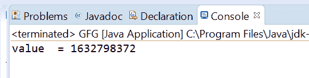
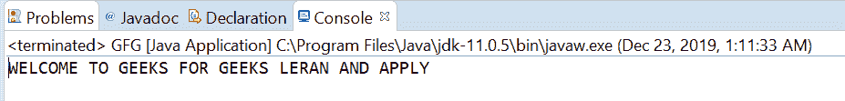

# Java 中的 AtomicReference getAcquire()方法，带示例

> 原文:[https://www . geesforgeks . org/atomic reference-getac quire-method-in-Java-with-examples/](https://www.geeksforgeeks.org/atomicreference-getacquire-method-in-java-with-examples/)

一个**原子引用**类的 **getAcquire()** 方法用于返回这个原子引用对象的值，在获取变量时具有内存排序效果，与 memory_order_acquire 排序兼容。

**语法:**

```
public final V getAcquire()
```

**参数:**此方法不接受任何内容。
**返回值:**该方法返回该原子引用对象的**当前值**，具有内存排序效果。

下面的程序说明了 get()方法:

**程序 1:**

## Java 语言(一种计算机语言，尤用于创建网站)

```
// Java program to demonstrate
// AtomicReference.getAcquire() method

import java.util.concurrent.atomic.AtomicReference;

public class GFG {
    public static void main(String[] args)
    {

        // create an atomic reference object
        // which stores Integer.
        AtomicReference<Integer> ref
            = new AtomicReference<Integer>();

        // set some value
        ref.set(1632798372);

        // apply getAcquire() and print value
        int value = ref.getAcquire();
        System.out.println("value  = " + value);
    }
}
```

**输出:**



**程序 2:**

## Java 语言(一种计算机语言，尤用于创建网站)

```
// Java program to demonstrate
// AtomicReference.get() method
import java.util.concurrent.atomic.AtomicReference;

public class GFG {
    public static void main(String[] args)
    {

        // create an atomic reference object
        // which stores String.
        AtomicReference<String> ref
            = new AtomicReference<String>();

        // set some value
        ref.set("WELCOME TO "
                + "GEEKS FOR GEEKS"
                + " LERAN AND APPLY");

        // apply getAcquire and print value
        String value = ref.getAcquire();
        System.out.println(value);
    }
}
```

**输出:**



**参考:**T2【https://docs . Oracle . com/javase/10/docs/API/Java/util/concurrent/atomic/atomic Reference . html # getAcquire()T4】