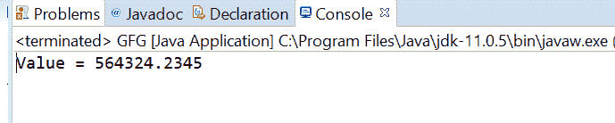
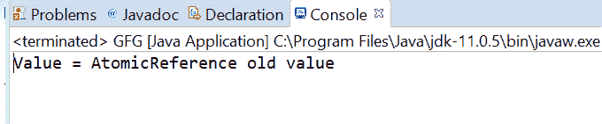

# Java 中的 AtomicReference getOpaque()方法，带示例

> 原文:[https://www . geeksforgeeks . org/atomic reference-get opaque-method-in-Java-with-examples/](https://www.geeksforgeeks.org/atomicreference-getopaque-method-in-java-with-examples/)

一个**原子引用**类的 **getOpaque()** 方法用来返回原子引用对象的当前值，内存效果由 varhandle . getOpaque(Java . lang . object…)指定。这个 VarHandle . GetAuthy(Java . lang . object…)方法处理操作时不能保证相对于其他线程的内存排序效果。

**语法:**

```
public final V getOpaque()

```

**参数:**此方法不接受任何内容。

**返回值:**这个方法返回 AtomicReference 的值。

下面的程序说明了 getOpaque()方法:
**程序 1:**

```
// Java program to demonstrate
// AtomicReference.getOpaque() method
import java.util.concurrent.atomic.AtomicReference;

public class GFG {
    public static void main(String[] args)
    {

        // create an atomic reference object.
        AtomicReference<Double> ref
            = new AtomicReference<Double>();

        // set some value
        ref.set(564324.2345);

        // get value using getOpaque()
        double value = ref.getOpaque();

        // print
        System.out.println("Value = " + value);
    }
}
```

**Output:**

**程序 2:**

```
// Java program to demonstrate
// AtomicReference.getOpaque() method
import java.util.concurrent.atomic.AtomicReference;

public class GFG {
    public static void main(String[] args)
    {

        // create an atomic reference object.
        AtomicReference<String> ref
            = new AtomicReference<String>();

        // set some value
        ref.set("AtomicReference old value");

        // get value getOpaque()
        String value = ref.getOpaque();

        // print
        System.out.println("Value = " + value);
    }
}
```

**Output:**

**参考文献:**[https://docs . Oracle . com/javase/10/docs/API/Java/util/concurrent/atomic/atomic reference . html # getopacity()](https://docs.oracle.com/javase/10/docs/api/java/util/concurrent/atomic/AtomicReference.html#getOpaque())