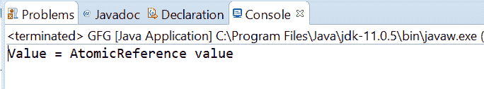

# Java 中的 AtomicReference getPlain()方法，带示例

> 原文:[https://www . geesforgeks . org/atomic reference-get plain-method-in-Java-with-examples/](https://www.geeksforgeeks.org/atomicreference-getplain-method-in-java-with-examples/)

一个**原子引用**类的 **getPlain()** 方法用来返回原子引用对象的当前值，内存语义的读取就像变量被声明为非易失性的一样。

**语法:**

```
public final V getPlain()

```

**参数:**此方法不接受任何内容。

**返回值:**这个方法返回 AtomicReference 的值。

下面的程序说明了 getPlain()方法:
**程序 1:**

```
// Java program to demonstrate
// AtomicReference.getPlain() method
import java.util.concurrent.atomic.AtomicReference;

public class GFG {
    public static void main(String[] args)
    {

        // create an atomic reference object.
        AtomicReference<Integer> ref
            = new AtomicReference<Integer>();

        // set some value
        ref.set(564324);

        // get value using getPlain()
        int value = ref.getPlain();

        // print
        System.out.println("Value = " + value);
    }
}
```

**Output:**

**程序 2:**

```
// Java program to demonstrate
// AtomicReference.getPlain() method
import java.util.concurrent.atomic.AtomicReference;

public class GFG {
    public static void main(String[] args)
    {

        // create an atomic reference object.
        AtomicReference<String> ref
            = new AtomicReference<String>();

        // set some value
        ref.set("AtomicReference value");

        // get value getPlain()
        String value = ref.getPlain();

        // print
        System.out.println("Value = " + value);
    }
}
```

**Output:**

**参考文献:**T2