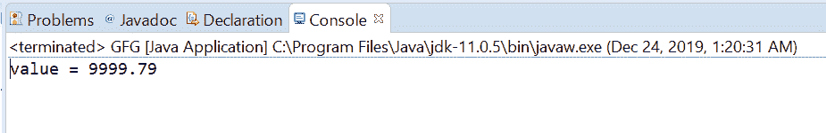

# Java 中的 AtomicReference setOpaque()方法，带示例

> 原文:[https://www . geeksforgeeks . org/atomicreference-setapaque-method-in-Java-with-examples/](https://www.geeksforgeeks.org/atomicreference-setopaque-method-in-java-with-examples/)

一个**原子引用**类的**SetPaque()**方法用于设置这个原子引用对象的值，该对象具有 VarHandle . SetPaque(Java . lang . object…)指定的内存效果。通过这种方式，可以按程序顺序设置值，但不能保证相对于其他线程的内存排序效果。

**语法:**

```java
public final void setOpaque(V newValue)

```

**参数:**此方法接受新值，即要设置的新值。

**返回值:**此方法不返回任何内容。

下面的程序说明了 setOpaque()方法:
**程序 1:**

```java
// Java program to demonstrate
// AtomicReference.setOpaque() method
import java.util.concurrent.atomic.AtomicReference;

public class GFG {
    public static void main(String[] args)
    {

        // create an atomic reference object.
        AtomicReference<Float> ref
            = new AtomicReference<Float>();

        // set some value using setOpaque method
        ref.setOpaque((float)9999.79);

        // print value
        System.out.println("value = " + ref.get());
    }
}
```

**Output:**

**程序 2:**

```java
// Java program to demonstrate
// AtomicReference.setOpaque() method
import java.util.concurrent.atomic.AtomicReference;

public class GFG {
    public static void main(String[] args)
    {

        // create an atomic reference object
        AtomicReference<String> ref
            = new AtomicReference<String>();

        // set some value using setOpaque()
        ref.setOpaque("CP Algos");

        // print value
        System.out.println("Algo = " + ref.get());
    }
}
```

**Output:**

**参考文献:**[https://docs . Oracle . com/javase/10/docs/API/Java/util/concurrent/atomic/atomic reference . html # setOpaque(V)](https://docs.oracle.com/javase/10/docs/api/java/util/concurrent/atomic/AtomicReference.html#setOpaque(V))