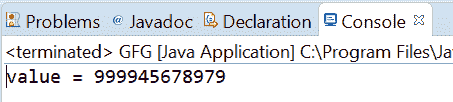
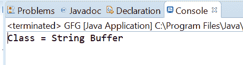

# Java 中的 AtomicReference setPlain()方法，带示例

> 原文:[https://www . geesforgeks . org/atomic reference-set lain-method-in-Java-with-examples/](https://www.geeksforgeeks.org/atomicreference-setplain-method-in-java-with-examples/)

**原子引用**类的**SetLain()**方法用于设置该原子引用对象的值，其内存语义为设置，就好像该变量被声明为非易失性和非最终的一样。

**语法:**

```
public final void setPlain(V newValue)

```

**参数:**此方法接受新值，即要设置的新值。

**返回值:**此方法不返回任何内容。

以下程序说明了 setPlain()方法:
**程序 1:**

```
// Java program to demonstrate
// AtomicReference.setPlain() method
import java.util.concurrent.atomic.AtomicReference;

public class GFG {
    public static void main(String[] args)
    {

        // create an atomic reference object.
        AtomicReference<Long> ref
            = new AtomicReference<Long>();

        // set some value using setPlain method
        ref.setPlain(999945678979L);

        // print value
        System.out.println("value = " + ref.get());
    }
}
```

**Output:**

**程序 2:**

```
// Java program to demonstrate
// AtomicReference.setPlain() method
import java.util.concurrent.atomic.AtomicReference;

public class GFG {
    public static void main(String[] args)
    {

        // create an atomic reference object
        AtomicReference<String> ref
            = new AtomicReference<String>();

        // set some value using setPlain()
        ref.setPlain("String Buffer");

        // print value
        System.out.println("Class = " + ref.get());
    }
}
```

**Output:**

**参考文献:**T2