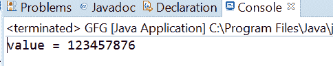
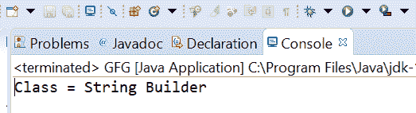

# Java 中的 AtomicReference setRelease()方法，带示例

> 原文:[https://www . geesforgeks . org/atomicreference-set release-method-in-Java-with-examples/](https://www.geeksforgeeks.org/atomicreference-setrelease-method-in-java-with-examples/)

一个**原子引用**类的 **setRelease()** 方法用于设置这个原子引用对象的值，该对象具有由 VarHandle . setRelease(Java . lang . object…)指定的内存效果。此方法具有与 memory_order_release 排序兼容的内存排序效果。

**语法:**

```java
public final void setRelease(V newValue)

```

**参数:**此方法接受新值，即要设置的新值。

**返回值:**此方法不返回任何内容。

下面的程序说明了 setRelease()方法:
**程序 1:**

```java
// Java program to demonstrate
// AtomicReference.setRelease() method

import java.util.concurrent.atomic.AtomicReference;

public class GFG {
    public static void main(String[] args)
    {

        // create an atomic reference object.
        AtomicReference<Long> ref
            = new AtomicReference<Long>();

        // set some value using setRelease method
        ref.setRelease(123457876L);

        // print value
        System.out.println("value = " + ref.get());
    }
}
```

**Output:**

**程序 2:**

```java
// Java program to demonstrate
// AtomicReference.setRelease() method
import java.util.concurrent.atomic.AtomicReference;

public class GFG {
    public static void main(String[] args)
    {

        // create an atomic reference object
        AtomicReference<String> ref
            = new AtomicReference<String>();

        // set some value using setRelease()
        ref.setRelease("String Builder");

        // print value
        System.out.println("Class = " + ref.get());
    }
}
```

**Output:**

**参考文献:**[https://docs . Oracle . com/javase/10/docs/API/Java/util/concurrent/atomic/atomic reference . html # setRelease(V)](https://docs.oracle.com/javase/10/docs/api/java/util/concurrent/atomic/AtomicReference.html#setRelease(V))