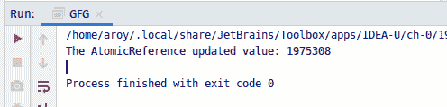
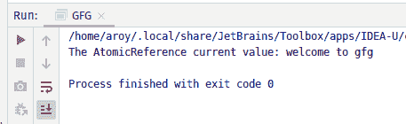

# Java 中的 AtomicReference updateAndGet()方法，示例

> 原文:[https://www . geesforgeks . org/atomicreference-updateandget-method-in-Java-with-examples/](https://www.geeksforgeeks.org/atomicreference-updateandget-method-in-java-with-examples/)

**原子引用**类的 **updateAndGet()** 方法用于原子更新，通过对当前值应用指定的更新函数操作来更新原子引用的当前值。它将 updateFunction 接口的一个对象作为参数，并将该对象中指定的操作应用于当前值。它返回更新后的值。

**语法:**

```
public final V 
  updateAndGet(UnaryOperator<V> updateFunction)

```

**参数:**该方法接受**更新功能**，这是一个无副作用的功能。

**返回值:**此方法返回**更新值**。

下面的程序说明了 updateAndGet()方法:
**程序 1:**

```
// Java program to demonstrate
// AtomicReference.updateAndGet() method

import java.util.concurrent.atomic.*;
import java.util.function.UnaryOperator;

public class GFG {
    public static void main(String args[])
    {

        // AtomicReference with value
        AtomicReference<Integer> ref
            = new AtomicReference<>(987654);

        // Declaring the updateFunction
        // applying function
        UnaryOperator function
            = (v) -> Integer.parseInt(v.toString()) * 2;

        // apply updateAndGet()
        int value = ref.updateAndGet(function);

        // print AtomicReference
        System.out.println(
            "The AtomicReference updated value: "
            + value);
    }
}
```

**Output:**

**程序 2:**

```
// Java program to demonstrate
// AtomicReference.updateAndGet() method

import java.util.concurrent.atomic.*;
import java.util.function.UnaryOperator;

public class GFG {
    public static void main(String args[])
    {

        // AtomicReference with value
        AtomicReference<String> ref
            = new AtomicReference<>("welcome");

        // Declaring the updateFunction
        // applying function to add value as string
        UnaryOperator twoDigits
            = (v) -> v + " to gfg";

        // apply updateAndGet()
        String value
            = ref.updateAndGet(twoDigits);

        // print AtomicReference
        System.out.println(
            "The AtomicReference current value: "
            + value);
    }
}
```

**Output:**

**参考文献:**[https://docs . Oracle . com/javase/10/docs/API/Java/util/concurrent/atomic/atomic reference . html # updateAndGet(Java . util . function . unaryoperator)](https://docs.oracle.com/javase/10/docs/api/java/util/concurrent/atomic/AtomicReference.html#updateAndGet(java.util.function.UnaryOperator))