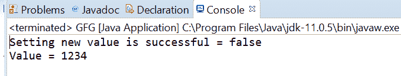
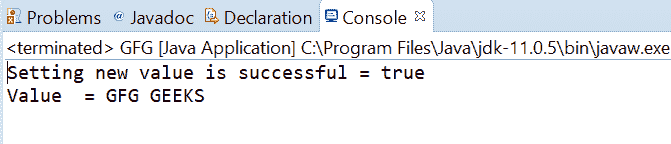

# Java 中的 atomic reference weakCompareAndSetPlain()方法，带示例

> 原文:[https://www . geeksforgeeks . org/atomic reference-weakcompareandset plain-method-in-Java-with-examples/](https://www.geeksforgeeks.org/atomicreference-weakcompareandsetplain-method-in-java-with-examples/)

如果当前值等于作为参数传递的预期值，则使用**原子引用**类的 **weakCompareAndSetPlain()** 方法自动将原子引用的值设置为新值。此方法使用设置的内存语义更新值，就像变量被声明为非易失性和非最终的一样。如果向 AtomicRefrence 设置新值成功，则此方法返回 true。

**语法:**

```java
public final boolean
       weakCompareAndSetPlain(V expectedValue,
                              V newValue)

```

**参数:**该方法接受**期望值**为期望值，**新值**为新设定值。

**返回值:**此方法成功返回**真**。

下面的程序说明了 weakCompareAndSetPlain()方法:
**程序 1:**

```java
// Java program to demonstrate
// AtomicReference.weakCompareAndSetPlain() method

import java.util.concurrent.atomic.AtomicReference;

public class GFG {
    public static void main(String[] args)
    {

        // create an atomic reference object
        // which stores Integer.
        AtomicReference<Long> ref
            = new AtomicReference<Long>();

        // set some value
        ref.set(1234L);

        // apply weakCompareAndSetPlain()
        boolean result
            = ref.weakCompareAndSetPlain(
                1111L,
                999999L);

        // print value
        System.out.println("Setting new value"
                           + " is successful = "
                           + result);
        System.out.println("Value = " + ref.get());
    }
}
```

**Output:**

**程序 2:**

```java
// Java program to demonstrate
// AtomicReference.weakCompareAndSetPlain() method

import java.util.concurrent.atomic.AtomicReference;

public class GFG {
    public static void main(String[] args)
    {
        // create an atomic reference object
        // which stores String.
        AtomicReference<String> ref
            = new AtomicReference<String>();

        // set some value
        ref.set("WELCOME TO GEEKS FOR GEEKS");

        // apply weakCompareAndSetPlain()
        boolean result
            = ref.weakCompareAndSetPlain(
                "WELCOME TO GEEKS FOR GEEKS",
                "GFG GEEKS");

        // print value
        System.out.println("Setting new value"
                           + " is successful = "
                           + result);
        System.out.println("Value  = " + ref.get());
    }
}
```

**Output:**

**参考文献:**[https://docs . Oracle . com/javase/10/docs/API/Java/util/concurrent/atomic/atomic reference . html # weakcomparendsetplain(V，V)](https://docs.oracle.com/javase/10/docs/api/java/util/concurrent/atomic/AtomicReference.html#weakCompareAndSetPlain(V, V))