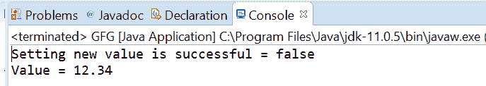
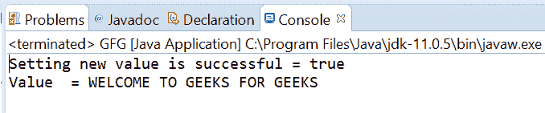

# 原子引用 Java 中的 weakCompareAndSetRelease()方法，示例

> 原文:[https://www . geeksforgeeks . org/atomic reference-weakcompareandsetrelease-method-in-Java-with-examples/](https://www.geeksforgeeks.org/atomicreference-weakcompareandsetrelease-method-in-java-with-examples/)

如果当前值等于作为参数传递的预期值，则使用**原子引用**类的**WeakCompareAndSetLease()**方法自动将原子引用的值设置为新值。此方法更新该值，并确保先前的加载和存储在此访问后不会重新排序。如果向 AtomicRefrence 设置新值成功，则此方法返回 true。

**语法:**

```java
public final boolean
       weakCompareAndSetRelease(V expectedValue,
                                V newValue)

```

**参数:**该方法接受**期望值**为期望值，**新值**为新设定值。

**返回值:**如果成功，该方法返回 true。

以下程序说明了 weakCompareAndSetRelease()方法:
**程序 1:**

```java
// Java program to demonstrate
// AtomicReference.weakCompareAndSetRelease() method

import java.util.concurrent.atomic.AtomicReference;

public class GFG {
    public static void main(String[] args)
    {

        // create an atomic reference object.
        AtomicReference<Float> ref
            = new AtomicReference<Float>();

        // set some value
        ref.set(12.3400f);

        // apply weakCompareAndSetRelease()
        boolean result
            = ref.weakCompareAndSetRelease(
                1.2f,
                234.32f);

        // print value
        System.out.println("Setting new value"
                           + " is successful = "
                           + result);
        System.out.println("Value = " + ref.get());
    }
}
```

**Output:**

**程序 2:**

```java
// Java program to demonstrate
// AtomicReference.weakCompareAndSetRelease() method

import java.util.concurrent.atomic.AtomicReference;

public class GFG {
    public static void main(String[] args)
    {

        // create an atomic reference object
        // which stores String.
        AtomicReference<String> ref
            = new AtomicReference<String>();

        // set some value
        ref.set("WELCOME TO GFG");

        // apply weakCompareAndSetRelease()
        boolean result
            = ref.weakCompareAndSetRelease(
                "WELCOME TO GFG",
                "WELCOME TO GEEKS FOR GEEKS");

        // print value
        System.out.println("Setting new value"
                           + " is successful = " + result);
        System.out.println("Value  = " + ref.get());
    }
}
```

**Output:**

**参考文献:**T2