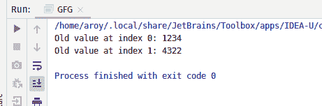
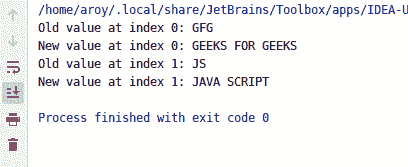

# Java 中的 AtomicReferenceArray compareAndExchange()方法，带示例

> 原文:[https://www . geeksforgeeks . org/atomicreferencearray-compareandexchange-method-in-Java-with-examples/](https://www.geeksforgeeks.org/atomicreferencearray-compareandexchange-method-in-java-with-examples/)

如果称为见证值的 AtomicReferenceArray 对象的索引 I 处的当前值等于预期值，则使用 **AtomicReferenceArray** 类的 **compareAndExchange()** 方法自动将 AtomicReferenceArray 的索引 I 的值设置为新值。此方法将返回见证值，该值将与预期值相同。这个方法处理带有内存读取语义的操作，就像变量被声明为 volatile 一样。

**语法:**

```java
public final boolean
       compareAndExchange(
           int i, E expectedValue, E newValue)

```

**参数:**该方法接受:

*   **i** 是执行操作的原子引用数组的索引，
*   **期望值**是期望值，并且
*   **新值**是要设置的新值。

**返回值:**该方法返回**见证值**，如果成功则与期望值相同。

下面的程序说明了 compareAndExchange()方法:
**程序 1:**

```java
// Java program to demonstrate
// compareAndExchange() method

import java.util.concurrent.atomic.*;

public class GFG {
    public static void main(String[] args)
    {
        // create an atomic reference object.
        AtomicReferenceArray<Integer> ref
            = new AtomicReferenceArray<Integer>(3);

        // set some value
        ref.set(0, 1234);
        ref.set(1, 4322);

        // apply compareAndExchange()
        int oldV1
            = ref.compareAndExchange(0, 1234, 8913);
        int oldV2
            = ref.compareAndExchange(1, 4322, 6543);

        // print
        System.out.println("Old value at index 0: "
                           + oldV1);
        System.out.println("Old value at index 1: "
                           + oldV2);
    }
}
```

**Output:**

**程序 2:**

```java
// Java program to demonstrate
// compareAndExchange() method

import java.util.concurrent.atomic.*;

public class GFG {
    public static void main(String[] args)
    {
        // create an atomic reference object.
        AtomicReferenceArray<String> ref
            = new AtomicReferenceArray<String>(3);

        // set some value
        ref.set(0, "GFG");
        ref.set(1, "JS");

        // apply compareAndExchange()
        String oldV1
            = ref.compareAndExchange(
                0, "GFG",
                "GEEKS FOR GEEKS");
        String oldV2
            = ref.compareAndExchange(
                1, "JS",
                "JAVA SCRIPT");

        // print
        System.out.println("Old value at index 0: "
                           + oldV1);
        System.out.println("New value at index 0: "
                           + ref.get(0));
        System.out.println("Old value at index 1: "
                           + oldV2);
        System.out.println("New value at index 1: "
                           + ref.get(1));
    }
}
```

**Output:**

**参考文献:**[https://docs . Oracle . com/javase/10/docs/API/Java/util/concurrent/atomic/atomic referencearray . html # compareAndExchange(int，E，E)](https://docs.oracle.com/javase/10/docs/api/java/util/concurrent/atomic/AtomicReferenceArray.html#compareAndExchange)