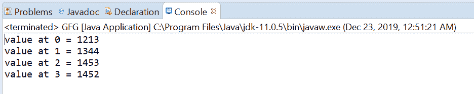
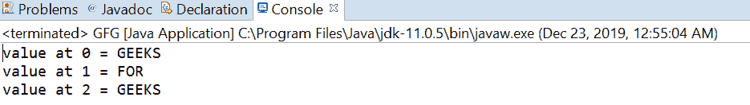

# Java 中的 AtomicReferenceArray getAcquire()方法，示例

> 原文:[https://www . geeksforgeeks . org/atomicreferencearray-getac quire-method-in-Java-with-examples/](https://www.geeksforgeeks.org/atomicreferencearray-getacquire-method-in-java-with-examples/)

一个**原子引用数组**类的 **getAcquire()** 方法用于返回这个原子引用数组对象的索引 I 处的元素的值，其内存排序效果与 memory_order_acquire 排序兼容。

**语法:**

```
public final E getAcquire(int i)

```

**参数:**该方法接受**指数 i** 取值。

**返回值:**此方法返回索引 I 处的当前值

下面的程序说明了 getAcquire()方法:
**程序 1:**

```
// Java program to demonstrate
// AtomicReferenceArray.getAcquire() method

import java.util.concurrent.atomic.AtomicReferenceArray;

public class GFG {
    public static void main(String[] args)
    {

        // create an atomic reference array
        // object which stores Integer.
        AtomicReferenceArray<Integer> array
            = new AtomicReferenceArray<Integer>(5);

        // set some value in array
        array.set(0, 1213);
        array.set(1, 1344);
        array.set(2, 1453);
        array.set(3, 1452);

        // get and print the value
        // using getAcquire method
        for (int i = 0; i < 4; i++) {

            int value = array.getAcquire(i);
            System.out.println("value at "
                               + i + " = " + value);
        }
    }
}
```

**Output:**

**程序 2:**

```
// Java program to demonstrate
// AtomicReferenceArray.getAcquire() method

import java.util.concurrent.atomic.AtomicReferenceArray;

public class GFG {
    public static void main(String[] args)
    {

        // create an atomic reference array object
        // which stores String.
        AtomicReferenceArray<String> array
            = new AtomicReferenceArray<String>(5);

        // set some value in array
        array.set(0, "GEEKS");
        array.set(1, "FOR");
        array.set(2, "GEEKS");

        // get and print the value using get method
        for (int i = 0; i < 2; i++) {

            String value = array.getAcquire(i);
            System.out.println("value at "
                               + i + " = " + value);
        }
    }
}
```

**Output:**

**参考:**[https://docs . Oracle . com/javase/10/docs/API/Java/util/concurrent/atomic/atomic referencearray . html # getAcquire(int)](https://docs.oracle.com/javase/10/docs/api/java/util/concurrent/atomic/AtomicReferenceArray.html#getAcquire(int))