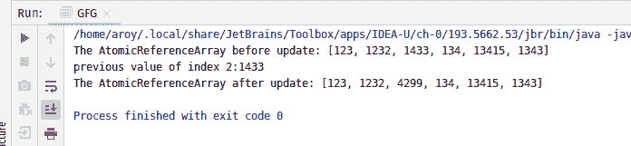
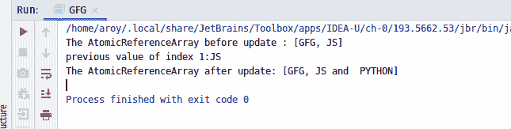

# Java 中的 atomic referencearray getAndAccumulate()方法，示例

> 原文:[https://www . geeksforgeeks . org/atomicreferencearray-getandaccumulate-method-in-Java-with-examples/](https://www.geeksforgeeks.org/atomicreferencearray-getandaccumulate-method-in-java-with-examples/)

一个**原子引用数组**类的 **getAndAccumulate()** 方法用于原子更新原子引用数组索引 I 处的元素，将给定的累积函数应用于当前和给定值，并返回前一个值。累积函数应该没有副作用，因为当尝试的更新由于线程之间的争用而失败时，它可以被重新应用。该函数的第一个参数是索引 I 处的当前值，第二个参数是给定的更新。

**语法:**

```java
public final E getAndAccumulate(int i, E x,
     BinaryOperator<E> accumulatorFunction)

```

**参数:**该方法接受:

*   **i** 是要执行操作的原子引用数组的索引，接受
*   **x** 是更新后的值
*   **累积函数**是两个自变量的无副作用函数。

**返回值:**此方法返回**之前的值**。

下面的程序举例说明了 getAndAccumulate()方法:
**程序 1:**

```java
// Java program to demonstrate
// getAndAccumulate() method

import java.util.concurrent.atomic.*;
import java.util.function.BinaryOperator;

public class GFG {
    public static void main(String args[])
    {
        // an array
        Integer a[]
            = { 123, 1232, 1433, 134, 13415, 1343 };

        // AtomicReferenceArray with array
        AtomicReferenceArray<Integer> array
            = new AtomicReferenceArray<>(a);

        // Print AtomicReferenceArray
        System.out.println(
            "The AtomicReferenceArray before update: "
            + array);

        // Index and Value to apply getAndAccumulate
        int index = 2;
        int E = 3;

        // Declaring the accumulatorFunction
        // applying function
        BinaryOperator add
            = (u, v)
            -> Integer.parseInt(
                   u.toString())
                   * Integer
                         .parseInt(
                             v.toString());

        // apply getAndAccumulate()
        int value
            = array.getAndAccumulate(index, E, add);

        // print AtomicReferenceArray
        System.out.println(
            "previous value of index 2:"
            + value);
        System.out.println(
            "The AtomicReferenceArray after update: "
            + array);
    }
}
```

**Output:**

**程序 2:**

```java
// Java program to demonstrate
// getAndAccumulate() method

import java.util.concurrent.atomic.*;
import java.util.function.BinaryOperator;

public class GFG {
    public static void main(String args[])
    {
        // an array
        String a[] = { "GFG", "JS" };

        // AtomicReferenceArray with array
        AtomicReferenceArray<String> array
            = new AtomicReferenceArray<>(a);

        // Print AtomicReferenceArray
        System.out.println(
            "The AtomicReferenceArray before update : "
            + array);

        // Index and Value to apply getAndAccumulate
        int index = 1;
        String E = " PYTHON";

        // Declaring the accumulatorFunction
        // applying function to add value as string
        BinaryOperator add
            = (u, v) -> u.toString() + " and " + v.toString();

        // apply getAndAccumulate()
        String value
            = array.getAndAccumulate(index, E, add);

        // print AtomicReferenceArray
        System.out.println(
            "previous value of index 1:"
            + value);
        System.out.println(
            "The AtomicReferenceArray after update: "
            + array);
    }
}
```

**Output:**

**参考文献:**[https://docs . Oracle . com/javase/10/docs/API/Java/util/concurrent/atomic/atomic referencearray . html # getAndAccumulate(int，E，Java . util . function . binaryoperator)](https://docs.oracle.com/javase/10/docs/api/java/util/concurrent/atomic/AtomicReferenceArray.html#getAndAccumulate(int, E, java.util.function.BinaryOperator))