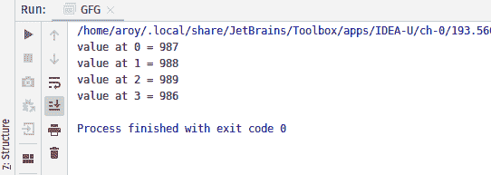
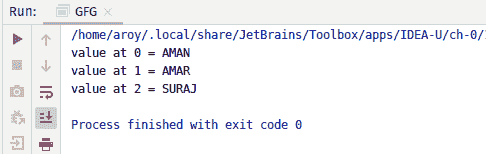

# Java 中的 AtomicReferenceArray getOpaque()方法，示例

> 原文:[https://www . geeksforgeeks . org/atomicreferencearray-get opacity-method-in-Java-with-examples/](https://www.geeksforgeeks.org/atomicreferencearray-getopaque-method-in-java-with-examples/)

一个**原子引用数组**类的**GetAuthArray()**方法用于返回这个原子引用数组对象的索引 I 处的元素的值，该对象具有由 VarHandle . GetAuthArray(Java . lang . object…)指定的内存效果。这个 VarHandle . GetAuthy(Java . lang . object…)方法处理操作时不能保证相对于其他线程的内存排序效果。

**语法:**

```java
public final E getOpaque(int i)

```

**参数:**该方法接受指标 **i** 取值。

**返回值:**该方法返回指数 I 处的**当前值**

下面的程序说明了 getOpaque()方法:
**程序 1:**

```java
// Java program to demonstrate
// AtomicReferenceArray.getOpaque() method

import java.util.concurrent.atomic.*;

public class GFG {
    public static void main(String[] args)
    {

        // create an atomic reference array
        // object which stores Integer.
        AtomicReferenceArray<Integer> array
            = new AtomicReferenceArray<Integer>(5);

        // set some value in array
        array.set(0, 987);
        array.set(1, 988);
        array.set(2, 989);
        array.set(3, 986);

        // get and print the value
        // using getOpaque method
        for (int i = 0; i < 4; i++) {

            int value = array.getOpaque(i);
            System.out.println("value at "
                               + i + " = "
                               + value);
        }
    }
}
```

**Output:**

**程序 2:**

```java
// Java program to demonstrate
// AtomicReferenceArray.getOpaque() method

import java.util.concurrent.atomic.*;

public class GFG {
    public static void main(String[] args)
    {

        // create a array of Strings
        String[] names
            = { "AMAN", "AMAR", "SURAJ" };

        // create an atomic reference object.
        AtomicReferenceArray<String> array
            = new AtomicReferenceArray<String>(names);

        // get and print the value
        // using getOpaque method
        for (int i = 0; i < array.length(); i++) {

            String value = array.getOpaque(i);
            System.out.println("value at "
                               + i + " = "
                               + value);
        }
    }
}
```

**Output:**

**参考文献:**[https://docs . Oracle . com/javase/10/docs/API/Java/util/concurrent/atomic/atomic referencearray . html # getopacity(int)](https://docs.oracle.com/javase/10/docs/api/java/util/concurrent/atomic/AtomicReferenceArray.html#getOpaque(int))