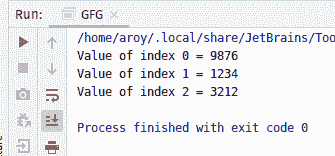
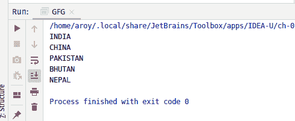

# Java 中的 AtomicReferenceArray lazySet()方法，带示例

> 原文:[https://www . geeksforgeeks . org/atomicreferencearray-lazy set-method-in-Java-with-examples/](https://www.geeksforgeeks.org/atomicreferencearray-lazyset-method-in-java-with-examples/)

一个**原子引用数组**类的 **lazySet()** 方法用于将索引 I 处的元素的值设置为新值。索引 I 和 newValue 都作为参数传递给该方法。此方法将值设置为具有 varhandle . setrelease(Java . lang . object…)指定的内存效果，以确保先前的加载和存储在此访问后不会重新排序。

**语法:**

```
public final void lazySet(int i, E newValue)

```

**参数:**该方法接受:

*   **i** 是执行操作的原子引用数组的索引，
*   **新值**是要设置的新值。

**返回值:**此方法不返回任何内容。

下面的程序说明了 lazySet()方法:
**程序 1:**

```
// Java program to demonstrate
// AtomicReferenceArray.lazySet() method

import java.util.concurrent.atomic.*;

public class GFG {
    public static void main(String[] args)
    {
        // create an atomic reference object.
        AtomicReferenceArray<Integer> ref
            = new AtomicReferenceArray<Integer>(3);

        // set some value using lazySet() and print
        ref.lazySet(0, 1234);
        ref.lazySet(1, 4322);
        ref.lazySet(2, 2345);
        System.out.println("Value of index 0 = "
                           + ref.get(0));
        System.out.println("Value of index 1 = "
                           + ref.get(1));
        System.out.println("Value of index 2 = "
                           + ref.get(2));
    }
}
```

**Output:**

**程序 2:**

```
// Java program to demonstrate
// AtomicReferenceArray.lazySet() method

import java.util.concurrent.atomic.*;

public class GFG {

    public static void main(String[] args)
    {

        // create an atomic reference object
        AtomicReferenceArray<String>
            HIMALAYAN_COUNTRY
            = new AtomicReferenceArray<String>(5);

        // set some value
        HIMALAYAN_COUNTRY.lazySet(0, "INDIA");
        HIMALAYAN_COUNTRY.lazySet(1, "CHINA");
        HIMALAYAN_COUNTRY.lazySet(2, "PAKISTAN");
        HIMALAYAN_COUNTRY.lazySet(3, "BHUTAN");
        HIMALAYAN_COUNTRY.lazySet(4, "NEPAL");

        // print
        for (int i = 0; i < 5; i++) {
            System.out.println(
                HIMALAYAN_COUNTRY.get(i));
        }
    }
}
```

**Output:**

**参考文献:**[https://docs . Oracle . com/javase/10/docs/API/Java/util/concurrent/atomic/atomic referencearray . html # lazySet(int，E)](https://docs.oracle.com/javase/10/docs/api/java/util/concurrent/atomic/AtomicReferenceArray.html#lazySet)