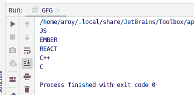

# Java 中的 AtomicReferenceArray setPlain()方法，示例

> 原文:[https://www . geeksforgeeks . org/atomicreferencearray-set lain-method-in-Java-with-examples/](https://www.geeksforgeeks.org/atomicreferencearray-setplain-method-in-java-with-examples/)

一个**原子引用数组**类的**set lain()**方法用于将索引 I 处的元素的值设置为新值。索引 I 和 newValue 都作为参数传递给该方法。此方法使用设置的内存语义来设置值，就像变量被声明为非易失性和非最终的一样。

**语法:**

```java
public final void setPlain(int i, E newValue)

```

**参数:**该方法接受:

*   **i** 是执行操作的原子引用数组的索引，
*   **新值**是要设置的新值。

**返回值:**此方法不返回任何内容。

以下程序说明了 setPlain()方法:
**程序 1:**

```java
// Java program to demonstrate
// setPlain() method

import java.util.concurrent.atomic.*;

public class GFG {

    public static void main(String[] args)
    {

        // create an atomic reference object.
        AtomicReferenceArray<Integer> ref
            = new AtomicReferenceArray<Integer>(5);

        // set some value and print
        ref.setPlain(0, 9876);
        ref.setPlain(1, 1234);
        ref.setPlain(2, 3212);

        System.out.println("Value of index 0 = "
                           + ref.get(0));
        System.out.println("Value of index 1 = "
                           + ref.get(1));
        System.out.println("Value of index 2 = "
                           + ref.get(2));
    }
}
```

**Output:**

**程序 2:**

```java
// Java program to demonstrate
// setPlain() method

import java.util.concurrent.atomic.*;

public class GFG {

    public static void main(String[] args)
    {

        // create an atomic reference object
        AtomicReferenceArray<String> ref
            = new AtomicReferenceArray<String>(5);

        // set some value
        ref.setPlain(0, "JS");
        ref.setPlain(1, "EMBER");
        ref.setPlain(2, "REACT");
        ref.setPlain(3, "C++");
        ref.setPlain(4, "C");

        // print
        for (int i = 0; i < 5; i++) {
            System.out.println(ref.get(i));
        }
    }
}
```

**Output:**

**参考文献:**[https://docs . Oracle . com/javase/10/docs/API/Java/util/concurrent/atomic/atomic referencearray . html # setlain(int，E)](https://docs.oracle.com/javase/10/docs/api/java/util/concurrent/atomic/AtomicReferenceArray.html#setPlain)