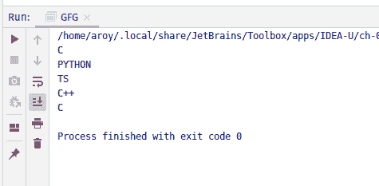

# Java 中的 AtomicReferenceArray setRelease()方法，示例

> 原文:[https://www . geeksforgeeks . org/atomicreferencearray-set release-method-in-Java-with-examples/](https://www.geeksforgeeks.org/atomicreferencearray-setrelease-method-in-java-with-examples/)

**原子引用数组**类的 **setRelease()** 方法用于将索引 I 处的元素的值设置为新值。索引 I 和 newValue 都作为参数传递给该方法。这个方法用 varhandle . setrelease(Java . lang . object…)指定的内存效果设置值。此方法具有与 memory_order_release 排序兼容的内存排序效果。

**语法:**

```java
public final void setRelease(int i, E newValue)

```

**参数:**该方法接受:

*   **i** 是执行操作的原子引用数组的索引，
*   **新值**是要设置的新值。

**返回值:**此方法不返回任何内容。

下面的程序说明了 setRelease()方法:
**程序 1:**

```java
// Java program to demonstrate
// setRelease() method

import java.util.concurrent.atomic.*;

public class GFG {

    public static void main(String[] args)
    {

        // create an atomic reference object.
        AtomicReferenceArray<Integer> ref
            = new AtomicReferenceArray<Integer>(5);

        // set some value and print
        ref.setRelease(0, 1324);
        ref.setRelease(1, 144);
        ref.setRelease(2, 322);

        System.out.println(
            "Value of index 0 = "
            + ref.get(0));
        System.out.println(
            "Value of index 1 = "
            + ref.get(1));
        System.out.println(
            "Value of index 2 = "
            + ref.get(2));
    }
}
```

**Output:**

**程序 2:**

```java
// Java program to demonstrate
// setRelease() method

import java.util.concurrent.atomic.*;

public class GFG {

    public static void main(String[] args)
    {

        // create an atomic reference object.c
        AtomicReferenceArray<String> ref
            = new AtomicReferenceArray<String>(5);

        // set some value
        ref.setRelease(0, "C");
        ref.setRelease(1, "PYTHON");
        ref.setRelease(2, "TS");
        ref.setRelease(3, "C++");
        ref.setRelease(4, "C");

        // print
        for (int i = 0; i < 5; i++) {
            System.out.println(ref.get(i));
        }
    }
}
```

**Output:**

**参考文献:**[https://docs . Oracle . com/javase/10/docs/API/Java/util/concurrent/atomic/atomic referencearray . html # setRelease(int，E)](https://docs.oracle.com/javase/10/docs/api/java/util/concurrent/atomic/AtomicReferenceArray.html#setRelease)