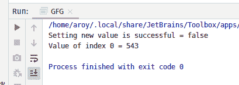
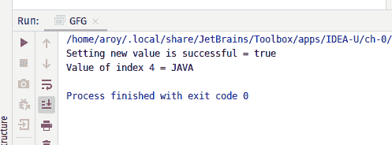

# Java 中的 AtomicReferenceArray weakCompareAndSetAcquire()方法，带示例

> 原文:[https://www . geeksforgeeks . org/atomicreferencearray-weakcompareandsetacquire-method-in-Java-with-examples/](https://www.geeksforgeeks.org/atomicreferencearray-weakcompareandsetacquire-method-in-java-with-examples/)

**原子引用数组**类的**WeakCompareandSetacquire()**方法用于在当前值等于作为参数传递的预期值的情况下，自动将索引 I 处的元素值设置为原子引用数组的新值到新值。此方法更新索引 I 处的值，其内存排序效果与 memory_order_acquire 排序兼容。如果向 AtomicRefrence 设置新值成功，则此方法返回 true。

**语法:**

```
public final boolean
       weakCompareAndSetAcquire(
           int i, E expectedValue, E newValue)

```

**参数:**该方法接受:

*   **i** 是执行操作的原子引用数组的索引，
*   **期望值**是期望值，并且
*   **新值**是要设置的新值。

**返回值:**如果给原子设置新值成功，该方法返回**真**。

以下程序说明了 weakCompareAndSetAcquire()方法:
**程序 1:**

```
// Java program to demonstrate
// weakCompareAndSetAcquire() method

import java.util.concurrent.atomic.*;

public class GFG {

    public static void main(String[] args)
    {

        // create an atomic reference object.
        AtomicReferenceArray<Integer> ref
            = new AtomicReferenceArray<Integer>(5);

        // set some value
        ref.set(0, 543);
        ref.set(1, 123);
        ref.set(2, 5443);

        // apply weakCompareAndSetAcquire()
        boolean result
            = ref.weakCompareAndSetAcquire(
                0,
                5443,
                234);

        // print value
        System.out.println(
            "Setting new value"
            + " is successful = "
            + result);

        System.out.println("Value of index 0 = "
                           + ref.get(0));
    }
}
```

**Output:**

**程序 2:**

```
// Java program to demonstrate
// weakCompareAndSetAcquire() method

public class GFG {

    public static void main(String[] args)
    {

        // create an atomic reference object.c
        AtomicReferenceArray<String> ref
            = new AtomicReferenceArray<String>(5);

        // set some value
        ref.set(0, "C");
        ref.set(1, "PYTHON");
        ref.set(2, "TS");
        ref.set(3, "C++");
        ref.set(4, "C");

        // apply weakCompareAndSetAcquire()
        boolean result
            = ref.weakCompareAndSetAcquire(
                4,
                "C",
                "JAVA");

        // print value
        System.out.println(
            "Setting new value"
            + " is successful = "
            + result);

        System.out.println(
            "Value of index 4 = "
            + ref.get(4));
    }
}
```

**Output:**

**参考文献:**[https://docs . Oracle . com/javase/10/docs/API/Java/util/concurrent/atomic/atomic referencearray . html # weakCompareAndSetAcquire(V，V)](https://docs.oracle.com/javase/10/docs/api/java/util/concurrent/atomic/AtomicReferenceArray.html#weakCompareAndSetAcquire(V, V))