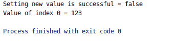
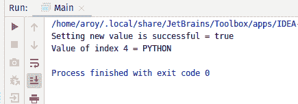

# Java 中的 AtomicReferenceArray weakCompareAndSetPlain()方法，带示例

> 原文:[https://www . geeksforgeeks . org/atomicreferencearray-weakcompareandset plain-method-in-Java-with-examples/](https://www.geeksforgeeks.org/atomicreferencearray-weakcompareandsetplain-method-in-java-with-examples/)

一个**原子引用数组**类的**WeakComparendSetPlain()**方法用于在当前值等于作为参数传递的预期值的情况下，自动将索引 I 处的元素值设置为原子引用数组的新值到新值。此方法使用设置的内存语义更新索引 I 处的值，就像索引 I 处的变量被声明为非易失性和非最终变量一样。如果设置新值成功，此方法返回 true。

**语法:**

```java
public final boolean weakCompareAndSetPlain(int i,
                                            E expectedValue,
                                            E newValue)

```

**参数:**该方法接受 **i** 作为原子引用数组的索引来执行操作，**期望值**是期望值，**新值**是要设置的新值。

**返回值:**如果成功，该方法返回 true。

下面的程序说明了 weakCompareAndSetPlain()方法:
**程序 1:**

```java
// Java program to demonstrate AtomicReferenceArray
// weakCompareAndSetPlain() method

import java.util.concurrent.atomic.AtomicReferenceArray;

public class GFG {

    public static void main(String[] args)
    {

        // create an atomic reference object.
        AtomicReferenceArray<Integer> ref
            = new AtomicReferenceArray<Integer>(5);

        // set some value
        ref.set(0, 321);
        ref.set(1, 123);
        ref.set(2, 322);

        // apply weakCompareAndSetPlain()
        boolean result
            = ref.weakCompareAndSetPlain(
                0, 124,
                234);

        // print value
        System.out.println("Setting new value"
                           + " is successful = "
                           + result);

        System.out.println("Value of index 0 = "
                           + ref.get(1));
    }
}
```

**Output:**

**程序 2:**

```java
// Java program to demonstrate AtomicReferenceArray
// weakCompareAndSetPlain() method

import java.util.concurrent.atomic.AtomicReferenceArray;

public class GFG {

    public static void main(String[] args)
    {

        // create an atomic reference object.c
        AtomicReferenceArray<String> ref
            = new AtomicReferenceArray<String>(5);

        // set some value
        ref.set(0, "C");
        ref.set(1, "JAVA");
        ref.set(2, "JS");
        ref.set(3, "C++");
        ref.set(4, "C");

        // apply weakCompareAndSetVolatile()
        boolean result
            = ref.weakCompareAndSetVolatile(
                4, "C",
                "PYTHON");

        // print value
        System.out.println("Setting new value"
                           + " is successful = "
                           + result);

        System.out.println("Value of index 4 = "
                           + ref.get(4));
    }
}
```

**Output:**

**参考文献:**[https://docs . Oracle . com/javase/10/docs/API/Java/util/concurrent/atomic/atomic referencearray . html # weakcomparendsetplain(V，V)](https://docs.oracle.com/javase/10/docs/api/java/util/concurrent/atomic/AtomicReferenceArray.html#weakCompareAndSetPlain(V, V))