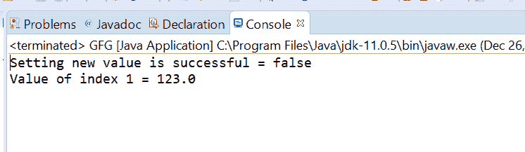
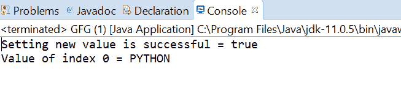

# Java 中的原子引用数组 weakCompareAndSetRelease()方法，示例

> 原文:[https://www . geeksforgeeks . org/atomicreferencearray-weakcompareandsetrelease-method-in-Java-with-examples/](https://www.geeksforgeeks.org/atomicreferencearray-weakcompareandsetrelease-method-in-java-with-examples/)

如果当前值等于作为参数传递的预期值，则使用**原子引用数组**类的**WeakCompareandsTerrease()**方法自动将索引 I 处的元素值设置为原子引用数组的新值到新值。此方法更新该值，并确保先前的加载和存储在此访问后不会重新排序。如果向 AtomicRefrence 设置新值成功，则此方法返回 true。

**语法:**

```
public final boolean
       weakCompareAndSetRelease(int i,
                                E expectedValue,
                                E newValue)

```

**参数:**该方法接受 **i** 作为原子引用数组的索引来执行操作，**期望值**是期望值，**新值**是要设置的新值。

**返回值:**如果成功，该方法返回 true。

以下程序说明了 weakCompareAndSetRelease()方法:
**程序 1:**

```
// Java program to demonstrate AtomicReferenceArray
// weakCompareAndSetRelease() method

import java.util.concurrent.atomic.AtomicReferenceArray;

public class GFG {
    public static void main(String[] args)
    {

        // create an atomic reference object.
        AtomicReferenceArray<Double> ref
            = new AtomicReferenceArray<Double>(5);

        // set some value
        ref.set(0, 321.00);
        ref.set(1, 123.00);
        ref.set(2, 322.00);

        // apply weakCompareAndSetRelease()
        boolean result
            = ref.weakCompareAndSetRelease(
                1,
                124.00,
                234.32);

        // print value
        System.out.println("Setting new value"
                           + " is successful = "
                           + result);

        System.out.println("Value of index 1 = "
                           + ref.get(1));
    }
}
```

**Output:**

**程序 2:**

```
// Java program to demonstrate AtomicReferenceArray
// weakCompareAndSetRelease() method

import java.util.concurrent.atomic.AtomicReferenceArray;

public class GFG {
    public static void main(String[] args)
    {

        // create an atomic reference object.
        AtomicReferenceArray<String> ref
            = new AtomicReferenceArray<String>(5);

        // set some value
        ref.set(0, "GFG");
        ref.set(1, "JAVA");

        // apply weakCompareAndSetVolatile()
        boolean result
            = ref.weakCompareAndSetVolatile(
                0, "GFG",
                "PYTHON");

        // print value
        System.out.println("Setting new value"
                           + " is successful = "
                           + result);

        System.out.println("Value of index 0 = "
                           + ref.get(0));
    }
}
```

**Output:**

**参考文献:**[https://docs . Oracle . com/javase/10/docs/API/Java/util/concurrent/atomic/atomic referencearray . html # weakCompareAndSetRelease(V，V)](https://docs.oracle.com/javase/10/docs/api/java/util/concurrent/atomic/AtomicReferenceArray.html#weakCompareAndSetRelease(V, V))