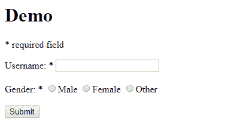
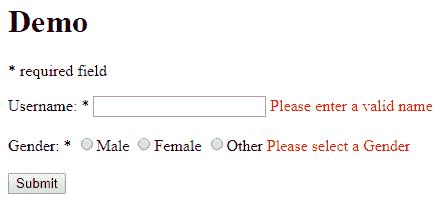
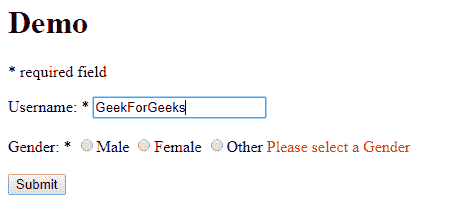

# servlet 中的属性| Java

> 原文:[https://www.geeksforgeeks.org/attributes-in-servlets-java/](https://www.geeksforgeeks.org/attributes-in-servlets-java/)

servlet 中的属性是一个对象，可以通过以下方面进行设置、获取或移除

1.  请求范围
2.  适用范围
3.  会话范围

要将值从 servlet 传递到 html/jsp 文件，请求对象调用 **setAttribute()** 方法。setAttribute()方法将输入作为对象，将数据从 servlet 发送到请求网站

```java
public void setAttribute(String name, Object obj)
```

在应用程序范围内设置指定的对象。

在用户端，html 使用一种语法来获取属性

```java
${ var-name }
```

其中 var-name 与 setAttribute()方法中的**名称**相同

让我们看一个在服务器端验证表单的网站示例

**HTML 文件 1(请求网站)**

代码会将输入数据发送给 Servlet 来处理验证，如果发生任何验证，Servlet 会返回错误文本。

```java
<body>
<h1>Demo</h1>
<p style="color: black;">* required field</p> 
<form method="post" action="./CommitServlet">
    <label>Username: *</label>

    <!-- Received response bundle data from the servlet as ${ var-name }  -->

    <input type="text" value="${after.inputName}" name="inputName"/>
    <span name="errorName">${errors.Name}</span>
    <br/><br>

    <label>Gender: *</label>
    <input type="radio" name="gender" value="male" />Male
    <input type="radio" name="gender" value="female" />Female
    <input type="radio" name="gender" value="other" />Other 
    <span name="errorGender">${errors.Gender}</span>
    <br><br>
    <input type="submit"/>
</form>
</body>
```

**输出:**



**Servlet 代码**

该程序处理请求的数据并检查其有效性，如果遇到任何错误，它将在称为映射类的包中添加错误文本。这个包再次被发送到请求站点进行纠错

```java
// Servlet code
import java.io.IOException;
import java.util.HashMap;
import java.util.Map;
import java.util.regex.Matcher;
import java.util.regex.Pattern;

import javax.servlet.ServletException;
import javax.servlet.annotation.WebServlet;
import javax.servlet.http.HttpServlet;
import javax.servlet.http.HttpServletRequest;
import javax.servlet.http.HttpServletResponse;

@WebServlet("/CommitServlet")
public class CommitServlet extends HttpServlet {
    private static final long serialVersionUID = 1L;

    protected void doPost(HttpServletRequest request,
                          HttpServletResponse response)
        throws ServletException, IOException
    {

        // Create a Bundle of errors in the form of Map
        Map<String, String> errors = new HashMap<String, String>();
        Map<String, String> after = new HashMap<String, String>();

        // Get the input values from the website
        String inputName = request.getParameter("inputName");
        String inputGender = request.getParameter("gender");

        // If error occur, previous entered data will be reflected
        after.put("inputName", inputName);

        // Check for Validation of Name and Gender
        if (!validateName(inputName))

            // If error occur, create a entry for
            // the bundle and write a alert message
            errors.put("Name", "Please enter a valid name");

        if (inputGender == null)

            // If Gender is not select, encounter an error
            errors.put("Gender", "Please select a Gender");

        if (errors.isEmpty())

            // If no error occur, redirect to the response website
            response.sendRedirect("success.html");

        else {

            // Set this bundle into the request attribute
            // and pass the data to the requested website
            request.setAttribute("after", after);
            request.setAttribute("errors", errors);
            request.getRequestDispatcher("comment.jsp").forward(request, response);
        }
    }

    // Method to validate Proper Name, entered by the user
    public static boolean validateName(String txt)
    {
        String regex = "^[a-zA-Z ]+{content}quot;;
        Pattern pattern = Pattern.compile(regex,
                                          Pattern.CASE_INSENSITIVE);
        Matcher matcher = pattern.matcher(txt);
        return matcher.find();
    }
}
```

输出:




**HTML 代码 2**

如果没有出现错误，将打印成功消息

```java
<body>
    <center>
        <h1>Comment Successfully Stored</h1>
    </center>
</body>
```