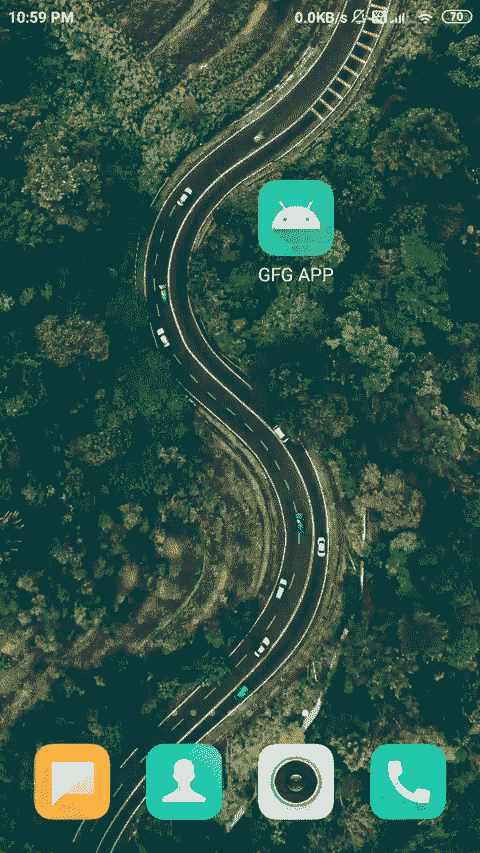

# 安卓中的录音机，示例

> 原文:[https://www . geeksforgeeks . org/带示例的安卓录音机/](https://www.geeksforgeeks.org/audio-recorder-in-android-with-example/)

在录制音频或视频的安卓系统中，有一个内置类叫做 **MediaRecorder** 。Android 中的这个类有助于轻松录制视频和音频文件。安卓多媒体框架为捕获和编码常见的音频和视频格式提供内置支持。在安卓系统中，录制音频时，我们将使用带有 **MediaRecorder** 类的设备麦克风，录制视频时，我们将使用用户的设备摄像头和 **MediaRecorder** 类。现在在本文中，我们将通过一个例子来看看一个录音机在安卓系统中的实现。

## **媒体记录器**类的重要方法

<figure class="table">

| 

方法

 | 

描述

 |
| --- | --- |
| setAudioSource() | 此方法将指定要录制的音频的来源。 |
| setAudioEncoder() | 此方法用于指定音频编码器。 |
| setOutputFormat() | 这个方法用来指定我们音频的输出格式。 |
| setOutputFile() | 此方法用于指定要存储的录制音频文件的路径。 |
| 停止() | 此方法用于停止录制过程。 |
| 开始() | 此方法用于启动记录过程。 |
| 发布() | 此方法用于释放与媒体录制器类关联的资源。 |

</figure>

## 例子

现在，我们正在创建一个简单的录音机应用程序，我们将在其中记录来自用户设备麦克风的音频，然后我们将在用户设备中存储该音频记录。我们还将播放此保存的录音。下面给出了一个 GIF 示例，来了解一下在本文中要做什么。请注意，我们将使用 **Java** 语言来实现这个项目。



### **分步实施**

**第一步:创建新项目**

要在安卓工作室创建新项目，请参考[如何在安卓工作室创建/启动新项目](https://www.geeksforgeeks.org/android-how-to-create-start-a-new-project-in-android-studio/)。注意选择 **Java** 作为编程语言。

**第二步:在 AndroidManifest.xml 文件**中添加权限

在 **AndroidManifest.xml** 文件中添加下一行。

## 可扩展标记语言

```java
<?xml version="1.0" encoding="utf-8"?>
<manifest xmlns:android="http://schemas.android.com/apk/res/android"
    xmlns:tools="http://schemas.android.com/tools"
    package="com.gtappdevelopers.camviewlibrary">

    <!--Permission for recording audio and storage of audio in users device-->
    <uses-permission android:name="android.permission.RECORD_AUDIO"/>
    <uses-permission android:name="android.permission.WRITE_EXTERNAL_STORAGE"/>
    <uses-permission android:name="android.permission.STORAGE"/>

    <application
        android:allowBackup="true"
        android:icon="@mipmap/ic_launcher"
        android:label="@string/app_name"
        android:roundIcon="@mipmap/ic_launcher_round"
        android:supportsRtl="true"
        android:theme="@style/Theme.CamViewLibrary">
        <activity android:name=".MainActivity">
            <intent-filter>
                <action android:name="android.intent.action.MAIN" />

                <category android:name="android.intent.category.LAUNCHER" />
            </intent-filter>
        </activity>
    </application>

</manifest>
```

**第三步:修改 colors.xml 和 strings.xml 文件**

下面是 **colors.xml** 文件的代码。

## 可扩展标记语言

```java
<?xml version="1.0" encoding="utf-8"?>
<resources>
    <color name="purple_200">#0F9D58</color>
    <color name="purple_500">#0F9D58</color>
    <color name="purple_700">#0F9D58</color>
    <color name="teal_200">#FF03DAC5</color>
    <color name="teal_700">#FF018786</color>
    <color name="black">#FF000000</color>
    <color name="white">#FFFFFFFF</color>
    <color name="gray">#A39696</color>
</resources>
```

下面是 **strings.xml** 文件的代码。

## 可扩展标记语言

```java
<resources>
    <string name="app_name">GFG APP</string>
    <string name="toggle_flash">Toggle Flash</string>
    <string name="action_settings">Settings</string>
    <string name="scanned_data">Scanned Data</string>
    <string name="audio_recorder">Audio Recorder</string>
    <string name="start_recording">Start Recording</string>
    <string name="stop_recording">Stop Recording</string>
    <string name="play_recording">Play Recording</string>
    <string name="stop_playing">Stop Playing</string>
    <string name="status">Status</string>
</resources>
```

**第 4 步:使用 activity_main.xml 文件**

导航至**应用程序> res >布局> activity_main.xml** 。下面是 **activity_main.xml** 文件的代码。代码中添加了注释，以更详细地理解代码。

## 可扩展标记语言

```java
<?xml version="1.0" encoding="utf-8"?>
<!--XML code for activity_main.xml-->
<RelativeLayout
    xmlns:android="http://schemas.android.com/apk/res/android"
    xmlns:app="http://schemas.android.com/apk/res-auto"
    xmlns:tools="http://schemas.android.com/tools"
    android:layout_width="match_parent"
    android:layout_height="match_parent"
    android:orientation="horizontal"
    tools:context=".MainActivity">

    <!--Heading Text View-->
    <TextView
        android:id="@+id/txthead"
        android:layout_width="match_parent"
        android:layout_height="wrap_content"
        android:layout_centerHorizontal="true"
        android:text="@string/audio_recorder"
        android:textAlignment="center"
        android:textColor="@color/black"
        android:textSize="30sp" />

    <!--This will display the status of our app when
        we will record some audio and play that audio-->
    <TextView
        android:id="@+id/idTVstatus"
        android:layout_width="match_parent"
        android:layout_height="wrap_content"
        android:layout_marginTop="150dp"
        android:text="@string/status"
        android:textAlignment="center"
        android:textSize="18sp" />

    <!--Linear Layout for adding textviews
        in horizontal manner-->
    <LinearLayout
        android:layout_width="match_parent"
        android:layout_height="wrap_content"
        android:layout_centerInParent="true"
        android:layout_marginTop="30dp"
        android:orientation="horizontal"
        android:weightSum="4">

        <!--Textview to start audio recording
            drawableTop will add above mic image-->
        <TextView
            android:id="@+id/btnRecord"
            android:layout_width="0dp"
            android:layout_height="wrap_content"
            android:layout_margin="5dp"
            android:layout_weight="1"
            android:background="@color/purple_500"
            android:padding="5dp"
            android:text="@string/start_recording"
            android:textAlignment="center"
            android:textColor="@color/white"
            app:drawableTopCompat="@drawable/ic_start_recording" />

        <!--Textview to stop audio recording
            drawableTop will add above mic image-->
        <TextView
            android:id="@+id/btnStop"
            android:layout_width="0dp"
            android:layout_height="wrap_content"
            android:layout_margin="5dp"
            android:layout_weight="1"
            android:background="@color/purple_500"
            android:padding="5dp"
            android:text="@string/stop_recording"
            android:textAlignment="center"
            android:textColor="@color/white"
            app:drawableTopCompat="@drawable/ic_stop_recording" />

        <!--Textview to play audio that is recorded
            drawableTop will add above mic image-->
        <TextView
            android:id="@+id/btnPlay"
            android:layout_width="0dp"
            android:layout_height="wrap_content"
            android:layout_margin="5dp"
            android:layout_weight="1"
            android:background="@color/purple_500"
            android:padding="5dp"
            android:text="@string/play_recording"
            android:textAlignment="center"
            android:textColor="@color/white"
            app:drawableTopCompat="@drawable/ic_play_audio" />

        <!--Textview to pause the play of audio recording
            drawableTop will add above mic image-->
        <TextView
            android:id="@+id/btnStopPlay"
            android:layout_width="0dp"
            android:layout_height="wrap_content"
            android:layout_margin="5dp"
            android:layout_weight="1"
            android:background="@color/purple_500"
            android:lines="2"
            android:padding="5dp"
            android:text="@string/stop_playing"
            android:textAlignment="center"
            android:textColor="@color/white"
            app:drawableTopCompat="@drawable/ic_pause_audio" />

    </LinearLayout>
</RelativeLayout>
```

**步骤 5:使用 MainActivity.java 文件**

导航至**应用程序> java >您的应用程序的包名>MainActivity.java**。以下是**MainActivity.java**文件的代码。代码中添加了注释，以更详细地理解代码。

## Java 语言(一种计算机语言，尤用于创建网站)

```java
import android.content.pm.PackageManager;
import android.media.MediaPlayer;
import android.media.MediaRecorder;
import android.os.Bundle;
import android.os.Environment;
import android.util.Log;
import android.view.View;
import android.widget.TextView;
import android.widget.Toast;

import androidx.appcompat.app.AppCompatActivity;
import androidx.core.app.ActivityCompat;
import androidx.core.content.ContextCompat;

import java.io.IOException;

import static android.Manifest.permission.RECORD_AUDIO;
import static android.Manifest.permission.WRITE_EXTERNAL_STORAGE;

public class MainActivity extends AppCompatActivity {

    // Initializing all variables..
    private TextView startTV, stopTV, playTV, stopplayTV, statusTV;

    // creating a variable for medi recorder object class.
    private MediaRecorder mRecorder;

    // creating a variable for mediaplayer class
    private MediaPlayer mPlayer;

    // string variable is created for storing a file name
    private static String mFileName = null;

    // constant for storing audio permission
    public static final int REQUEST_AUDIO_PERMISSION_CODE = 1;

    @Override
    protected void onCreate(Bundle savedInstanceState) {
        super.onCreate(savedInstanceState);
        setContentView(R.layout.activity_main);

        // initialize all variables with their layout items.
        statusTV = findViewById(R.id.idTVstatus);
        startTV = findViewById(R.id.btnRecord);
        stopTV = findViewById(R.id.btnStop);
        playTV = findViewById(R.id.btnPlay);
        stopplayTV = findViewById(R.id.btnStopPlay);
        stopTV.setBackgroundColor(getResources().getColor(R.color.gray));
        playTV.setBackgroundColor(getResources().getColor(R.color.gray));
        stopplayTV.setBackgroundColor(getResources().getColor(R.color.gray));

        startTV.setOnClickListener(new View.OnClickListener() {
            @Override
            public void onClick(View v) {
                // start recording method will
                // start the recording of audio.
                startRecording();
            }
        });
        stopTV.setOnClickListener(new View.OnClickListener() {
            @Override
            public void onClick(View v) {
                // pause Recording method will
                // pause the recording of audio.
                pauseRecording();

            }
        });
        playTV.setOnClickListener(new View.OnClickListener() {
            @Override
            public void onClick(View v) {
                // play audio method will play
                // the audio which we have recorded
                playAudio();
            }
        });
        stopplayTV.setOnClickListener(new View.OnClickListener() {
            @Override
            public void onClick(View v) {
                // pause play method will
                // pause the play of audio
                pausePlaying();
            }
        });
    }

    private void startRecording() {
        // check permission method is used to check
        // that the user has granted permission
        // to record nd store the audio.
        if (CheckPermissions()) {

            // setbackgroundcolor method will change
            // the background color of text view.
            stopTV.setBackgroundColor(getResources().getColor(R.color.purple_200));
            startTV.setBackgroundColor(getResources().getColor(R.color.gray));
            playTV.setBackgroundColor(getResources().getColor(R.color.gray));
            stopplayTV.setBackgroundColor(getResources().getColor(R.color.gray));

            // we are here initializing our filename variable
            // with the path of the recorded audio file.
            mFileName = Environment.getExternalStorageDirectory().getAbsolutePath();
            mFileName += "/AudioRecording.3gp";

            // below method is used to initialize
            // the media recorder clss
            mRecorder = new MediaRecorder();

            // below method is used to set the audio
            // source which we are using a mic.
            mRecorder.setAudioSource(MediaRecorder.AudioSource.MIC);

            // below method is used to set
            // the output format of the audio.
            mRecorder.setOutputFormat(MediaRecorder.OutputFormat.THREE_GPP);

            // below method is used to set the
            // audio encoder for our recorded audio.
            mRecorder.setAudioEncoder(MediaRecorder.AudioEncoder.AMR_NB);

            // below method is used to set the
            // output file location for our recorded audio
            mRecorder.setOutputFile(mFileName);
            try {
                // below method will prepare
                // our audio recorder class
                mRecorder.prepare();
            } catch (IOException e) {
                Log.e("TAG", "prepare() failed");
            }
            // start method will start
            // the audio recording.
            mRecorder.start();
            statusTV.setText("Recording Started");
        } else {
            // if audio recording permissions are
            // not granted by user below method will
            // ask for runtime permission for mic and storage.
            RequestPermissions();
        }
    }

    @Override
    public void onRequestPermissionsResult(int requestCode, String[] permissions, int[] grantResults) {
        // this method is called when user will
        // grant the permission for audio recording.
        switch (requestCode) {
            case REQUEST_AUDIO_PERMISSION_CODE:
                if (grantResults.length > 0) {
                    boolean permissionToRecord = grantResults[0] == PackageManager.PERMISSION_GRANTED;
                    boolean permissionToStore = grantResults[1] == PackageManager.PERMISSION_GRANTED;
                    if (permissionToRecord && permissionToStore) {
                        Toast.makeText(getApplicationContext(), "Permission Granted", Toast.LENGTH_LONG).show();
                    } else {
                        Toast.makeText(getApplicationContext(), "Permission Denied", Toast.LENGTH_LONG).show();
                    }
                }
                break;
        }
    }

    public boolean CheckPermissions() {
        // this method is used to check permission
        int result = ContextCompat.checkSelfPermission(getApplicationContext(), WRITE_EXTERNAL_STORAGE);
        int result1 = ContextCompat.checkSelfPermission(getApplicationContext(), RECORD_AUDIO);
        return result == PackageManager.PERMISSION_GRANTED && result1 == PackageManager.PERMISSION_GRANTED;
    }

    private void RequestPermissions() {
        // this method is used to request the
        // permission for audio recording and storage.
        ActivityCompat.requestPermissions(MainActivity.this, new String[]{RECORD_AUDIO, WRITE_EXTERNAL_STORAGE}, REQUEST_AUDIO_PERMISSION_CODE);
    }

    public void playAudio() {
        stopTV.setBackgroundColor(getResources().getColor(R.color.gray));
        startTV.setBackgroundColor(getResources().getColor(R.color.purple_200));
        playTV.setBackgroundColor(getResources().getColor(R.color.gray));
        stopplayTV.setBackgroundColor(getResources().getColor(R.color.purple_200));

        // for playing our recorded audio
        // we are using media player class.
        mPlayer = new MediaPlayer();
        try {
            // below method is used to set the
            // data source which will be our file name
            mPlayer.setDataSource(mFileName);

            // below method will prepare our media player
            mPlayer.prepare();

            // below method will start our media player.
            mPlayer.start();
            statusTV.setText("Recording Started Playing");
        } catch (IOException e) {
            Log.e("TAG", "prepare() failed");
        }
    }

    public void pauseRecording() {
        stopTV.setBackgroundColor(getResources().getColor(R.color.gray));
        startTV.setBackgroundColor(getResources().getColor(R.color.purple_200));
        playTV.setBackgroundColor(getResources().getColor(R.color.purple_200));
        stopplayTV.setBackgroundColor(getResources().getColor(R.color.purple_200));

        // below method will stop
        // the audio recording.
        mRecorder.stop();

        // below method will release
        // the media recorder class.
        mRecorder.release();
        mRecorder = null;
        statusTV.setText("Recording Stopped");
    }

    public void pausePlaying() {
        // this method will release the media player
        // class and pause the playing of our recorded audio.
        mPlayer.release();
        mPlayer = null;
        stopTV.setBackgroundColor(getResources().getColor(R.color.gray));
        startTV.setBackgroundColor(getResources().getColor(R.color.purple_200));
        playTV.setBackgroundColor(getResources().getColor(R.color.purple_200));
        stopplayTV.setBackgroundColor(getResources().getColor(R.color.gray));
        statusTV.setText("Recording Play Stopped");
    }
}
```

所有可绘制文件都存储在可绘制文件夹中。导航到应用程序>资源>可绘制文件夹，查看所有可绘制内容。现在在物理设备上运行该应用程序进行测试。

### 输出:在物理设备上运行

<video class="wp-video-shortcode" id="video-526087-1" width="640" height="360" preload="metadata" controls=""><source type="video/mp4" src="https://media.geeksforgeeks.org/wp-content/uploads/20201208230330/Screenrecorder-2020-12-08-22-59-08-63.mp4?_=1">[https://media.geeksforgeeks.org/wp-content/uploads/20201208230330/Screenrecorder-2020-12-08-22-59-08-63.mp4](https://media.geeksforgeeks.org/wp-content/uploads/20201208230330/Screenrecorder-2020-12-08-22-59-08-63.mp4)</video>

**项目 GitHub 链接:**[https://GitHub . com/ChaitanyaMunje/QR _ Code _ Scanner/tree/Audio _ recorder](https://github.com/ChaitanyaMunje/QR_Code_Scanner/tree/Audio_recorder)