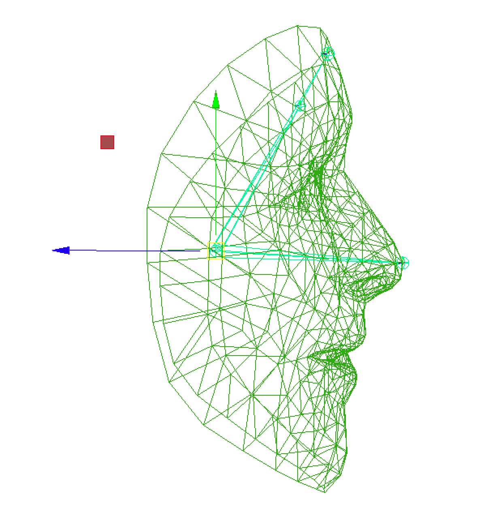
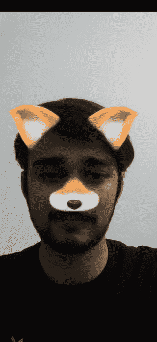

# 在安卓中使用 ARCore 增强人脸

> 原文:[https://www . geeksforgeeks . org/Android 中带有 arcore 的增强人脸/](https://www.geeksforgeeks.org/augmented-faces-with-arcore-in-android/)

增强面允许应用程序自然地区分个人面部的各个区域，并利用这些区域来覆盖资源，例如，以适当匹配个人面部的轮廓和区域的方式覆盖表面和模型。ARCore 是在安卓上构建增强现实应用的一个平台。增强人脸是 ARCore 的一个子系统，它允许您的应用程序:

*   自然地，识别任何个人识别的面部的各个区域，并利用这些区域来覆盖资源，例如，以适当匹配个人面部的轮廓和区域的方式覆盖表面和模型。
*   利用 ARCore 提供的 468 点面网格，在一个不同的面上应用自定义纹理。

> **例如，我们可以创建动画面具、眼镜、虚拟帽子等效果，执行皮肤修饰，或者下一个 Snapchat App。**

## 这一切是如何运作的？

增强人脸不需要不常见或特殊的硬件，如深度传感器。相反，它使用手机的摄像头和机器学习来提供三个数据片段:

1.  **生成一个人脸网格:**一个 468 点密集的 3D 人脸网格，可以让你平移精确跟随面部瞬间的细节纹理。
2.  **识别姿势:**人脸上的点，基于生成的人脸网格进行锚定，这对于在太阳穴和鼻子上或附近放置效果非常有用。
3.  基于人脸网格生成和识别的区域，覆盖和定位纹理和三维模型。

## ARCore 如何在没有任何深度硬件的情况下从 2D 图像中提供三维人脸网格？

它使用构建在 TensorFlow Lite 平台之上的机器学习模型来实现这一点，交叉管道经过优化，可以在设备上实时运行。它使用一种称为转移学习的技术，其中我们为两个目标训练神经网络，一个是预测三维顶点，另一个是预测 2D 轮廓。为了预测三维顶点，我们用一个合成的三维数据集对其进行训练，并使用这个神经网络作为下一阶段训练的起点。


在下一阶段，它使用带注释的数据集，带注释的真实世界数据集来训练用于 2D 轮廓预测的模型。生成的网络不仅可以从合成数据集中预测三维顶点，还可以从 2D 图像中表现良好。为了确保该解决方案适用于每个人，ARCore 开发人员使用地理上不同的数据集训练网络，以便它适用于所有类型的人脸、宽脸、高脸和所有类型的肤色。

为了在移动设备上实现这些复杂的算法，我们在 ARCore 中内置了多种自适应算法。这些算法动态感知处理先前图像所花费的时间，并相应地调整管道的各种参数。它使用多个 ML 模型，一个为更高质量而优化，另一个为更高性能而优化，当计算资源确实具有挑战性时。它还调整管道参数，如推断率，以便跳过一些图像，取而代之的是插值数据。通过所有这些技术，您可以为用户带来全帧速率体验。因此，它在处理 ARCore 内部的所有这些技术时，以全相机帧速率提供人脸网格和区域姿态。

## 识别增强的人脸网格

为了在识别的人脸上适当地覆盖纹理和三维模型，ARCore 提供了检测到的区域和增强的人脸网格。该网格是面部的虚拟描绘，包括顶点、面部区域和用户头部的焦点。当摄像机识别出用户的面部时，ARCore 会执行以下步骤来生成增强的面部网格以及中心和区域姿态:

*   它区分了中心姿势和面部网格。
    *   位于鼻子后面的中心姿势是用户头部的实际中心点(换句话说，在头骨内部)。
    *   面网格由构成面的许多顶点组成，并且相对于中心姿态被特征化。



*   AugmentedFace 类利用人脸网格和中心姿态来区分客户端人脸上的人脸区域。这些地区是:
    *   右眉毛(右额头)
    *   左太阳穴(左额头)
    *   鼻尖

面部网格、中心姿势和面部区域姿势被增强的面部应用程序接口用作定位点和区域，以在应用程序中放置资源。


**468 点人脸纹理网格**

## 参考术语

*   **可跟踪**:可跟踪是 ARCore 可以跟随的接口，也是锚可以连接的接口。
*   **锚点**:描述现实世界中一个固定的位置和方位。为了停留在物理空间的固定位置，随着 ARCore 对空间理解的提高，该位置的数字描述也会更新。锚点是可哈希的，例如可以用作哈希映射中的键。
*   **姿势**:在需要陈述场景的时候，需要放置物体，并且需要根据场景的坐标指定位置。姿势是你陈述的方式。
*   **会话:**处理 AR 框架状态，处理会话生命周期。这个类提供了访问 ARCore 应用编程接口的主要途径。该类允许用户进行会话、配置会话、启动或停止会话，最重要的是，接收允许访问相机图像和设备姿态的帧。
*   **纹理:**纹理对增强面特别有帮助。这允许你制作一个灯光覆盖，与识别的面部区域对齐，以增加你的体验。
*   **ArFragment:** ARCore 利用了一个 ArFragment，该 ArFragment 提供了许多功能，例如，平面查找、权限处理和摄像机设置。您可以在您的活动中合法地使用片段，但是无论您在什么时候需要自定义功能，例如，增强面，您都应该扩展 ArFragment 并设置适当的设置。这个片段是隐藏所有复合素材(如 OpenGL、渲染模型等)的层，并给出加载和渲染 3D 模型的高级 API。
*   **模型可渲染:**模型可渲染通过将 3D 模型附着到节点来渲染 3D 模型。
*   **Sceneform SDK:**Sceneform SDK 是安卓的另一个库，支持在您的应用程序中快速创建和混合增强现实体验。它加入了 ARCore 和一个惊人的基于物理的 3D 渲染器。

## 示例项目

我们将**创建 Snapchat、Instagram 和抖音等人脸滤镜。** 下面给出了一个 GIF 示例，来了解一下在本文中我们要做什么。注意，我们将使用 **Java** 语言来实现这个项目。



**第一步:创建新项目**

要在安卓工作室创建新项目，请参考[如何在安卓工作室创建/启动新项目](https://www.geeksforgeeks.org/android-how-to-create-start-a-new-project-in-android-studio/)。注意选择 **Java** 作为编程语言。

**第二步:添加本例使用的资产文件**

在样本数据/模型文件夹中添加任何 3D 模型。我们可以通过在项目文件目录中创建一个新文件夹或者直接从安卓工作室创建一个新文件夹来实现这一点。允许的 3D 模型扩展包括。fbx，。网上有很多免费的模型。您可以访问这里的[或更多。您可以从](https://poly.google.com/)[这里](https://drive.google.com/drive/folders/1KgTbs6SwiEJN-j0gP_IzWMGKZyitT3GH?usp=sharing)下载本例中使用的资产。请参考这篇文章[在安卓工作室](https://www.geeksforgeeks.org/resource-raw-folder-in-android-studio/)创建一个原始文件夹。然后只需将 **fox_face.sfb** 文件复制粘贴到 raw 文件夹即可。同样，将**fox _ face _ mesh _ texture . png**文件复制粘贴到[可绘制](https://www.geeksforgeeks.org/how-to-add-image-to-drawable-folder-in-android-studio/amp/?ref=rp)文件夹。

**第 3 步:向 build.gradle(:app)文件添加依赖项**

将以下依赖项添加到[**build . gradle(:app)**](https://www.geeksforgeeks.org/android-build-gradle/)**文件中。**

> **//提供 ARCore 会话和相关资源。**
> 
> **实现' com.google.ar:core:1.16.0 '**
> 
> **//提供 ArFragment 和其他 UX 资源。**
> 
> **实现' com . Google . ar . sceneform . UX:sceneform-UX:1 . 15 . 0 '**
> 
>  **//或者，使用没有 UX 依赖关系的 ArSceneView。
> 
> 实现' com . Google . ar . sceneform:core:1 . 8 . 0 '**

**将以下代码片段添加到 build.grdale 文件中。这是转换**所必需的(仅一次)。fbx 资产进入。sfb** 并将其保存在原始文件夹中。或者您可以按照步骤 2 中的操作自己添加它们。**

> **//需要(仅一次)转换。fbx 资产进入。sfb**
> 
> **//并保存在原始文件夹中**
> 
> **scene form . asset(' sample data/models/fox _ face . fbx '，**
> 
> **默认'，**
> 
> **sampleData/models/fox_face.sfa '，**
> 
> **src/main/res/raw/fox_face ')**

****第 4 步:向 build.gradle(:project)文件添加依赖项****

**将以下依赖项添加到 **build.gradle(:project)** 文件中。**

> **//将场景格式插件类路径添加到项目中**
> 
> **// level build.gradle 文件**
> 
> **类路径“com . Google . ar . sceneform:plugin:1 . 15 . 0”**

****第 5 步:使用 AndroidManifest.xml 文件****

**在 **AndroidManifest.xml** 文件中添加以下一行。**

> **//无论是“增强现实可选”还是“增强现实必需”应用都需要相机许可。**
> 
> **//表示应用程序需要 ARCore(“需要 AR”)。确保应用程序仅**
> 
> **//在谷歌 Play 商店支持 ARCore 的设备上可见。**
> 
>  **//对于“增强现实可选”应用，删除这一行。→
> 
> <uses-feature android:name="”android.hardware.camera.ar”"></uses-feature>
> 
> …
> 
> //表示应用程序需要 ARCore(“需要 AR”)。导致谷歌
> 
> //播放商店下载并安装 ARCore 以及应用程序。
> 
> //对于“AR 可选”应用，请指定“可选”而不是“必需”。
> 
> <meta-data android:name="”com.google.ar.core”" android:value="”required”"></meta-data>
> 
> …**

**下面是 **AndroidManifest.xml** 文件的完整代码。**

## **可扩展标记语言**

```
<?xml version="1.0" encoding="utf-8"?>
<manifest xmlns:android="http://schemas.android.com/apk/res/android"
    package="com.example.arsnapchat">

    <uses-feature
        android:name="android.hardware.camera"
        android:required="true" />

    <uses-permission android:name="android.permission.CAMERA" />
    <uses-permission android:name="android.permission.INTERNET" />

    <uses-feature
        android:name="android.hardware.camera.ar"
        android:required="true" />
    <uses-feature android:name="android.hardware.camera.autofocus" />

    <uses-feature
        android:glEsVersion="0x00020000"
        android:required="true" />

    <application
        android:allowBackup="true"
        android:icon="@mipmap/ic_launcher"
        android:label="@string/app_name"
        android:roundIcon="@mipmap/ic_launcher_round"
        android:supportsRtl="true"
        android:theme="@style/AppTheme">
        <meta-data
            android:name="com.google.ar.core"
            android:value="required" />
        <activity android:name=".MainActivity">
            <intent-filter>
                <action android:name="android.intent.action.MAIN" />

                <category android:name="android.intent.category.LAUNCHER" />
            </intent-filter>
        </activity>
    </application>

</manifest>
```

 ****第六步:修改 activity_main.xml 文件****

**我们已经在 **activity_main.xml 文件中添加了一个[片段](https://www.geeksforgeeks.org/introduction-fragments-android/)。**下面是 **activity_main.xml** 文件的代码。**

## **可扩展标记语言**

```
<?xml version="1.0" encoding="utf-8"?>
<androidx.constraintlayout.widget.ConstraintLayout
    xmlns:android="http://schemas.android.com/apk/res/android"
    xmlns:tools="http://schemas.android.com/tools"
    android:layout_width="match_parent"
    android:layout_height="match_parent"
    tools:context=".MainActivity">

    <fragment
        android:id="@+id/arFragment"
        android:name="com.example.arsnapchat.CustomArFragment"
        android:layout_width="match_parent"
        android:layout_height="match_parent" />

</androidx.constraintlayout.widget.ConstraintLayout>
```

> ****注:****
> 
> **请将您的包名添加到该属性中。**
> 
> **Android:name = " com . example . arsnapchat .习惯片段"**

****第 7 步:创建一个新的 Java 类****

**创建一个新的类，并将文件命名为**习惯片段**，它扩展了**片段**。以下是**CustomArFragment.java**文件的代码。**

## **Java 语言(一种计算机语言，尤用于创建网站)**

```
import android.os.Bundle;
import android.view.LayoutInflater;
import android.view.View;
import android.view.ViewGroup;
import android.widget.FrameLayout;
import androidx.annotation.Nullable;
import com.google.ar.core.Config;
import com.google.ar.core.Session;
import com.google.ar.sceneform.ux.ArFragment;
import java.util.EnumSet;
import java.util.Set;

public class CustomArFragment extends ArFragment {
    @Override
    protected Config getSessionConfiguration(Session session) {
        Config config = new Config(session);

        // Configure 3D Face Mesh
        config.setAugmentedFaceMode(Config.AugmentedFaceMode.MESH3D);
        this.getArSceneView().setupSession(session);
        return config;
    }

    @Override
    protected Set<Session.Feature> getSessionFeatures() {
        // Configure Front Camera
        return EnumSet.of(Session.Feature.FRONT_CAMERA);
    }

    // Override to turn off planeDiscoveryController.
    // Plane traceable are not supported with the front camera.
    @Override
    public View onCreateView(LayoutInflater inflater, @Nullable ViewGroup container, @Nullable Bundle savedInstanceState) {
        FrameLayout frameLayout = (FrameLayout) super.onCreateView(inflater, container, savedInstanceState);
        getPlaneDiscoveryController().hide();
        getPlaneDiscoveryController().setInstructionView(null);
        return frameLayout;
    }
}
```

****第八步:修改****MainActivity.java 文件****

**以下是**MainActivity.java**文件的代码。代码中添加了注释，以更详细地理解代码。**

## **Java 语言(一种计算机语言，尤用于创建网站)**

```
import android.os.Bundle;
import android.widget.Toast;
import androidx.appcompat.app.AppCompatActivity;
import com.google.ar.core.AugmentedFace;
import com.google.ar.core.Frame;
import com.google.ar.core.TrackingState;
import com.google.ar.sceneform.rendering.ModelRenderable;
import com.google.ar.sceneform.rendering.Renderable;
import com.google.ar.sceneform.rendering.Texture;
import com.google.ar.sceneform.ux.AugmentedFaceNode;
import java.util.Collection;
import java.util.HashMap;
import java.util.Iterator;
import java.util.Map;

public class MainActivity extends AppCompatActivity {
    private ModelRenderable modelRenderable;
    private Texture texture;
    private boolean isAdded = false;
    private final HashMap<AugmentedFace, AugmentedFaceNode> faceNodeMap = new HashMap<>();

    @Override
    protected void onCreate(Bundle savedInstanceState) {
        super.onCreate(savedInstanceState);
        setContentView(R.layout.activity_main);

        CustomArFragment customArFragment = (CustomArFragment) getSupportFragmentManager().findFragmentById(R.id.arFragment);

        // Use ModelRenderable.Builder to load the *.sfb
        // models at runtime.
        // Load the face regions renderable.
        // To ensure that the asset doesn't cast or receive
        // shadows in the scene, ensure that setShadowCaster
        // and setShadowReceiver are both set to false.
        ModelRenderable.builder()
                .setSource(this, R.raw.fox_face)
                .build()
                .thenAccept(rendarable -> {
                    this.modelRenderable = rendarable;
                    this.modelRenderable.setShadowCaster(false);
                    this.modelRenderable.setShadowReceiver(false);

                })
                .exceptionally(throwable -> {
                    Toast.makeText(this, "error loading model", Toast.LENGTH_SHORT).show();
                    return null;
                });

        // Load the face mesh texture.(2D texture on face)
        // Save the texture(.png file) in drawable folder.
        Texture.builder()
                .setSource(this, R.drawable.fox_face_mesh_texture)
                .build()
                .thenAccept(textureModel -> this.texture = textureModel)
                .exceptionally(throwable -> {
                    Toast.makeText(this, "cannot load texture", Toast.LENGTH_SHORT).show();
                    return null;
                });

        assert customArFragment != null;

        // This is important to make sure that the camera
        // stream renders first so that the face mesh
        // occlusion works correctly.
        customArFragment.getArSceneView().setCameraStreamRenderPriority(Renderable.RENDER_PRIORITY_FIRST);
        customArFragment.getArSceneView().getScene().addOnUpdateListener(frameTime -> {
            if (modelRenderable == null || texture == null) {
                return;
            }
            Frame frame = customArFragment.getArSceneView().getArFrame();
            assert frame != null;

            // Render the effect for the face Rendering the effect involves these steps:
            // 1.Create the Sceneform face node.
            // 2.Add the face node to the Sceneform scene.
            // 3.Set the face region Renderable. Extracting the face mesh and
            // rendering the face effect is added to a listener on
            // the scene that gets called on every processed camera frame.
            Collection<AugmentedFace> augmentedFaces = frame.getUpdatedTrackables(AugmentedFace.class);

            // Make new AugmentedFaceNodes for any new faces.
            for (AugmentedFace augmentedFace : augmentedFaces) {
                if (isAdded) return;

                AugmentedFaceNode augmentedFaceMode = new AugmentedFaceNode(augmentedFace);
                augmentedFaceMode.setParent(customArFragment.getArSceneView().getScene());
                augmentedFaceMode.setFaceRegionsRenderable(modelRenderable);
                augmentedFaceMode.setFaceMeshTexture(texture);
                faceNodeMap.put(augmentedFace, augmentedFaceMode);
                isAdded = true;

                // Remove any AugmentedFaceNodes associated with
                // an AugmentedFace that stopped tracking.
                Iterator<Map.Entry<AugmentedFace, AugmentedFaceNode>> iterator = faceNodeMap.entrySet().iterator();
                Map.Entry<AugmentedFace, AugmentedFaceNode> entry = iterator.next();
                AugmentedFace face = entry.getKey();
                while (face.getTrackingState() == TrackingState.STOPPED) {
                    AugmentedFaceNode node = entry.getValue();
                    node.setParent(null);
                    iterator.remove();
                }
            }
        });
    }
}
```

### **输出:在物理设备上运行**

**<video class="wp-video-shortcode" id="video-520288-1" width="640" height="360" preload="metadata" controls=""><source type="video/mp4" src="https://media.geeksforgeeks.org/wp-content/uploads/20201120194043/output.mp4?_=1">[https://media.geeksforgeeks.org/wp-content/uploads/20201120194043/output.mp4](https://media.geeksforgeeks.org/wp-content/uploads/20201120194043/output.mp4)</video>**

****Github 项目链接:**[**https://github . com/raghavtilak/increased faces**](https://github.com/raghavtilak/AugmentedFaces)**

## **氩核的局限性**

1.  **增强人脸仅适用于前置摄像头。**
2.  **并非所有设备都支持 ARCore。仍有一小部分设备不支持增强现实核心。您可以在[https://developers.google.com/ar/discover/supported-devices](https://developers.google.com/ar/discover/supported-devices)查看 ARCore 支持的设备列表。**
3.  **对于 AR 可选应用 minSdkVersion 应为 14，对于 AR 必需应用 minSdkVersion 应为 24。**
4.  **如果你的应用属于需要增强现实的应用，那么使用它的设备应该安装增强现实核心。**

> ****备注:****
> 
> 1.  **在进行会话之前，必须事先验证 ARCore 是否已安装并且是最新的。如果没有安装 ARCore，则会话创建可能会失败，ARCore 的任何后续安装或升级都需要重新启动应用程序，并可能导致应用程序被终止。**
> 2.  **对于虚幻、安卓和统一，人脸网格的方向是不同的。**
> 3.  **调用 Trackable.createAnchor(Pose)将导致 IllegalStateException，因为增强面只支持前置(自拍)相机，不支持附加锚点。**