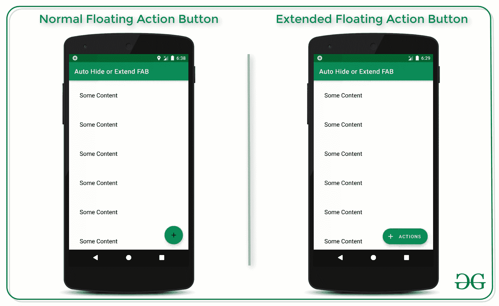
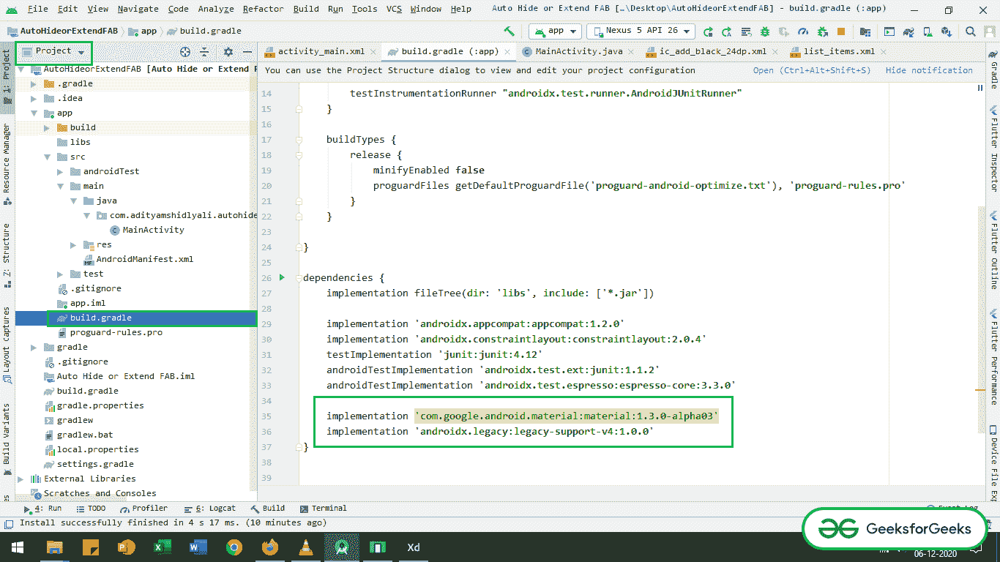
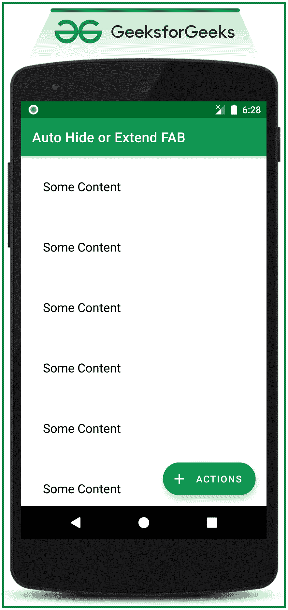
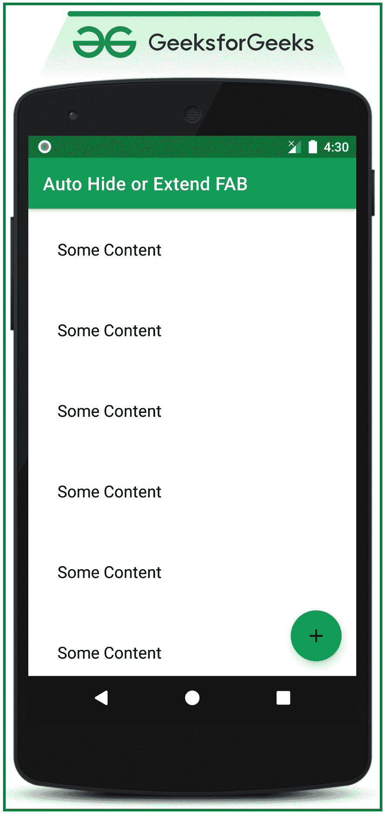

# 安卓系统中嵌套滚动视图的自动隐藏或自动扩展浮动动作按钮

> 原文:[https://www . geesforgeks . org/auto-hide-or-auto-extend-floating-action-button-for-nested croll view-in-Android/](https://www.geeksforgeeks.org/auto-hide-or-auto-extend-floating-action-button-for-nestedscrollview-in-android/)

在上一篇文章[中，通过示例](https://www.geeksforgeeks.org/extended-floating-action-button-in-android-with-example/)讨论了如何在安卓系统中实现扩展浮动操作按钮(FAB)及其更多功能。在本文中，我们已经讨论过它是安卓中自动隐藏或自动扩展浮动动作按钮的特性之一。看看下面这张关于本文讨论的事情的图片。在本文中，使用了嵌套滚动视图。



## **实现自动隐藏或自动扩展浮动动作按钮的步骤**

**第一步:创建一个空的活动项目**

*   创建一个空的 Android 工作室活动。并选择 Java 作为编程语言。
*   参考[安卓|如何在安卓工作室创建/启动新项目？](https://www.geeksforgeeks.org/android-how-to-create-start-a-new-project-in-android-studio/)了解如何创建一个空的活动 Android Studio 项目。

**步骤 2:调用应用级渐变文件**中的依赖关系

*   首先，在***app->build . gradle .***中找到 app 级 gradle 文件
*   调用应用程序级渐变文件的以下依赖项。
*   确保系统已连接到网络，以便下载所需的依赖项。

> **材料设计扩展浮动动作按钮:**
> 
> 实现' com . Google . Android . material:material:1 . 3 . 0-alpha 03 '
> 
> **对于嵌套的卷轴视图：**
> 
> 实现“androidx . legacy:legacy-support-v4:1 . 0 . 0”

*   如果找不到应用程序级渐变文件并调用依赖项，请参考下图。



**第三步:在布局文件夹**内创建样本列表 _item.xml

*   仅用一个[文本视图](https://www.geeksforgeeks.org/textview-widget-in-android-using-java-with-examples/)实现样本列表项。
*   在布局文件夹下的 list_item.xml 文件中调用以下代码。

## 可扩展标记语言

```
<?xml version="1.0" encoding="utf-8"?>
<TextView 
    xmlns:android="http://schemas.android.com/apk/res/android"
    xmlns:tools="http://schemas.android.com/tools"
    android:id="@+id/listView"
    android:layout_width="match_parent"
    android:layout_height="wrap_content"
    android:padding="32dp"
    android:text="Some Content"
    android:textColor="@android:color/black"
    android:textSize="18sp"
    tools:ignore="HardcodedText">
</TextView>
```

**第 4 步:使用 activity_main.xml 文件**

*   根布局应该是 activity_main.xml 中的协调器布局
*   此外，嵌套滚动视图和一个扩展浮动动作按钮在布局中以重力 ***“底部|末端”实现。**T3】*
*   在 ***内嵌套的滚动视图*** 布局样本布局是为了演示目的而包含的。
*   在 activity_main.xml 文件中调用以下代码来实现所需的用户界面。

## 可扩展标记语言

```
<?xml version="1.0" encoding="utf-8"?>
<androidx.coordinatorlayout.widget.CoordinatorLayout 
    xmlns:android="http://schemas.android.com/apk/res/android"
    xmlns:app="http://schemas.android.com/apk/res-auto"
    xmlns:tools="http://schemas.android.com/tools"
    android:layout_width="match_parent"
    android:layout_height="match_parent"
    tools:context=".MainActivity"
    tools:ignore="HardcodedText">

    <androidx.core.widget.NestedScrollView
        android:id="@+id/nestedScrollView"
        android:layout_width="match_parent"
        android:layout_height="match_parent">

        <LinearLayout
            android:layout_width="match_parent"
            android:layout_height="wrap_content"
            android:orientation="vertical">

            <!--repeatedly invoke the list_item layout
                 inside the NestedScrollView-->
            <!--this consumes lot memory resource from the device,
                 this is done only for demonstration purposes-->
            <include layout="@layout/list_item" />

            <include layout="@layout/list_item" />

            <include layout="@layout/list_item" />

            <include layout="@layout/list_item" />

            <include layout="@layout/list_item" />

            <include layout="@layout/list_item" />

            <include layout="@layout/list_item" />

            <include layout="@layout/list_item" />

            <include layout="@layout/list_item" />

            <include layout="@layout/list_item" />

            <include layout="@layout/list_item" />

            <include layout="@layout/list_item" />

            <include layout="@layout/list_item" />

            <include layout="@layout/list_item" />

            <include layout="@layout/list_item" />

        </LinearLayout>

    </androidx.core.widget.NestedScrollView>

    <com.google.android.material.floatingactionbutton.ExtendedFloatingActionButton
        android:id="@+id/extFloatingActionButton"
        android:layout_width="wrap_content"
        android:layout_height="wrap_content"
        android:layout_gravity="end|bottom"
        android:layout_marginEnd="16dp"
        android:layout_marginBottom="16dp"
        android:backgroundTint="@color/colorPrimary"
        android:text="ACTIONS"
        android:textColor="@android:color/white"
        app:icon="@drawable/ic_add_black_24dp"
        app:iconTint="@android:color/white" />

</androidx.coordinatorlayout.widget.CoordinatorLayout>
```

**输出 UI:**



**步骤 5:现在使用 MainActivity.java 文件**

*   有一个需要处理的 ***嵌套的*** 与 ***在 OnScrollChangeListener 上。*** 如果嵌套滚动视图向下滚动，则扩展浮动操作按钮应处于收缩状态，当向上滚动时，FAB 应处于扩展状态。
*   调用以下代码来实现功能。添加注释是为了更好地理解。

## Java 语言(一种计算机语言，尤用于创建网站)

```
import androidx.appcompat.app.AppCompatActivity;
import androidx.core.widget.NestedScrollView;
import android.os.Bundle;
import com.google.android.material.floatingactionbutton.ExtendedFloatingActionButton;
public class MainActivity extends AppCompatActivity {

    @Override
    protected void onCreate(Bundle savedInstanceState) {
        super.onCreate(savedInstanceState);
        setContentView(R.layout.activity_main);

        // register the extended floating action Button
        final ExtendedFloatingActionButton extendedFloatingActionButton = findViewById(R.id.extFloatingActionButton);

        // register the nestedScrollView from the main layout
        NestedScrollView nestedScrollView = findViewById(R.id.nestedScrollView);

        // handle the nestedScrollView behaviour with OnScrollChangeListener
        // to extend or shrink the Extended Floating Action Button
        nestedScrollView.setOnScrollChangeListener(new NestedScrollView.OnScrollChangeListener() {
            @Override
            public void onScrollChange(NestedScrollView v, int scrollX, int scrollY, int oldScrollX, int oldScrollY) {
                // the delay of the extension of the FAB is set for 12 items
                if (scrollY > oldScrollY + 12 && extendedFloatingActionButton.isExtended()) {
                    extendedFloatingActionButton.shrink();
                }

                // the delay of the extension of the FAB is set for 12 items
                if (scrollY < oldScrollY - 12 && !extendedFloatingActionButton.isExtended()) {
                    extendedFloatingActionButton.extend();
                }

                // if the nestedScrollView is at the first item of the list then the
                // extended floating action should be in extended state
                if (scrollY == 0) {
                    extendedFloatingActionButton.extend();
                }
            }
        });
    }
}
```

### **输出:在仿真器上运行**

<video class="wp-video-shortcode" id="video-525126-1" width="640" height="360" preload="metadata" controls=""><source type="video/mp4" src="https://media.geeksforgeeks.org/wp-content/uploads/20201206183358/GFG_nexus.mp4?_=1">[https://media.geeksforgeeks.org/wp-content/uploads/20201206183358/GFG_nexus.mp4](https://media.geeksforgeeks.org/wp-content/uploads/20201206183358/GFG_nexus.mp4)</video>

### **现在用正常浮动动作按钮**代替扩展浮动动作按钮

*   将扩展浮动动作按钮替换为正常浮动动作按钮，以隐藏向下滚动时的 FAB，向上滚动时 FAB 应该出现。
*   在 activity_main.xml 文件中调用以下代码。在这里，扩展工厂被普通工厂取代。

## 可扩展标记语言

```
<?xml version="1.0" encoding="utf-8"?>
<androidx.coordinatorlayout.widget.CoordinatorLayout 
    xmlns:android="http://schemas.android.com/apk/res/android"
    xmlns:app="http://schemas.android.com/apk/res-auto"
    xmlns:tools="http://schemas.android.com/tools"
    android:layout_width="match_parent"
    android:layout_height="match_parent"
    tools:context=".MainActivity"
    tools:ignore="HardcodedText">

    <androidx.core.widget.NestedScrollView
        android:id="@+id/nestedScrollView"
        android:layout_width="match_parent"
        android:layout_height="match_parent">

        <LinearLayout
            android:layout_width="match_parent"
            android:layout_height="wrap_content"
            android:orientation="vertical">

            <!--repeatedly invoke the list_item layout
                 inside the NestedScrollView-->
            <!--this consumes lot memory resource from the device, 
                this is done only for demonstration purposes-->
            <include layout="@layout/list_item" />

            <include layout="@layout/list_item" />

            <include layout="@layout/list_item" />

            <include layout="@layout/list_item" />

            <include layout="@layout/list_item" />

            <include layout="@layout/list_item" />

            <include layout="@layout/list_item" />

            <include layout="@layout/list_item" />

            <include layout="@layout/list_item" />

            <include layout="@layout/list_item" />

            <include layout="@layout/list_item" />

            <include layout="@layout/list_item" />

            <include layout="@layout/list_item" />

            <include layout="@layout/list_item" />

            <include layout="@layout/list_item" />

        </LinearLayout>

    </androidx.core.widget.NestedScrollView>

    <com.google.android.material.floatingactionbutton.FloatingActionButton
        android:id="@+id/extFloatingActionButton"
        android:layout_width="wrap_content"
        android:layout_height="wrap_content"
        android:layout_gravity="end|bottom"
        android:layout_marginEnd="16dp"
        android:layout_marginBottom="16dp"
        android:backgroundTint="@color/colorPrimary"
        android:text="ACTIONS"
        android:textColor="@android:color/white"
        app:srcCompat="@drawable/ic_add_black_24dp" />

</androidx.coordinatorlayout.widget.CoordinatorLayout>
```

**输出 UI:**



*   现在调用**MainActivity.java**文件中的以下代码来显示或隐藏浮动动作按钮。

## Java 语言(一种计算机语言，尤用于创建网站)

```
import androidx.appcompat.app.AppCompatActivity;
import androidx.core.widget.NestedScrollView;
import android.os.Bundle;
import com.google.android.material.floatingactionbutton.FloatingActionButton;

public class MainActivity extends AppCompatActivity {

    @Override
    protected void onCreate(Bundle savedInstanceState) {
        super.onCreate(savedInstanceState);
        setContentView(R.layout.activity_main);

        // register the floating action Button
        final FloatingActionButton extendedFloatingActionButton = findViewById(R.id.extFloatingActionButton);

        // register the nestedScrollView from the main layout
        NestedScrollView nestedScrollView = findViewById(R.id.nestedScrollView);

        // handle the nestedScrollView behaviour with OnScrollChangeListener
        // to hide or show the Floating Action Button
        nestedScrollView.setOnScrollChangeListener(new NestedScrollView.OnScrollChangeListener() {
            @Override
            public void onScrollChange(NestedScrollView v, int scrollX, int scrollY, int oldScrollX, int oldScrollY) {
                // the delay of the extension of the FAB is set for 12 items
                if (scrollY > oldScrollY + 12 && extendedFloatingActionButton.isShown()) {
                    extendedFloatingActionButton.hide();
                }

                // the delay of the extension of the FAB is set for 12 items
                if (scrollY < oldScrollY - 12 && !extendedFloatingActionButton.isShown()) {
                    extendedFloatingActionButton.show();
                }

                // if the nestedScrollView is at the first item of the list then the
                // floating action should be in show state
                if (scrollY == 0) {
                    extendedFloatingActionButton.show();
                }
            }
        });
    }
}
```

### **输出:在仿真器上运行**

<video class="wp-video-shortcode" id="video-525126-2" width="640" height="360" preload="metadata" controls=""><source type="video/mp4" src="https://media.geeksforgeeks.org/wp-content/uploads/20201206182604/GFG_nexus_5.mp4?_=2">[https://media.geeksforgeeks.org/wp-content/uploads/20201206182604/GFG_nexus_5.mp4](https://media.geeksforgeeks.org/wp-content/uploads/20201206182604/GFG_nexus_5.mp4)</video>