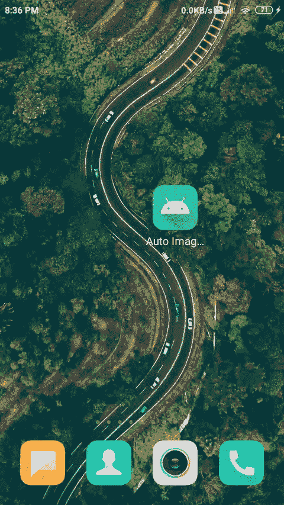

# 安卓中的自动图像滑块示例

> 原文:[https://www . geesforgeks . org/auto-image-slider-in-Android-with-example/](https://www.geeksforgeeks.org/auto-image-slider-in-android-with-example/)

自动图像滑块是安卓系统中最常见的用户界面组件之一。这种类型的滑块主要出现在大型电子商务网站的应用程序中，如 Flipkart、亚马逊等。自动图像滑块用于以幻灯片的形式表示在特定时间间隔后发生变化的数据。在本文中，我们将了解如何在安卓系统上创建自动图像滑块。我们将使用 SliderView 库在我们的应用程序中添加这种类型的用户界面组件。

> **注意:**你也可以使用 ViewPager 参考安卓系统中的[图像滑块。](https://www.geeksforgeeks.org/image-slider-in-android-using-viewpager/)

现在我们将看到这个幻灯片视图在安卓系统中的实现。

## 例子

下面给出了一个 GIF 示例，来了解一下在本文中要做什么。请注意，我们将使用 **Java** 语言来实现这个项目。



### 逐步实施

**第一步:创建新项目**

要在安卓工作室创建新项目，请参考[如何在安卓工作室创建/启动新项目。](https://www.geeksforgeeks.org/android-how-to-create-start-a-new-project-in-android-studio/)注意选择 **Java** 作为编程语言。

**第二步:在 build.gradle 文件**中添加滑块视图的依赖关系

导航到梯度脚本，然后导航到构建.梯度(模块)级别。在 dependencies 部分的 build.gradle 文件中添加以下行。

> //相关性排序滑块视图
> 
> 实现' com . github . smart eist:autoimageslider:1 . 3 . 9 '
> 
> //从 url 加载图像的依赖关系
> 
> 实现“com . github . bumptech . glide:glide:4 . 11 . 0”

**第三步:在 AndroidManifest.xml 文件**中添加互联网权限

导航至**应用程序>货单**打开货单文件并添加以下两行。

**第 4 步:使用 activity_main.xml 文件**

转到 **activity_main.xml** 文件，参考以下代码。下面是 **activity_main.xml** 文件的代码。

## 可扩展标记语言

```
<?xml version="1.0" encoding="utf-8"?>
<RelativeLayout 
    xmlns:android="http://schemas.android.com/apk/res/android"
    xmlns:app="http://schemas.android.com/apk/res-auto"
    xmlns:tools="http://schemas.android.com/tools"
    android:layout_width="match_parent"
    android:layout_height="match_parent"
    tools:context=".MainActivity">

    <!--
    slideranimation duration is to set duration for transition between two slides
    sliderautocycledirection is to set animationbetween transition of your slides
    sliderindicator enables is used to display the indicators for slider
    slider indicator gravity is to set gravity for indicator gravity
    slider indicator margin is to set margin for indicator
    slider indicator orientation is used to add orientation for slider
    slider indicator padding is use to add padding to indicator
    slider indicator selected color is use to specify selected color
    and slider indicator unselected color is use to specify the color when the slider is unselected
    slider scroll time in sec is used to specify scrolling time in seconds
    -->
    <com.smarteist.autoimageslider.SliderView
        android:id="@+id/slider"
        android:layout_width="match_parent"
        android:layout_height="150dp"
        android:layout_centerInParent="true"
        app:sliderAnimationDuration="600"
        app:sliderAutoCycleDirection="back_and_forth"
        app:sliderIndicatorAnimationDuration="600"
        app:sliderIndicatorEnabled="true"
        app:sliderIndicatorGravity="center_horizontal|bottom"
        app:sliderIndicatorMargin="15dp"
        app:sliderIndicatorOrientation="horizontal"
        app:sliderIndicatorPadding="3dp"
        app:sliderIndicatorRadius="2dp"
        app:sliderIndicatorSelectedColor="#5A5A5A"
        app:sliderIndicatorUnselectedColor="#FFF"
        app:sliderScrollTimeInSec="1" />

</RelativeLayout>
```

**第五步:创建一个新的模态类来存储数据**

导航到应用程序> java >你的应用程序的包名，然后右击它和 New > Java 类，将你的 Model 类命名为 **SliderData** ，并在该 Java 类内部的代码下面。下面是**SliderData.java**文件的代码。代码中添加了注释，以更详细地理解代码。

## Java 语言(一种计算机语言，尤用于创建网站)

```
public class SliderData {

    // image url is used to 
    // store the url of image
    private String imgUrl;

    // Constructor method.
    public SliderData(String imgUrl) {
        this.imgUrl = imgUrl;
    }

    // Getter method
    public String getImgUrl() {
        return imgUrl;
    }

    // Setter method
    public void setImgUrl(String imgUrl) {
        this.imgUrl = imgUrl;
    }
}
```

**第 6 步:为 SliderView** 的项目创建一个 XML 文件

导航到应用程序>资源>布局>右键单击它并选择新建>布局资源文件，然后将您的 XML 文件命名为 **slider_layout.xml** 。创建此文件后，向其中添加以下代码。

## 可扩展标记语言

```
<?xml version="1.0" encoding="utf-8"?>
<RelativeLayout 
    xmlns:android="http://schemas.android.com/apk/res/android"
    android:layout_width="match_parent"
    android:layout_height="match_parent">

    <!--Image we will display is our slider view-->
    <ImageView
        android:id="@+id/myimage"
        android:layout_width="400dp"
        android:layout_height="300dp"
        android:layout_centerHorizontal="true"
        android:contentDescription="@string/app_name" />

</RelativeLayout>
```

**第 7 步:创建适配器类，为我们的幻灯片视图**的每个项目设置数据

导航到应用程序> java >你的应用程序的包名，然后右击它和 New > Java 类，把你的类命名为 **SliderAdapter** 和下面那个 Java 类里面的代码。下面是**SliderAdapter.java**文件的代码。代码中添加了注释，以更详细地理解代码。

## Java 语言(一种计算机语言，尤用于创建网站)

```
import android.content.Context;
import android.view.LayoutInflater;
import android.view.View;
import android.view.ViewGroup;
import android.widget.ImageView;

import com.bumptech.glide.Glide;
import com.smarteist.autoimageslider.SliderViewAdapter;

import java.util.ArrayList;
import java.util.List;

public class SliderAdapter extends SliderViewAdapter<SliderAdapter.SliderAdapterViewHolder> {

    // list for storing urls of images.
    private final List<SliderData> mSliderItems;

    // Constructor
    public SliderAdapter(Context context, ArrayList<SliderData> sliderDataArrayList) {
        this.mSliderItems = sliderDataArrayList;
    }

    // We are inflating the slider_layout 
    // inside on Create View Holder method.
    @Override
    public SliderAdapterViewHolder onCreateViewHolder(ViewGroup parent) {
        View inflate = LayoutInflater.from(parent.getContext()).inflate(R.layout.slider_layout, null);
        return new SliderAdapterViewHolder(inflate);
    }

    // Inside on bind view holder we will
    // set data to item of Slider View.
    @Override
    public void onBindViewHolder(SliderAdapterViewHolder viewHolder, final int position) {

        final SliderData sliderItem = mSliderItems.get(position);

        // Glide is use to load image
        // from url in your imageview.
        Glide.with(viewHolder.itemView)
                .load(sliderItem.getImgUrl())
                .fitCenter()
                .into(viewHolder.imageViewBackground);
    }

    // this method will return
    // the count of our list.
    @Override
    public int getCount() {
        return mSliderItems.size();
    }

    static class SliderAdapterViewHolder extends SliderViewAdapter.ViewHolder {
        // Adapter class for initializing 
        // the views of our slider view.
        View itemView;
        ImageView imageViewBackground;

        public SliderAdapterViewHolder(View itemView) {
            super(itemView);
            imageViewBackground = itemView.findViewById(R.id.myimage);
            this.itemView = itemView;
        }
    }
}
```

**步骤 8:** **处理 MainActivity.java 文件**

转到**MainActivity.java**文件，参考以下代码。以下是**MainActivity.java**文件的代码。代码中添加了注释，以更详细地理解代码。

## Java 语言(一种计算机语言，尤用于创建网站)

```
import android.os.Bundle;
import androidx.appcompat.app.AppCompatActivity;
import com.smarteist.autoimageslider.SliderView;
import java.util.ArrayList;

public class MainActivity extends AppCompatActivity {
    // Urls of our images.
    String url1 = "https://www.geeksforgeeks.org/wp-content/uploads/gfg_200X200-1.png";
    String url2 = "https://qphs.fs.quoracdn.net/main-qimg-8e203d34a6a56345f86f1a92570557ba.webp";
    String url3 = "https://bizzbucket.co/wp-content/uploads/2020/08/Life-in-The-Metro-Blog-Title-22.png";

    @Override
    protected void onCreate(Bundle savedInstanceState) {
        super.onCreate(savedInstanceState);
        setContentView(R.layout.activity_main);

        // we are creating array list for storing our image urls.
        ArrayList<SliderData> sliderDataArrayList = new ArrayList<>();

        // initializing the slider view.
        SliderView sliderView = findViewById(R.id.slider);

        // adding the urls inside array list
        sliderDataArrayList.add(new SliderData(url1));
        sliderDataArrayList.add(new SliderData(url2));
        sliderDataArrayList.add(new SliderData(url3));

        // passing this array list inside our adapter class.
        SliderAdapter adapter = new SliderAdapter(this, sliderDataArrayList);

        // below method is used to set auto cycle direction in left to 
        // right direction you can change according to requirement.
        sliderView.setAutoCycleDirection(SliderView.LAYOUT_DIRECTION_LTR);

        // below method is used to 
        // setadapter to sliderview.
        sliderView.setSliderAdapter(adapter);

        // below method is use to set 
        // scroll time in seconds.
        sliderView.setScrollTimeInSec(3);

        // to set it scrollable automatically
        // we use below method.
        sliderView.setAutoCycle(true);

        // to start autocycle below method is used.
        sliderView.startAutoCycle();
    }
}
```

### 输出:

<video class="wp-video-shortcode" id="video-530021-1" width="640" height="360" preload="metadata" controls=""><source type="video/mp4" src="https://media.geeksforgeeks.org/wp-content/uploads/20201214203828/Screenrecorder-2020-12-14-20-36-09-614.mp4?_=1">[https://media.geeksforgeeks.org/wp-content/uploads/20201214203828/Screenrecorder-2020-12-14-20-36-09-614.mp4](https://media.geeksforgeeks.org/wp-content/uploads/20201214203828/Screenrecorder-2020-12-14-20-36-09-614.mp4)</video>

**点击此链接查看项目:**[https://github.com/ChaitanyaMunje/GFGImageSlider](https://github.com/ChaitanyaMunje/GFGImageSlider)