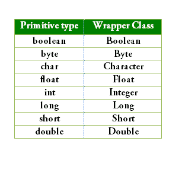

# Java 中的自动装箱和拆箱

> 哎哎哎::1230【https://www . geeksforgeeks . org/autoboxing-unboxing-Java/

**自动装箱:**将一个原始值转换为对应的[包装类](https://www.geeksforgeeks.org/wrapper-classes-java/)的对象，称为自动装箱。例如，将 int 转换为[整数类](https://www.geeksforgeeks.org/wrapper-classes-java/)。当基元值为:

*   作为参数传递给方法**，该方法需要相应包装类的对象**。
*   分配给相应的**包装类**的变量。

**取消装箱:**将包装类型的对象转换为其对应的基元值称为取消装箱。例如[整数](https://www.geeksforgeeks.org/wrapper-classes-java/)到 int 的转换。当包装类的对象是:

*   作为参数传递给方法**，该方法需要相应基元类型的值**。
*   分配给相应的**基本类型**的变量。

下表列出了 Java 编译器用于自动装箱和取消装箱的原语类型及其对应的包装类:
[](https://media.geeksforgeeks.org/wp-content/uploads/Wrapper.png)

```
// Java program to illustrate the concept
// of Autoboxing and Unboxing
import java.io.*;

class GFG
{
    public static void main (String[] args)
    {
        // creating an Integer Object
        // with value 10.
        Integer i = new Integer(10);

        // unboxing the Object
        int i1 = i;

        System.out.println("Value of i: " + i);
        System.out.println("Value of i1: " + i1);

        //Autoboxing of char
        Character gfg = 'a';

        // Auto-unboxing of Character
        char ch = gfg;
        System.out.println("Value of ch: " + ch);
        System.out.println("Value of gfg: " + gfg);

    }
}
```

输出:

```
Value of i: 10
Value of i1: 10
Value of ch: a
Value of gfg: a

```

另一个理解编译器如何使用[泛型](https://www.geeksforgeeks.org/generics-in-java/)在 java 的 Collections 示例中进行自动装箱和取消装箱的例子。

```
/* Java program to illustrate autoboxing */
import java.io.*;
import java.util.*;

class GFG
{
    public static void main (String[] args)
    {
        /* Here we are creating a list
          of elements of Integer type.
          adding the int primitives type values */
        List<Integer> list = new ArrayList<Integer>();
        for (int i = 0; i < 10; i++)
            list.add(i);
    }
}
```

在上面的例子中，我们已经创建了一个整数类型的元素列表。我们正在添加 int 原语类型值，而不是 Integer Object，代码已成功编译。它不会产生编译时错误，因为 java 编译器从原语 int i 创建整数包装对象并将其添加到列表中。
参见以下示例，了解它如何转换…

```
/* Java program to illustrate autoboxing */
import java.io.*;
import java.util.*;

class GFG
{
    public static void main (String[] args)
    {
        /* Here we are creating a list of elements
          of Integer type. Adding the int primitives
          type values by converting them into Integer
          wrapper Object*/
        List<Integer> list = new ArrayList<Integer>();
        for (int i = 0; i < 10; i++)
            list.add(Integer.valueOf(i));

    }
}
```

自动拆箱的另一个例子是在列表中查找奇数的和。程序中重要的一点是，运算符余数(%)和一元加号(+=)运算符不适用于整数对象。但是代码仍然编译成功，因为 Integer Object 到原语 int 值的拆箱是通过在运行时调用 int value()方法进行的。

```
// Java program to illustrate  find sum
// of odd numbers using autobxing and unboxing
import java.io.*;
import java.util.*;

class GFG
{
    public static int sumOfOddNumber(List<Integer> list)
    {
        int sum = 0;
        for (Integer i : list)
        {
            // unboxing of i automatically
            if(i % 2 != 0)
                sum += i;
            /* unboxing of i is done automatically
               using intvalue implicitly
            if(i.intValue() % 2 != 0)
                sum += i.intValue();*/
        }
        return sum;
    }

    public static void main (String[] args)
    {
        /* Here we are creating a list of elements
           of Integer type and adding the int primitives
           type values to the list*/
        List<Integer> list = new ArrayList<Integer>();
        for (int i = 0; i < 10; i++)
            list.add(i);

        // getting sum of all odd no. in the list.
        int sumOdd = sumOfOddNumber(list);
        System.out.println("Sum of odd numbers = " + sumOdd);
    }
}
```

输出:

```
Sum of odd numbers = 25

```

**自动装箱/拆箱的优势:**

*   自动装箱和取消装箱可以让开发人员编写更简洁的代码，使其更容易阅读。
*   该技术让我们可以互换地使用基元类型和包装器类对象，并且我们不需要显式地执行任何类型转换。

**参考:**T2

本文由 **Nitsdheerendra** 供稿。如果你喜欢 GeeksforGeeks 并想投稿，你也可以使用[contribute.geeksforgeeks.org](http://www.contribute.geeksforgeeks.org)写一篇文章或者把你的文章邮寄到 contribute@geeksforgeeks.org。看到你的文章出现在极客博客主页上，帮助其他极客。

如果你发现任何不正确的地方，或者你想分享更多关于上面讨论的话题的信息，请写评论。