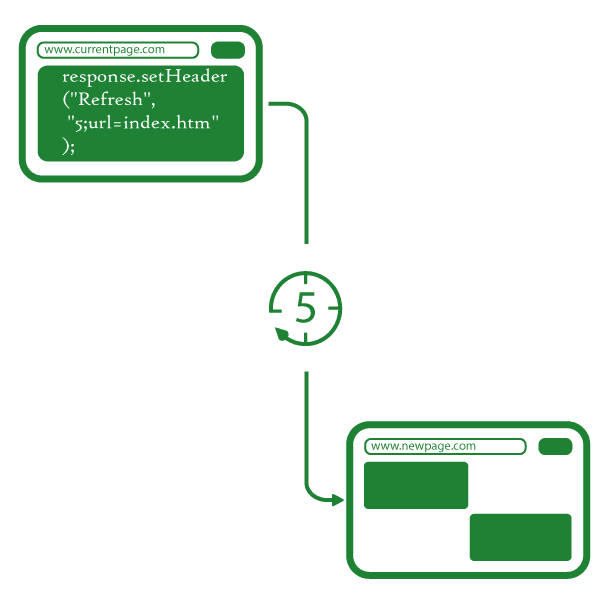

# Java Web Servlet 中基于时间的自动重载响应

> 原文:[https://www . geesforgeks . org/automated-time-based-reload-response-in-Java-web-servlet/](https://www.geeksforgeeks.org/automated-time-based-reload-response-in-java-web-servlet/)

Java Web Servlet 中基于时间的自动重载响应进入画面在使用[Java Servlet](https://www.geeksforgeeks.org/introduction-java-servlets/)时，我们需要一个根据自己的需要进行页面自动重载的机制。这种自动刷新可以作为响应在 Java servlet 本身中创建。在网页中，需要在不点击任何按钮或链接的情况下，在特定时间或间隔后自动刷新页面或将其转发到新网页。

因此，在这里，我们将通过设置一个头来发送响应，以便在特定时间后重新加载到一个新的网址。



**集成开发环境的方法:**

1.  您需要安装一个集成开发环境和一个网络服务器来运行下面的 servlet。
2.  建议创建一个具有默认配置的项目。它将处理 servlet 映射和 **web.xml** 。
3.  然后创建一个名为自动重载的新 servlet，并将下面给出的代码复制到 Servlet 中。
4.  创建另一个名为**的 servlet 重新加载页面**，这将是输出页面。
5.  您可以将这些 Servlets 配置到 **web.xml** 中进行动态映射。
6.  在网络服务器上部署项目，并在浏览器上找到给定的网址(将**项目**更改为您的实际项目名称)**http://localhost:8080/project/autore load。**

## Java 语言(一种计算机语言，尤用于创建网站)

```
import java.io.*;
import javax.servlet.*;
import javax.servlet.http.*;

public class autoreload
    extends HttpServlet { 
  // Current Webpage

    public void doGet(HttpServletRequest request,
                      HttpServletResponse response)
        throws ServletException, IOException
    {
        response.setContentType("text/html;charset=UTF-8");
        try (PrintWriter out = response.getWriter()) {

            out.println("<!DOCTYPE html>");
            out.println("<html>");
            out.println("<head>");
            out.println("<title>Auto-Reload</title>");
            out.println("</head>");
            out.println("<body>");
            out.println(
                "<h1>This webpage will be reloaded to a new page in 5 Seconds...</h1>");

            //  response.setHeader("Refresh","5");
            //  Just Refresh Current Webpage After 5 Seconds

            response.setHeader("Refresh",
                               "5;url=reloadedpage");

            //  Refresh This Page to New URL after 5 Seconds
            //  Here Time can be set in seconds so you can
            //  change 5 to another number according to your
            //  need also You can change URL of new Webpage
            //  like here i have written URL for index page

            out.println("</body>");
            out.println("</html>");
        }
    }
}
```

**这里我们可以根据需要在上面的程序中更改时间和 URL。**

*   您也可以将此功能添加到任何 Servlets 中，而无需创建新的 Servlets。
*   你只需要在给定的行下面包含: **response.setHeader(“刷新”，“5；URL = re loaded page ")；**

**输出:**

<video class="wp-video-shortcode" id="video-515816-1" width="640" height="360" preload="metadata" controls=""><source type="video/mp4" src="https://media.geeksforgeeks.org/wp-content/uploads/20201119222207/outputvideo_1.mp4?_=1">[https://media.geeksforgeeks.org/wp-content/uploads/20201119222207/outputvideo_1.mp4](https://media.geeksforgeeks.org/wp-content/uploads/20201119222207/outputvideo_1.mp4)</video>