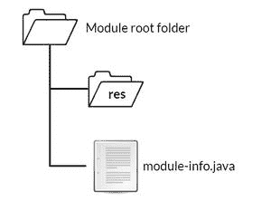

# Java 中的自动模块

> 原文:[https://www.geeksforgeeks.org/automatic-modules-in-java/](https://www.geeksforgeeks.org/automatic-modules-in-java/)

模块是为重用而设计的包的集合，模块 JAR 是一个普通的 JAR，在其根文件夹中有一个模块描述符。一个**自动模块**是一个已经放入模块路径的类路径中的 JAR。默认情况下，它们的名称来自 jar 文件名。

因此，您可以在应用程序中使用大量的现有库。其中许多还没有模块化，但是为了便于迁移，您可以将任何库的 JAR 文件添加到应用程序的模块路径中，然后使用该 JAR 中的包。这样做时，JAR 文件隐式地变成了一个自动模块，并指定模块声明需要一个指令。

它导出所有包，因此任何能够读取自动模块的模块都可以访问自动模块包中的所有公共类型。读取或需要所有其他模块，因此自动模块可以访问系统其他模块公开的所有公共类型

### 自动模块的命名

1.  如果名称跟在正则表达式“-”(\ \ d+(\ \)后面。|$))"那么模块名将从第一次出现的连字符前面的子序列中导出。
2.  “那个。删除了 jar "后缀或扩展名。
3.  模块名称中的所有非字母数字字符[^A-Za-z0-9]都用点“.”替换,
4.  所有重复的点只被一个点“.”代替，所有前导点和尾随点都将被移除。

### 自动模块中的资源

当自动模块需要资源(如音频、图像、视频等)时，这些资源应该与模块一起打包，以确保在执行时使用模块类型时它们可用。

按照惯例，资源通常与 module-info.java 文件一起放在模块根目录下名为 res 的文件夹中，这称为资源封装(如下所示)。



### 自动模块的用途:

1.  如果工件的主清单条目中有属性“自动-模块-名称”，那么自动模块允许您处理工件。
2.  像所有的包一样，传统的封装级别对于深度反射访问是开放的，对于公共类型的普通编译时和运行时访问也是开放的。
3.  我们可以读取所有其他命名模块，无论是自动的还是显式的。
4.  我们可以使用它更快地发现错误，因为这在类路径中是可能的。
5.  自动模块使我们的应用程序轻量级，并提高了应用程序的性能。这样，它可以在更多的设备上运行。
6.  它帮助我们开发一个模块化的应用程序或者模块化我们现有的应用程序，而不用等待第三方库变得模块化。

### 示例:

```java
simple-add/src/simple/add/calculate.java
```

## Java 语言(一种计算机语言，尤用于创建网站)

```java
// Java program to define the sum() 
// method inside the calculate class

package simple.add

public class calculate {

    public static int sum(int a1, int a2)
    {
        return a1 + a2;
    }
}
```

上面的例子有一个名为 **Calculate** 的类，它有一个返回两位数相加的函数(sum)。

```java
add.app/src/com/example/main.java
```

## Java 语言(一种计算机语言，尤用于创建网站)

```java
// Java program to import and use the 
// methods of the calculate class

package com.example

import simple.add.calculate;

public class main {

    public static void main(String[] args)
    {
        int sum = calculate.sum(10, 7);
        System.out.println("sum is " + sum);
    }
}
```

上面的代码有一个主类，通过导入使用计算类的函数和。

```java
add.app/src/module-info.java
```

```java
module add.app {
   requires simple.add;
}
```

上面的模块声明需要依赖关系 jar 模块(自动)的名称，它将从“easy-math.jar”转换为“easy.math”

**输出:**以下是使用自动模块所需的上述代码输出

```java
E:\automatic-module-example\add.app>java --module-path out;lib --module add.app/com.example.main
sum : 17
```

### 为什么是自动模块？

引入自动模块是为了使编译和启动应用程序更加流畅和可靠，并且比类路径更快地发现错误。为了保持它们的流畅，模块声明没有办法要求除了命名模块之外的任何东西，这就排除了从类路径加载的所有东西。如果故事到此结束，模块 JAR 只依赖于其他模块 JAR，这些模块 JAR 会穿透环境自下而上模块化。