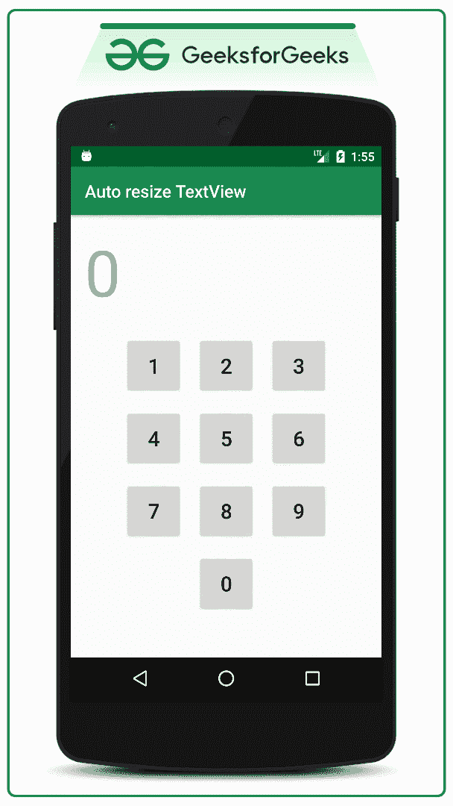
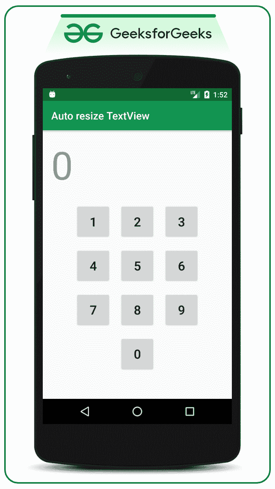

# 在安卓中自动调整文本视图

> 原文:[https://www . geesforgeks . org/auto size-text view-in-Android/](https://www.geeksforgeeks.org/autosizing-textview-in-android/)

如果用户正在进行输入，并且输入需要显示为[文本视图](https://www.geeksforgeeks.org/textview-widget-in-android-using-java-with-examples/)，并且如果用户输入了可以走出屏幕的内容，那么在这种情况下，文本视图的字体应该逐渐减小。因此，在本文中，我们讨论了当用户给出数据时，开发人员如何逐渐减小文本视图的大小。人们可以看一看下面的 GIF，以便更好地理解它，也就是我们将在本文末尾构建的内容。请注意，我们将使用 **Java** 语言来实现这个项目。



### 自动调整文本视图大小的步骤

本文以表盘为例。此方法可用于构建计算器，也可用于需要调整文本视图大小的许多其他场景。

**第一步:创建一个活动为空的安卓工作室项目**

*   关于如何创建一个空的活动安卓工作室项目，你可以参考这个[安卓|如何在安卓工作室](https://www.geeksforgeeks.org/android-how-to-create-start-a-new-project-in-android-studio/)创建/启动一个新项目。
*   将应用程序名称重命名为**自动调整文本视图**，布局名称为 **activity_main.xml**
*   并选择 Java 作为语言。

**步骤 2:通过使用 activity_main.xml 文件**构建一个 **合适的布局**

*   由于我们已经以拨号盘为例演示了 TextView 的自动调整大小，因此调用 **activity_main.xml** 文件中的以下代码，使 UI 像拨号盘一样。

## 可扩展标记语言

```java
<?xml version="1.0" encoding="utf-8"?>

<!--the attributes further invoked for the 
     TextView are the part of Android Jetpac so we need to
     include xmlns:app="http://schemas.android.com/apk/res-auto" 
     as you can see below-->
<LinearLayout 
    xmlns:android="http://schemas.android.com/apk/res/android"

    xmlns:app="http://schemas.android.com/apk/res-auto"

    xmlns:tools="http://schemas.android.com/tools"
    android:layout_width="match_parent"
    android:layout_height="match_parent"
    android:orientation="vertical"
    tools:context=".MainActivity"
    tools:ignore="HardcodedText">

    <!--One needs to hardcode the height of the TextView-->
    <!--so that it can decrease its height automatically within-->
    <!--the given height and it doesn't disturbs the other widgets-->
    <!--one can set the maxLines of the TextViews upto which-->
    <!--the lines of the TextViews must be visible in this case its 2-->
    <TextView
        android:id="@+id/primaryTextView"
        android:layout_width="match_parent"
        android:layout_height="100dp"
        android:hint="0"
        android:maxLines="2"
        app:autoSizeMaxTextSize="80sp"
        app:autoSizeMinTextSize="10sp"
        app:autoSizeStepGranularity="2sp"
        app:autoSizeTextType="uniform" />

    <LinearLayout
        android:layout_width="match_parent"
        android:layout_height="wrap_content"
        android:gravity="center"
        android:orientation="horizontal"
        android:weightSum="3">

        <Button
            android:layout_width="68dp"
            android:layout_height="68dp"
            android:layout_margin="8dp"
            android:onClick="clickedOne"
            android:text="1"
            android:textSize="24sp" />

        <Button
            android:layout_width="68dp"
            android:layout_height="68dp"
            android:layout_margin="8dp"
            android:onClick="clickedTwo"
            android:text="2"
            android:textSize="24sp" />

        <Button
            android:layout_width="68dp"
            android:layout_height="68dp"
            android:layout_margin="8dp"
            android:onClick="clickedThree"
            android:text="3"
            android:textSize="24sp" />

    </LinearLayout>

    <LinearLayout
        android:layout_width="match_parent"
        android:layout_height="wrap_content"
        android:gravity="center"
        android:orientation="horizontal"
        android:weightSum="3">

        <Button
            android:layout_width="68dp"
            android:layout_height="68dp"
            android:layout_margin="8dp"
            android:onClick="clickedFour"
            android:text="4"
            android:textSize="24sp" />

        <Button
            android:layout_width="68dp"
            android:layout_height="68dp"
            android:layout_margin="8dp"
            android:onClick="clickedFive"
            android:text="5"
            android:textSize="24sp" />

        <Button
            android:layout_width="68dp"
            android:layout_height="68dp"
            android:layout_margin="8dp"
            android:onClick="clickedSix"
            android:text="6"
            android:textSize="24sp" />

    </LinearLayout>

    <LinearLayout
        android:layout_width="match_parent"
        android:layout_height="wrap_content"
        android:gravity="center"
        android:orientation="horizontal"
        android:weightSum="3">

        <Button
            android:layout_width="68dp"
            android:layout_height="68dp"
            android:layout_margin="8dp"
            android:onClick="clickedSeven"
            android:text="7"
            android:textSize="24sp" />

        <Button
            android:layout_width="68dp"
            android:layout_height="68dp"
            android:layout_margin="8dp"
            android:onClick="clickedEight"
            android:text="8"
            android:textSize="24sp" />

        <Button
            android:layout_width="68dp"
            android:layout_height="68dp"
            android:layout_margin="8dp"
            android:onClick="clickedNine"
            android:text="9"
            android:textSize="24sp" />

    </LinearLayout>

    <Button
        android:layout_width="68dp"
        android:layout_height="68dp"
        android:layout_gravity="center"
        android:layout_marginTop="8dp"
        android:onClick="clickedZero"
        android:text="0"
        android:textSize="24sp" />

</LinearLayout>
```

*   在上面的代码 **app 中可以看到 TextView 的属性:autoSizeMaxTextSize="80sp "，**这是 TextView 的初始大小。
*   **app:autoSizeMinTextSize = " 10sp "**使用此属性，TextView 的大小将被调整到 10sp 的大小，**app:autosizestep 颗粒度="2sp"** 使用此属性，当 TextView 退出屏幕时，我们将它的大小统一减少为 2sp。
*   **app:autosize texttype = " uniform "**通过使用这个属性，我们只是统一调整了 TextView 的大小。
*   需要记住的一点是，不应该将文本视图的高度和宽度设置为 wrap_content。
*   要禁用文本视图的大小调整，可以将此属性设置为无。如下图所示。

> ***app:autoSizeTextType = " none "***

**产生如下输出界面:**



**步骤 3:现在使用 onClick XML 属性**分别处理每个按钮

*   现在在**MainActivity.java**文件中，我们将单独处理每个[按钮](https://www.geeksforgeeks.org/button-in-kotlin/)的所有 onClick 功能，并在按下时将 TextView 设置为适当的数字。所以，现在调用下面的代码:

## Java 语言(一种计算机语言，尤用于创建网站)

```java
import androidx.appcompat.app.AppCompatActivity;
import android.annotation.SuppressLint;
import android.os.Bundle;
import android.view.View;
import android.widget.TextView;

public class MainActivity extends AppCompatActivity {

    TextView primaryTextView;

    @Override
    protected void onCreate(Bundle savedInstanceState) {
        super.onCreate(savedInstanceState);
        setContentView(R.layout.activity_main);

        // register the button using appropriate ID of the TextView
        primaryTextView = findViewById(R.id.primaryTextView);
    }

    // handle the button 1 and append the 1 to the end of the TextView
    @SuppressLint("SetTextI18n")
    public void clickedOne(View view) {
        primaryTextView.setText(primaryTextView.getText() + "1");
    }

    // handle the button 2 and append the 2 to the end of the TextView
    @SuppressLint("SetTextI18n")
    public void clickedTwo(View view) {
        primaryTextView.setText(primaryTextView.getText() + "2");
    }

    // handle the button 3 and append the 3 to the end of the TextView
    @SuppressLint("SetTextI18n")
    public void clickedThree(View view) {
        primaryTextView.setText(primaryTextView.getText() + "3");
    }

    // handle the button 4 and append the 4 to the end of the TextView
    @SuppressLint("SetTextI18n")
    public void clickedFour(View view) {
        primaryTextView.setText(primaryTextView.getText() + "4");
    }

    // handle the button 5 and append the 5 to the end of the TextView
    @SuppressLint("SetTextI18n")
    public void clickedFive(View view) {
        primaryTextView.setText(primaryTextView.getText() + "5");
    }

    // handle the button 6 and append the 6 to the end of the TextView
    @SuppressLint("SetTextI18n")
    public void clickedSix(View view) {
        primaryTextView.setText(primaryTextView.getText() + "6");
    }

    // handle the button 7 and append the 7 to the end of the TextView
    @SuppressLint("SetTextI18n")
    public void clickedSeven(View view) {
        primaryTextView.setText(primaryTextView.getText() + "7");
    }

    // handle the button 8 and append the 8 to the end of the TextView
    @SuppressLint("SetTextI18n")
    public void clickedEight(View view) {
        primaryTextView.setText(primaryTextView.getText() + "8");
    }

    // handle the button 9 and append the 9 to the end of the TextView
    @SuppressLint("SetTextI18n")
    public void clickedNine(View view) {
        primaryTextView.setText(primaryTextView.getText() + "9");
    }

    // handle the button 0 and append the 0 to the end of the TextView
    @SuppressLint("SetTextI18n")
    public void clickedZero(View view) {
        primaryTextView.setText(primaryTextView.getText() + "0");
    }
}
```

### 输出:在模拟器上运行

<video class="wp-video-shortcode" id="video-489978-1" width="640" height="360" preload="metadata" controls=""><source type="video/mp4" src="https://media.geeksforgeeks.org/wp-content/uploads/20200922015916/GFG_frame_nexus_5.mp4?_=1">[https://media.geeksforgeeks.org/wp-content/uploads/20200922015916/GFG_frame_nexus_5.mp4](https://media.geeksforgeeks.org/wp-content/uploads/20200922015916/GFG_frame_nexus_5.mp4)</video>