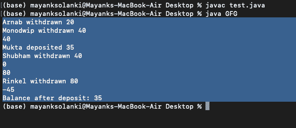
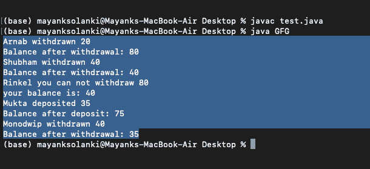

# 使用 Java 的银行交易系统

> 原文:[https://www . geesforgeks . org/banking-transaction-system-use-Java/](https://www.geeksforgeeks.org/banking-transaction-system-using-java/)

为了理解，必须对 [Java OOPs](https://www.geeksforgeeks.org/object-oriented-programming-oops-concept-in-java/) 、 [Java 多线程](https://www.geeksforgeeks.org/java-multithreading-tutorial/) & [Java 中断异常](https://www.geeksforgeeks.org/built-exceptions-java-examples/)有很强的把握。如果没有，请仔细阅读它们，因为标题本身就是多线程的纯粹实现。

**接近:**

1.  新手进场
2.  多线程方法
3.  多线程方法中的同步调用

为了理解，让我们考虑一个例子来实现这个方法。

插图:

我们将讨论使用 java 的银行交易系统的体系结构。在这篇社论中，我将握着你的手，带你完成整个交易程序，让你容易理解，这样你甚至可以向你的朋友解释。为了简单起见，我们考虑了一个有 5 个所有者(Arnab、Monodwip、Mukta、Rinkel 和 Shubham)的联合银行账户，初始余额为 100 美元(100 美元)。该账户交易情况如下:

<figure class="table">T38】莫诺威普T42【40T78】80

| name | Balance ($) | Withdrawal ($) | Deposit ($) | remarks | 期末余额($) |
| --- | --- | --- | --- | --- | --- |
| Ana | One hundred | Twenty |  | 阿纳已支取 20支取后余额:80 | Eighty |
| Eighty | 存款后余额:75 | Seventy-five |
| Lincker | Seventy-five |  | 林克尔你不能支取 80

你的余额是:75 | 75【T95 |

</figure>

**进场 1:** 菜鸟进场

我们已经在类“Bank”中声明了“取款”和“存款”方法，并通过创建 Bank 类的对象“obj”从驱动程序类“GFG”中访问它们。

**例**

## Java 语言(一种计算机语言，尤用于创建网站)

```
// Java Program to Illlustarte Rookie Approach
// In Banking transaction system

// Class  1
// Bank class
// Defining the banking transaction
class Bank {

    // Initial balance $100
    int total = 100;

    // Money withdrawal method. Withdraw only if
    // total money greater than or equal to the money
    // requested for withdrawal

    // Method
    // To withdraw money
    void withdrawn(String name, int withdrawal)
    {
        if (total >= withdrawal) {
            System.out.println(name + " withdrawn "
                               + withdrawal);

            total = total - withdrawal;
            System.out.println("Balance after withdrawal: "
                               + total);
            // Making the thread sleep for 1 second after
            // each withdrawal

            // Try block to check for exceptions
            try {

                // Making thread t osleep for 1 second
                Thread.sleep(1000);
            }

            // Catch block to handle the exceptions
            catch (InterruptedException e) {

                // Display the exception along with line
                // number
                // using printStacktrace() method
                e.printStackTrace();
            }
        }

        // If the money requested for withdrawal is greater
        // than the balance then deny transaction*/
        else {

            // Print statements
            System.out.println(name
                               + " you can not withdraw "
                               + withdrawal);

            System.out.println("your balance is: " + total);

            // Making the thread sleep for 1 second after
            // each transaction failure

            // Try block to check for exceptions
            try {
                Thread.sleep(1000);
            }

            catch (InterruptedException e) {

                e.printStackTrace();
            }
        }
    }

    // Method - to deposit money
    // Accept money whenever deposited
    void deposit(String name, int deposit)
    {
        System.out.println(name + " deposited " + deposit);
        total = total + deposit;
        System.out.println("Balance after deposit: "
                           + total);
        // Making the thread sleep for 1 second after
        // each deposit
        try {
            Thread.sleep(1000);
        }
        catch (InterruptedException e) {
            e.printStackTrace();
        }
    }
}
// Class 2
// main class
class GFG {

    // Main driver method
    public static void main(String[] args)
    {
        // Declaring an object of Bank class and calling the
        // withdarwn and deposit methods with suitable
        // parameters

        // Creating object of class 1 inside main()
        Bank obj = new Bank();

        // Custom input - Transactions
        obj.withdrawn("Arnab", 20);
        obj.withdrawn("Monodwip", 40);
        obj.deposit("Mukta", 35);
        obj.withdrawn("Rinkel", 80);
        obj.withdrawn("Shubham", 40);
    }
}
```

**输出:**

```
C:\Users\USER\Desktop\LearnCoding\MultiThreading>javac GFG.java
C:\Users\USER\Desktop\LearnCoding\MultiThreading>java GFG
Arnab withdrawn 20
Balance after withdrawal: 80

//After 1 Second
Monodwip withdrawn 40
Balance after withdrawal: 40

//After 1 Second
Mukta deposited 35
Balance after deposit: 75

//After 1 Second
Rinkel you can not withdraw 80
your balance is: 75

//After 1 Second
Shubham withdrawn 40
Balance after withdrawal: 35
```

如下所述，菜鸟方法有一些缺点:

没有两个人可以同时进行交易，一个需要等到前者完成交易。如果人数很多，那么我们需要等待，直到轮到我们。为了演示这个问题，我们在下面提供的视频中让线程在每个事务期间休眠 3 秒钟。在现实生活中，这将花费很多时间，使得这种方法无法在真实的事务项目中实现。

<video class="wp-video-shortcode" id="video-679302-1" width="640" height="360" preload="metadata" controls=""><source type="video/mp4" src="https://media.geeksforgeeks.org/wp-content/uploads/20210916103431/bankingssys.mp4?_=1">[https://media.geeksforgeeks.org/wp-content/uploads/20210916103431/bankingssys.mp4](https://media.geeksforgeeks.org/wp-content/uploads/20210916103431/bankingssys.mp4)</video>

**方法 2:** 多线程方法

> **多线程有什么帮助？**
> 
> 多线程允许不同的线程同时工作，而不会相互依赖。所以一大群线程可以同时执行一个操作。

**例**

## Java 语言(一种计算机语言，尤用于创建网站)

```
// Java Program to Illlustarte Multithreading Approach
// In Banking transaction system

// Class 1
// Helper class
class Bank {

    // Initial custom balance
    int total = 100;

    // Money withdrawal method. Withdraw only if total money
    // greater than or equal to the money requested for
    // withdrawal
    void withdrawn(String name, int withdrawal)
    {

        if (total >= withdrawal) {
            System.out.println(name + " withdrawn "
                               + withdrawal);
            total = total - withdrawal;

            System.out.println(total);

            //  Making the thread sleep for 1 second after
            //   each withdrawal

            // Try block to check for exceptions
            try {

                // Making thread to sleep for 1 second
                Thread.sleep(1000);
            }

            catch (InterruptedException e) {
                e.printStackTrace();
            }
        }

        // Else if the money requested for withdrawal is
        // greater than the balance then deny transaction
        else {

            System.out.println(name
                               + " you can not withdraw "
                               + withdrawal);
            System.out.println("your balance is: " + total);

            // Making the thread sleep for 1 second after
            // each transaction failure

            try {
                Thread.sleep(1000);
            }
            catch (InterruptedException e) {
                e.printStackTrace();
            }
        }
    }

    // Method - To deposit money
    // Accepting money whenever deposited
    void deposit(String name, int deposit)
    {
        System.out.println(name + " deposited " + deposit);
        total = total + deposit;
        System.out.println("Balance after deposit: "
                           + total);
        // Making the thread sleep for 1 second after
        // each deposit

        try {
            Thread.sleep(1000);
        }
        catch (InterruptedException e) {
            e.printStackTrace();
        }
    }
}

// Method - Withdraw method
// Called from ThreadWithdrawal class
// using the object of Bank class passed
// from the main() method
class ThreadWithdrawal extends Thread {

    Bank object;
    String name;
    int dollar;

    // Constructor of this method
    ThreadWithdrawal(Bank ob, String name, int money)
    {
        this.object = ob;
        this.name = name;
        this.dollar = money;
    }

    // run() method for thread
    public void run() { object.withdrawn(name, dollar); }
}
// Deposit method is called from ThreadDeposit class
// using the object of Bank class passed
// from the main method
class ThreadDeposit extends Thread {

    Bank object;
    String name;
    int dollar;
    ThreadDeposit(Bank ob, String name, int money)
    {
        // This keyword refers t ocurrent instance itself
        this.object = ob;
        this.name = name;
        this.dollar = money;
    }

    public void run() { object.deposit(name, dollar); }
}

// Class 2
// Main class
class GFG {

    // Main driver method
    public static void main(String[] args)
    {
        // Declaring an object of Bank class and passing the
        // object along with other parameters to the
        // ThreadWithdrawal and ThreadDeposit class. This
        // will be required to call withdrawn and deposit
        // methods from those class

        // Creating an object of class1
        Bank obj = new Bank();

        ThreadWithdrawal t1
            = new ThreadWithdrawal(obj, "Arnab", 20);
        ThreadWithdrawal t2
            = new ThreadWithdrawal(obj, "Monodwip", 40);
        ThreadDeposit t3
            = new ThreadDeposit(obj, "Mukta", 35);
        ThreadWithdrawal t4
            = new ThreadWithdrawal(obj, "Rinkel", 80);
        ThreadWithdrawal t5
            = new ThreadWithdrawal(obj, "Shubham", 40);

        // When a program calls the start() method, a new
        // thread is created and then the run() method is
        // executed.

        // Starting threads created above
        t1.start();
        t2.start();
        t3.start();
        t4.start();
        t5.start();
    }
}
```

**输出:**



**现在多线程方法出现了一些问题，如下所列**:****

当多个线程试图同时执行一个特定的操作时，就有可能出现错误的输出，这是因为所有的线程一次都在更新同一个资源。在上面的输出中，由于同样的原因，我们得到了负数中的**余额。**

**如何处理那些**病例**中多人试图同时访问同一操作？**

如果多个线程同时访问一个资源，那么就有可能出现错误输出。这种不必要的现象被定义为数据竞赛。

假设我们的联合银行账户里有 100 美元。为了欺骗银行家，我们可以同时要求 100 美元。系统将创建一个对象，分配 2 个线程，并将它们传递给提取方法。在这个过程结束时，我们俩都将有 100 美元！

为了解决这个问题，工程师们提出了同步概念。

**方法 3:** 结合多线程同步

**同步**提供对象锁并声明敏感区域(撤销&存款方式)。一个对象可以有多个线程，但是敏感区域一次只能被一个线程访问。线程调度器选择线程的执行顺序。由于这是一个随机的过程，每个解释的输出是不同的。

**为什么要用静态同步？**

假设我们有 5 个线程类，每个线程类有一个对象。每个对象都有多个线程。现在敏感区域一次将被 5 个线程访问！为了解决这个问题，工程师们提出了静态同步的想法。我们为类提供了一个锁。该类一次将选择 1 个对象。该对象将依次选择 1 个线程，并通过敏感区域。

**同步多线程执行是否比没有多线程的正常执行慢？**

不会。一项任务等待另一项任务的时间被认为是开销。在同步多线程中，这个开销时间可以用来做其他生产性工作，直到等待线程从线程调度器获得密钥进入同步区域。因此，在同步多线程执行的情况下，开销是最小的，所以我们可以预期它会更快。

**例**

## Java 语言(一种计算机语言，尤用于创建网站)

```
// Java Program to Illlustarte Multithreading Approach
// With Synchronization In Banking transaction system

// Class 1
// Helper class
class Bank {

    // Initial balance $100
    static int total = 100;

    // Money withdrawal method. Withdraw only if total money
    // greater than or equal to the money requested for
    // withdrawal
    static synchronized void withdrawn(String name,
                                       int withdrawal)
    {
        if (total >= withdrawal) {
            System.out.println(name + " withdrawn "
                               + withdrawal);
            total = total - withdrawal;
            System.out.println("Balance after withdrawal: "
                               + total);
            /* Making the thread sleep for 1 second after
                 each withdrawal.*/
            try {
                Thread.sleep(1000);
            }
            catch (InterruptedException e) {
                e.printStackTrace();
            }
        }

        // If the money requested for withdrawal is greater
        // than the balance then deny transaction
        else {
            System.out.println(name
                               + " you can not withdraw "
                               + withdrawal);
            System.out.println("your balance is: " + total);

            // Making the thread sleep for 1 second after
            //   each transaction failure

            // Try block to check for exceptions
            try {

                // Making thread to sleep for 1 second
                Thread.sleep(1000);
            }

            // Catch bloc kto handle exceptions
            catch (InterruptedException e) {

                // Displa ythe line number where exception
                // occured
                // Using printStackTrace() method
                e.printStackTrace();
            }
        }
    }

    // Method - Deposit method
    // Accepting money whenever deposited
    static synchronized void deposit(String name,
                                     int deposit)
    {
        System.out.println(name + " deposited " + deposit);
        total = total + deposit;
        System.out.println("Balance after deposit: "
                           + total);

        // Making the thread sleep for 1 second
        // after each deposit

        // Try block to check for exceptions
        try {

            // Making thread to sleep for 1 second
            Thread.sleep(1000);
        }

        // Catch block to handle InterruptedException
        // exception
        catch (InterruptedException e) {

            e.printStackTrace();
        }
    }
}

// Method - Withdraw
// It is called from ThreadWithdrawal class using
// the object of Bank class passed from the main method
class ThreadWithdrawal extends Thread {

    // Attributes of thid class
    Bank object;
    String name;
    int dollar;

    // Constructor of this class
    ThreadWithdrawal(Bank ob, String name, int money)
    {
        // This keyword refers to parent class
        this.object = ob;
        this.name = name;
        this.dollar = money;
    }

    // run() method for the thread
    public void run() { object.withdrawn(name, dollar); }
}

// Deposit method is called from ThreadDeposit class using
// the object of Bank class passed from the main method*/

// Class 2
// Helper class extending Thread class
class ThreadDeposit extends Thread {

    Bank object;
    String name;
    int dollar;

    ThreadDeposit(Bank ob, String name, int money)
    {
        this.object = ob;
        this.name = name;
        this.dollar = money;
    }

    public void run() { object.deposit(name, dollar); }
}

// Class 3
// Main class
class GFG {

    // Main driver method
    public static void main(String[] args)
    {
        // Declaring an object of Bank class and passing the
        // object along with other parameters to the
        // ThreadWithdrawal and ThreadDeposit class. This
        // will be required to call withdrawn and deposit
        // methods from those class

        // Creating object of above class inside main()
        Bank obj = new Bank();

        // Creating threads
        ThreadWithdrawal t1
            = new ThreadWithdrawal(obj, "Arnab", 20);
        ThreadWithdrawal t2
            = new ThreadWithdrawal(obj, "Monodwip", 40);
        ThreadDeposit t3
            = new ThreadDeposit(obj, "Mukta", 35);
        ThreadWithdrawal t4
            = new ThreadWithdrawal(obj, "Rinkel", 80);
        ThreadWithdrawal t5
            = new ThreadWithdrawal(obj, "Shubham", 40);

        // When a program calls the start() method, a new
        // thread is created and then the run() method is
        // executed
        t1.start();
        t2.start();
        t3.start();
        t4.start();
        t5.start();
    }
}
```

**输出(已编译&已解释):**



**输出(解释):**舒巴姆&莫诺德普未能取款

```
C:\Users\USER\Desktop\Network Java>java  GFG

Arnab withdrawn 20
Balance after withdrawal: 80
Rinkel withdrawn 80
Balance after withdrawal: 0
Shubham you can not withdraw 40
your balance is: 0
Mukta deposited 35
Balance after deposit: 35
Monodwip you can not withdraw 40
your balance is: 35
```

**输出(解释):**林克尔取钱失败。

```
C:\Users\USER\Desktop\Network Java>java  GFG

Arnab withdrawn 20
Balance after withdrawal: 80
Shubham withdrawn 40
Balance after withdrawal: 40
Monodwip withdrawn 40
Balance after withdrawal: 0
Mukta deposited 35
Balance after deposit: 35
Rinkel you can not withdraw 80
your balance is: 35
```

**输出(解释):** Monodwip 取钱失败。

```
C:\Users\USER\Desktop\Network Java>java  GFG

Arnab withdrawn 20
Balance after withdrawal: 80
Rinkel withdrawn 80
Balance after withdrawal: 0
Shubham you can not withdraw 40
your balance is: 0
Monodwip you can not withdraw 40
your balance is: 0
Mukta deposited 35
Balance after deposit: 35
```

> **注意:**线程调度器选择线程的执行顺序。由于这是一个随机的过程，每个解释的输出是不同的。