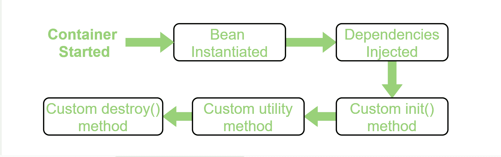

# Java Spring 中的 Bean 生命周期

> 原文:[https://www . geesforgeks . org/bean-生命周期-in-java-spring/](https://www.geeksforgeeks.org/bean-life-cycle-in-java-spring/)

**先决条件:** [春季框架简介](https://www.geeksforgeeks.org/introduction-to-spring-framework/)

任何物体的生命周期都意味着它何时&如何诞生，它在一生中如何表现，以及它何时&如何死亡。类似地，bean 生命周期指的是 bean 何时&如何被实例化，在它存在之前执行什么操作，以及何时&如何被销毁。在本文中，我们将讨论 bean 的生命周期。

Bean 生命周期由 spring 容器管理。当我们运行程序时，首先，spring 容器开始运行。之后，容器根据请求创建 bean 的实例，然后注入依赖项。最后，当弹簧容器关闭时，豆被破坏。因此，如果我们想在 bean 实例化上并且在关闭 spring 容器之后执行一些代码，那么我们可以在自定义的 **init()** 方法和 **destroy()** 方法中编写这些代码。

下图显示了 bean 生命周期的流程。

[](https://media.geeksforgeeks.org/wp-content/uploads/20200428011831/Bean-Life-Cycle-Process-flow3.png)

Bean 生命周期流程

**注意:**我们可以选择自定义方法名称，而不是 **init()** 和 **destroy()** 。这里，我们将使用 init()方法在 spring 容器启动和 bean 实例化时执行其所有代码，并使用 destroy()方法在关闭容器时执行其所有代码。

**<u>实现一个 bean 生命周期的方法</u>**
Spring 提供了三种实现一个 bean 生命周期的方法。为了理解这三种方式，我们举个例子。在这个例子中，我们将为我们的 bean(HelloWorld.java)编写并激活 init()和 destroy()方法，以便在 Spring 容器的启动和关闭时打印一些消息。因此，实现这一点的三种方法是:

**1。通过 XML:** 在这种方法中，为了使用 bean 的自定义 init()和 destroy()方法，我们必须在定义 bean 时在 Spring XML 配置文件中注册这两个方法。因此，遵循以下步骤:

*   首先，在这种情况下，我们需要创建一个 bean**HelloWorld.java**，并在类中编写 init()和 destroy()方法。

## Java 语言(一种计算机语言，尤用于创建网站)

```java
// Java program to create a bean
// in the spring framework
package beans;

public class HelloWorld {

    // This method executes
    // automatically as the bean
    // is instantiated
    public void init() throws Exception
    {
        System.out.println(
            "Bean HelloWorld has been "
            + "instantiated and I'm "
            + "the init() method");
    }

    // This method executes
    // when the spring container
    // is closed
    public void destroy() throws Exception
    {
        System.out.println(
            "Container has been closed "
            + "and I'm the destroy() method");
    }
}
```

*   现在，我们需要配置 spring XML 文件 **spring.xml** ，并且需要在其中注册 init()和 destroy()方法。

## 可扩展标记语言

```java
<!DOCTYPE
    beans PUBLIC "-//SPRING//DTD BEAN 2.0//EN"
        "http://www.springframework.org/dtd/spring-beans-2.0.dtd">

<beans>
    <bean id="hw" class="beans.HelloWorld"
            init-method="init" destroy-method="destroy"/>

</beans>
```

*   最后，我们需要创建一个驱动程序类来运行这个 bean。

## Java 语言(一种计算机语言，尤用于创建网站)

```java
// Java program to call the
// bean initialized above

package test;

import org.springframework
    .context
    .ConfigurableApplicationContext;

import org.springframework
    .context.support
    .ClassPathXmlApplicationContext;

import beans.HelloWorld;

// Driver class
public class Client {

    public static void main(String[] args)
        throws Exception
    {

        // Loading the Spring XML configuration
        // file into the spring container and
        // it will create the instance of
        // the bean as it loads into container

        ConfigurableApplicationContext cap
            = new ClassPathXmlApplicationContext(
                "resources/spring.xml");

        // It will close the spring container
        // and as a result invokes the
        // destroy() method
        cap.close();
    }
}
```

**输出:**

> Bean HelloWorld 已经实例化，我是 init()方法
> 容器已经关闭，我是 destroy()方法

**2。通过编程方式:**要为创建的 bean 提供在 spring 容器启动时调用自定义 **init()** 方法和在关闭容器时调用自定义 **destroy()** 方法的工具，我们需要用两个接口实现我们的 bean，即 **InitializingBean** 、**disposeable bean**，并且必须在属性设置()和 **destroy()** 方法之后覆盖**。 **afterPropertiesSet()** 方法在容器启动时被调用，bean 被实例化，而 **destroy()** 方法在容器关闭后被调用。**

**注意:**要调用销毁方法，我们必须调用一个 **close()** 方法的 ConfigurableApplicationContext。

因此，遵循以下步骤:

*   首先，我们需要创建一个 bean**HelloWorld.java**在这种情况下，通过实现 InitializingBean，DisposableBean，并覆盖 afterPropertiesSet()和 destroy()方法。

## Java 语言(一种计算机语言，尤用于创建网站)

```java
// Java program to create a bean
// in the spring framework
package beans;

import org.springframework
    .beans.factory.DisposableBean;

import org.springframework
    .beans.factory.InitializingBean;

// HelloWorld class which implements the
// interfaces
public class HelloWorld
    implements InitializingBean,
 DisposableBean {

    @Override
    // It is the init() method
    // of our bean and it gets
    // invoked on bean instantiation
    public void afterPropertiesSet()
throws Exception
    {
        System.out.println(
            "Bean HelloWorld has been "
            + "instantiated and I'm the "
            + "init() method");
    }

    @Override
    // This method is invoked
    // just after the container
    // is closed
    public void destroy() throws Exception
    {
        System.out.println(
            "Container has been closed "
            + "and I'm the destroy() method");
    }
}
```

*   现在，我们需要配置 spring XML 文件 **spring.xml** 并定义 bean。

## 可扩展标记语言

```java
<!DOCTYPE beans PUBLIC "-//SPRING//DTD BEAN 2.0//EN"
            "http://www.springframework.org/dtd/spring-beans-2.0.dtd">

<beans>
    <bean id="hw" class="beans.HelloWorld"/>

</beans>
```

*   最后，我们需要创建一个驱动程序类来运行这个 bean。

## Java 语言(一种计算机语言，尤用于创建网站)

```java
// Java program to call the
// bean initialized above

package test;

import org.springframework
    .context
    .ConfigurableApplicationContext;

import org.springframework
    .context.support
    .ClassPathXmlApplicationContext;

import beans.HelloWorld;

// Driver class
public class Client {

    public static void main(String[] args)
        throws Exception
    {

        // Loading the Spring XML configuration
        // file into the spring container and
        // it will create the instance of the bean
        // as it loads into container
        ConfigurableApplicationContext cap
            = new ClassPathXmlApplicationContext(
                "resources/spring.xml");

        // It will close the spring container
        // and as a result invokes the
        // destroy() method
        cap.close();
    }
}
```

**输出:**

> Bean HelloWorld 已经实例化，我是 init()方法
> 容器已经关闭，我是 destroy()方法

**3。使用注释:**要为创建的 bean 提供在 spring 容器启动时调用自定义 **init()** 方法的工具，并在关闭容器时调用自定义 **destroy()** 方法，我们需要通过 **@PostConstruct** 注释来注释 **init()** 方法，通过 **@PreDestroy** 注释来注释 **destroy()** 方法。
**注意:**要调用 **destroy()** 方法，我们必须调用 configuration applicationcontext 的 **close()** 方法。

因此，遵循以下步骤:

*   首先，在这种情况下，我们需要创建一个 bean HelloWorld.java，并用@PostConstruct 注释自定义 init()方法，并用@PreDestroy 销毁()方法。

## Java 语言(一种计算机语言，尤用于创建网站)

```java
// Java program to create a bean
// in the spring framework
package beans;

import javax.annotation.PostConstruct;
import javax.annotation.PreDestroy;

// HelloWorld class
public class HelloWorld {

    // Annotate this method to execute it
    // automatically as the bean is
    // instantiated
    @PostConstruct
    public void init() throws Exception
    {
        System.out.println(
            "Bean HelloWorld has been "
            + "instantiated and I'm the "
            + "init() method");
    }

    // Annotate this method to execute it
    // when Spring container is closed
    @PreDestroy
    public void destroy() throws Exception
    {
        System.out.println(
            "Container has been closed "
            + "and I'm the destroy() method");
    }
}
```

*   现在，我们需要配置 spring XML 文件 spring.xml 并定义 bean。

## 超文本标记语言

```java
<!DOCTYPE beans PUBLIC "-//SPRING//DTD BEAN 2.0//EN"
            "http://www.springframework.org/dtd/spring-beans-2.0.dtd">

<beans>

    <!-- activate the @PostConstruct and
@PreDestroy annotation -->

    <bean class="org.springframework
.context.annotation
.CommonAnnotationBeanPostProcessor"/>

    <!-- configure the bean -->
    <bean class="beans.HelloWorld"/>

</beans>
```

*   最后，我们需要创建一个驱动程序类来运行这个 bean。

## Java 语言(一种计算机语言，尤用于创建网站)

```java
// Java program to call the
// bean initialized above

package test;

import org.springframework
    .context
    .ConfigurableApplicationContext;

import org.springframework
    .context.support
    .ClassPathXmlApplicationContext;

import beans.HelloWorld;

// Driver class
public class Client {

    public static void main(String[] args)
        throws Exception
    {

        // Loading the Spring XML configuration
        // file into Spring container and
        // it will create the instance of the
        // bean as it loads into container
        ConfigurableApplicationContext cap
            = new ClassPathXmlApplicationContext(
                "resources/spring.xml");

        // It will close the Spring container
        // and as a result invokes the
        // destroy() method
        cap.close();
    }
}
```

**输出:**

> Bean HelloWorld 已经实例化，我是 init()方法
> 容器已经关闭，我是 destroy()方法