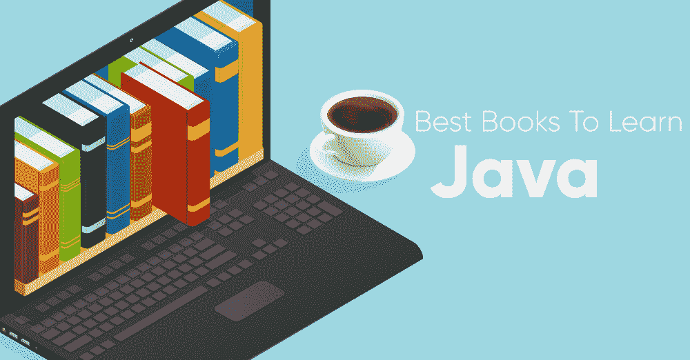
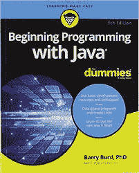
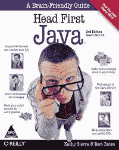
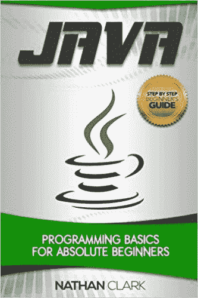
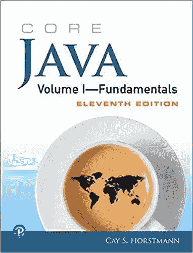
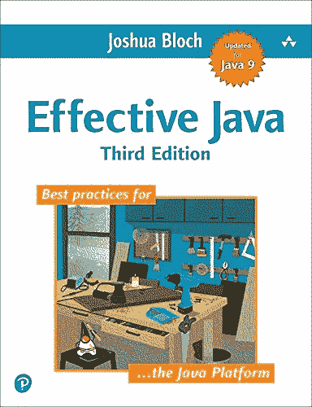
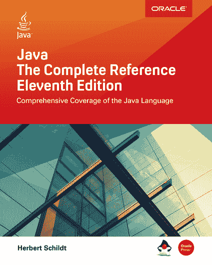
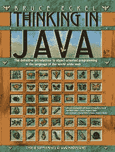

# 初学者和专家学习 Java 的最佳书籍

> 原文:[https://www . geesforgeks . org/初学者和专家学习 java 的最佳书籍/](https://www.geeksforgeeks.org/best-books-to-learn-java-for-beginners-and-experts/)

**学习 Java 编程艺术，重要的是先学会规则，再学会什么时候打破规则！**

这一点很重要，因为**[【Java】](https://www.geeksforgeeks.org/java/)**是世界上最流行的编程语言之一，因为它可以用于设计各种用途的定制应用程序。根据 2019 年 8 月的 [TIOBE 指数](https://www.tiobe.com/tiobe-index/)，Java 是排名第一的编程语言。
牢记这一点，如果你想学习 Java，市场上有很多书(适合处于学习各个阶段的程序员)。在这篇文章中，我们为 Java 编写了最好的书籍，既适合业余爱好者，也适合编程天才！！！每本书都非常受欢迎，所以你可以根据自己的学习感受选择你喜欢的书。所以二话没说，让我们看看他们！

首先，让我们从简单开始，专注于初学者最好的 Java 书籍，然后我们将转向更复杂的专家书籍！

### 初学者最佳 Java 书籍

**1。开始用 Java 为假人编程(第五版)**

作者:巴里·伯德

你希望像专业人士一样说 Java 吗？好吧，如果你希望在开始的时候像专业人士一样说 Java 术语，而在开始的时候只是一个傀儡，这本书是最好的，因为它为你提供了一个严肃的指南，向你展示了如何用 Java 创建一个程序，如何将各种部分组合在一起，如何处理 Java 中的标准编程挑战等等。
用 Java 开始编程 For Dummies 将帮助你‘说’Java，因为它是从变量、方法、循环和数组、对象、类等基本概念开始的。此外，这本书更新了 Java 9，因此您可以通过各种示例来学习该语言。 [**购买《用 Java 为傻瓜编程入门书》**](https://www.amazon.com/Beginning-Programming-Java-Dummies-Computer/dp/1119235537)

**2。头部优先 Java:大脑友好指南(第二版)**

作者:凯西·塞拉，伯特·贝茨

如果你厌倦了苦读 Java 操作手册，那么 Head-First Java 是你的不二之选！这本书是一本对大脑友好的指南(顾名思义！)而且，它提供了一种更直观的形式来吸引你的大脑，而不是一种可能很快变得无聊的大量文本的方法。
Head-First Java 从基本的编程基础开始 Java 之旅，然后进入高级主题，包括线程、网络套接字、用 RMI 进行分布式编程等。所以 Head-First Java 基本上是一个多感官的学习体验，会帮助你在短时间内成为一个真正的 Java 程序员！ [**买头第一爪哇:一个对大脑友好的指南书**](https://www.amazon.com/Head-First-Java-Kathy-Sierra/dp/0596009208/)

**3。Java:绝对初学者编程基础(第一版)**

作者:内森·克拉克

如果学习 Java 对你来说似乎是一项艰巨的任务，那就不要害怕！！！《Java:面向绝对初学者的编程基础》是一本优秀的书，它提供了对 Java 的全面介绍，这将让你立即编写程序和解决问题！在阅读这本书的过程中，您将学习 Java 的关键主题以及 57 个实际例子。
Java:面向绝对初学者的编程基础知识是专门为初学者编写的，通过第一个程序的一步一步，以及通过 Java 开发工具包和 Java 运行时环境的内部工作的指南。还有多个例子来说明每个主题，如数据类型、变量、常数、运算符、类型转换、循环、决策等。 [**购买 Java:绝对初学者编程基础书籍**](https://www.amazon.com/Java-Programming-Beginners-Step-Step/dp/1978104472/)

**4。核心 Java 第一卷–基础(第 11 版)**

作者:霍斯特曼

如果你想了解 Java 基础的核心，那么《核心 Java 第一卷》就是适合你的书！它将通过大量示例帮助您获得关于 Java 和 API 的深入教育，其中大多数示例反映了模块化，演示了更容易管理和发展的代码。
核心 Java Volume I–foundations 包含的章节主题从变量、数据结构、对象和类等基础知识到对象、泛型、集合、lambda 表达式、Swing 设计、并发和函数式编程等高级知识。 [**购买核心 Java 第一册**T4】](https://www.amazon.com/Core-Java-I-Fundamentals-11th-Horstmann/dp/0135166306/)

### 中级/专家最佳 Java 书籍

**1。有效 Java(第三版)**

作者:约书亚·布洛赫

如果你已经理解了 Java 的基本原理，现在想做一些真正的工作，那么《有效的 Java》就是适合你的书！它将帮助您深入了解 78 条程序员经验法则，这些法则是针对各种常见编程挑战的有效解决方案。
Effective Java 中包含的主题包括新的设计模式，这些模式展示了从泛型到枚举、注释到自动装箱的各种特性中的最佳特性。所有这些概念都以清晰简洁的方式用许多例子来解释，以确保你理解正确。 [**购买有效的 Java 书籍**](https://www.amazon.com/Effective-Java-Joshua-Bloch/dp/0134685997/)

**2。Java:完整参考(第 11 版)**

作者:赫伯特·席尔德

如果你在 Java 方面处于中级或专家水平，并且想要一个“回归基础”的方法，那么这本书是一个不错的选择，因为它是一个关于 Java 编程的结构良好且完整的源代码，包含了现实世界中所有主题的示例。
Java:《完整参考》涵盖了整个 Java，包括语法、关键字和基本编程原则等基本主题。还有复杂的主题，如 Java 应用编程接口库、并发实用程序、Swing、JavaBeans、servlets 等。还提供了 JShell 的介绍，这是 Java 的交互式编程工具。 [**买 Java:完全参考书**](https://www.amazon.com/Java-Complete-Reference-Eleventh/dp/1260440230/)

**3。Java 思维(第四版)**

作者:布鲁斯·埃凯尔

如果你想用 Java 思考，我的朋友们，用 Java 思考是适合你的书！！！这是一个实践指南，将彻底指导您使用 Java 的最佳特性编写最高效的 Java 代码。这本书包含了 700 多个编译文件中的 500 多个工作的 Java 程序，这些文件在这本书中被重写为最新版本的 Java。
Java 中的思考从面向对象的入门开始，面向初学者和专家，然后是设计模式、XML 简介、并发性等主题。总而言之，这是一本即使在多年学习和编写 Java 代码之后，仍然会成为您的相关知识来源的书。 [**购买 Java 书籍中的思维**](https://www.amazon.com/Thinking-Java-4th-Bruce-Eckel/dp/0131872486/)