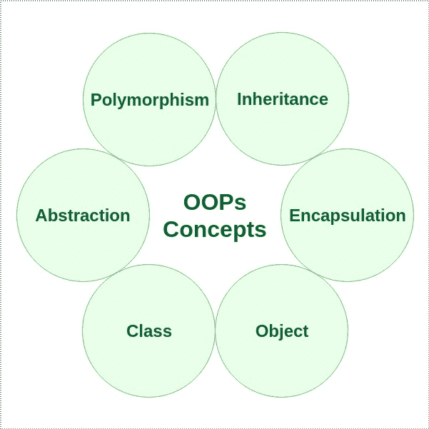

# 面向对象编程的最佳实践

> 原文:[https://www . geesforgeks . org/面向对象编程最佳实践-oop/](https://www.geeksforgeeks.org/best-practices-of-object-oriented-programming-oop/)

顾名思义，[面向对象编程](https://www.geeksforgeeks.org/object-oriented-programming-oops-concept-in-java/)或 OOPs 是指在编程中使用[对象](https://www.geeksforgeeks.org/classes-objects-java/)的语言。面向对象编程的目的是在编程中实现真实世界的实体，如[继承](https://www.geeksforgeeks.org/inheritance-in-java/)、[抽象](https://www.geeksforgeeks.org/abstraction-in-java-2/)、[多态](https://www.geeksforgeeks.org/polymorphism-in-java/)、[封装](https://www.geeksforgeeks.org/encapsulation-in-java/)。OOP 的主要目的是将数据和对数据进行操作的函数绑定在一起，这样除了函数之外，代码的任何其他部分都不能访问这些数据。在本文中，我们将了解 OOP 的一些最佳实践。

[SOLID 首字母缩略词](https://www.geeksforgeeks.org/solid-principle-in-programming-understand-with-real-life-examples/)被认为是最好的面向对象编程哲学。让我们理解这实际上意味着什么，以及其他一些重要的原则。

1.  **单一责任原则:**按照这个原则，一个班应该只有单一的责任或者单一的工作或者单一的目的。我们应该严格避免使用广义类，因为整个实现是在同一个类中给出的。它还声明责任应该完全由类、模块或函数封装。
2.  **开/闭原则:**根据这个原则，软件实体像类、模块、函数等。应该对扩展开放，而类应该对修改关闭。这意味着我们应该能够扩展一个类的行为，而不需要修改它。
3.  **利斯科夫的替代原则:**根据这个原则，派生类或子类必须可以替代它们的基类或父类。这个原则确保任何父类的子类都可以代替它的父类使用，没有任何意外的行为。
4.  **界面分离原则:**这是第一个适用于[界面](https://www.geeksforgeeks.org/interfaces-in-java/)的原则。它类似于单一责任原则。它声明我们不应该强迫任何客户端实现一个与他们无关的接口。这个概念的主要目标是专注于避免胖接口，并优先考虑许多小的客户端特定接口。
5.  **依赖倒置原则:**根据这个原则，高级模块/类不应该依赖于低级模块/类，而是应该依赖于[抽象](https://www.geeksforgeeks.org/abstraction-in-java-2/)。我们还需要确保抽象不应该依赖于细节，但是细节应该依赖于抽象。

除了上述原则之外，面向对象编程中需要实践的一些其他重要实践有:
**1。有意义的名字:**在面向对象的概念中需要遵循的第一个实践是使用有意义的名字。此外，所有方法都必须遵循 camel case 命名约定。我们应该总是以一个类只负责一个特定任务的方式进行设计。如果一个类存在于执行一个以上任务的项目中，那么它应该被进一步划分为只承担一个责任。然而，当我们使用[面向对象设计](https://www.geeksforgeeks.org/oops-object-oriented-design/)原则时，职责是预先定义的。例如，

*   在[构建器模式](https://www.geeksforgeeks.org/builder-design-pattern/)中，类创建对象。因此，我们使用名称作为构建器类。
*   如果一个类充当两个功能之间的中介，那么它就被命名为中介。比如 CatMediator、DogMediator 等。
*   如果我们使用消费者类型的设计，那么我们可以使用适配器后缀来解释类的责任。

**2。更少的参数:**我们总是需要以尽可能少的参数数量来编写方法。我们总是可以使用同一个类中其他对象的值，而不是多次要求用户输入相同的值。此外，参数太多的方法很难阅读。

**3。避免全局和非确定性行为:**每当我们使用 OOP 概念时，我们总是需要确保变量和对象的全局行为最小化。这可以通过一个创建动物猎豹的例子来可视化。动物的颜色在被创造出来后不会改变。因此，我们需要确保该属性不是全局的，并且是不可达的，以确保不会发生数据冲突。因此，需要避免使用全局变量或对象。我们可以在数据成员上使用[封装](https://www.geeksforgeeks.org/encapsulation-in-java/)的概念来解决这个问题。

**4。避免静态方法:**除了上述原因，静态方法必须尽可能避免，因为它们作为全局变量的行为方式几乎相似。此外，另一个需要避免的重要原因是，它们会与创建它的类建立秘密依赖关系，并且这种依赖关系在类的整个结构改变之前不会被观察到和显示出来。这使得可维护性变得更加困难。此外，静态方法不能单独测试。

**5。避免使用构造函数:**必须严格避免使用构造函数，因为从客户端的角度来看，它们会使程序可用性变得困难。为了使用由构造函数调用的程序，客户端需要记住参数的顺序，如果忘记了正确的顺序，对象初始化是不可能的。在构造函数需要多个参数的情况下，程序的可用性变得更加困难。另一种解决方案是[建造者模式](https://www.geeksforgeeks.org/builder-design-pattern/)。

**6。减少条件语句:**条件语句的使用必须尽可能减少。在程序中使用太多的条件语句会增加复杂性，并且代码不能被重用。相反，我们可以利用接口和抽象类，并在不同的方法中实现条件逻辑，这些方法可以被重用，并且方法和类的单一职责得到维护。无论我们在哪里需要重用相同的条件，我们只需调用实现它的方法，而不是再次编写代码。

总之，在不同的程序和软件中使用的实践可能是不同的，并且主要倾向于最终的结果，但是上面提到的实践是其中一些被普遍遵循的，并且它使得程序更加有效、可读、可重用和易于维护。