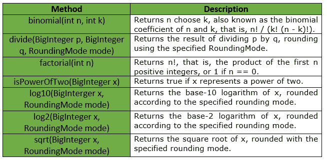

# bigentermath 类|番石榴|爪哇

> 原文:[https://www . geesforgeks . org/bigintermath-class-guava-Java/](https://www.geeksforgeeks.org/bigintegermath-class-guava-java/)

**BigIntegerMath**用于对 bigintermath 值进行数学运算。基本的独立数学函数根据所涉及的主要数值类型分为类***【IntMath】【long math】【double math】和类*** 。这些类具有并行结构，但每个都只支持相关的函数子集。int 和 long 的类似功能可以分别在 IntMath 和 LongMath 中找到。

**申报:**申报为*T3】类的是:*

```
@GwtCompatible(emulated = true)
public final class BigIntegerMath
   extends Object

```

下表显示了番石榴大根菌纲提供的方法:



**异常:**

*   **log2:***IllegalArgumentException*if x<= 0
*   **log10:***IllegalArgumentException*if x<= 0
*   **sqrt :** *非法参数异常* if x < 0
*   **除:** *算术异常*如果 q == 0，或者如果 mode ==不必要且 a 不是 b 的整数倍
*   **阶乘:**T2【IllegalargumentExceptionif n<0
*   **二项式:***IllegalArgumentException*if n<0，k n

**例 1 :**

```
// Java code to show implementation of
// BigIntegerMath Class of Guava
import java.math.*;
import com.google.common.math.BigIntegerMath;

class GFG {

    // Driver code
    public static void main(String args[])
    {

        // Creating an object of GFG class
        GFG obj = new GFG();

        // Function calling
        obj.examples();
    }

    private void examples()
    {

        try {

            // exception will be thrown as 10 is
            // not completely divisible by 3
            // thus rounding is required, and
            // RoundingMode is set as UNNESSARY
            System.out.println(BigIntegerMath.divide(BigInteger.TEN,
                                                new BigInteger("3"), 
                                           RoundingMode.UNNECESSARY));
        }
        catch (ArithmeticException ex) {
            System.out.println("Error Message is : " +
                                       ex.getMessage());
        }
    }
}
```

**Output:**

```
Error Message is : Rounding necessary

```

**例 2 :**

```
// Java code to show implementation of
// BigIntegerMath Class of Guava
import java.math.*;
import com.google.common.math.BigIntegerMath;

class GFG {

    // Driver code
    public static void main(String args[])
    {

        // Creating an object of GFG class
        GFG obj = new GFG();

        // Function calling
        obj.examples();
    }

    private void examples()
    {

        // As 10 is divisible by 5, so
        // no exception is thrown
        System.out.println(BigIntegerMath.divide(BigInteger.TEN,
                                        new BigInteger("5"),
                                    RoundingMode.UNNECESSARY));

        // To compute log to base 10
        System.out.println("Log10 is : " + 
             BigIntegerMath.log10(new BigInteger("1000"), 
                                 RoundingMode.HALF_EVEN));

        // To compute factorial
        System.out.println("factorial is : " + 
                         BigIntegerMath.factorial(7));

        // To compute log to base 2
        System.out.println("Log2 is : " + 
           BigIntegerMath.log2(new BigInteger("8"),
                          RoundingMode.HALF_EVEN));

        // To compute square root
        System.out.println("sqrt is : " +       
                    BigIntegerMath.sqrt(BigInteger.
                    TEN.multiply(BigInteger.TEN),
                        RoundingMode.HALF_EVEN));
    }
}
```

**Output:**

```
2
Log10 is : 3
factorial is : 5040
Log2 is : 3
sqrt is : 10

```

**参考:**T2】谷歌番石榴