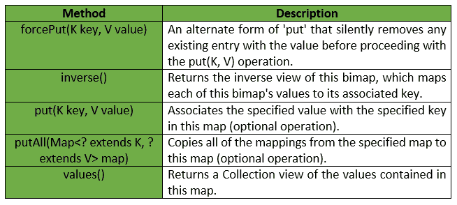

# bipap | guava | Java

> 原文:[https://www.geeksforgeeks.org/bimap-guava-java/](https://www.geeksforgeeks.org/bimap-guava-java/)

bimap 即 ***双向地图*** 是一种既保留其值的唯一性又保留其键的唯一性的地图。bimap 支持**反向视图**，这是另一个 bimap，包含与此 bimap 相同的条目，但具有反向的键和值。

**申报:**申报为**com . Google . common . collect . bimap<**K，V**T7**界面如下:

```
@GwtCompatible
public interface BiMap<K, V>
extends Map<K, V>

```

下面给出的是番石榴 BiMap 界面提供的一些方法:

**返回值&异常:**

*   **put :** 如果给定值已经绑定到这个 bimap 中的不同键，抛出***IllegalArgumentException***。在这种情况下，bimap 将保持不变。
*   **forcePut :** 返回以前与该键相关联的值，该值可以为空，如果没有以前的条目，则为空。
*   **放入:如果尝试放入任何条目失败，将抛出***IllegalArgumentException***。请注意，在引发异常之前，一些地图条目可能已添加到 bimap 中。**
*   **值:**返回一个集合，而不是地图界面中指定的集合，因为 bimap 具有唯一的值。
*   **反向:**返回此 bimap 的反向视图。

下面给出的是番石榴 BiMap 接口的实现:

```
// Java code to show implementation for
// Guava BiMap interface
import com.google.common.collect.BiMap;
import com.google.common.collect.HashBiMap;

class GFG {

    // Driver method
    public static void main(String args[])
    {

        // Creating a BiMap with first field as
        // an Integer and second field as String
        // stuRollMap is name of BiMap
        // i.e, the first field of BiMap stores
        // the Roll no. of student and second
        // field stores the name of Student
        BiMap<Integer, String> stuRollMap = HashBiMap.create();

        stuRollMap.put(new Integer(2), "Sahil");
        stuRollMap.put(new Integer(6), "Dhiman");
        stuRollMap.put(new Integer(9), "Shubham");
        stuRollMap.put(new Integer(15), "Abhishek");

        // To display Roll no. of student "Dhiman"
        System.out.println(stuRollMap.inverse().get("Dhiman"));

        // To display Roll no. of student "Shubham"
        System.out.println(stuRollMap.inverse().get("Shubham"));
    }
}
```

输出:

```
6
9

```