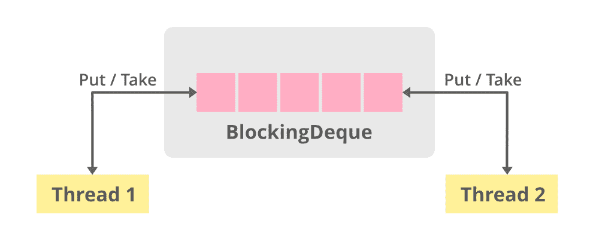
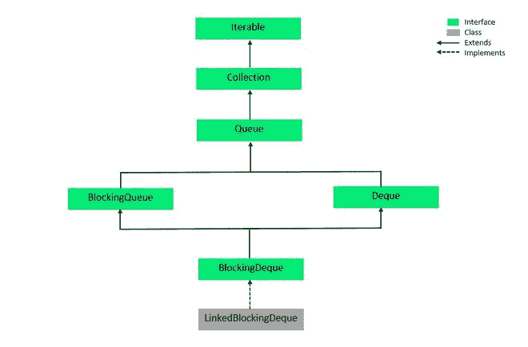

# 在 Java 中阻塞请求

> 原文:[https://www.geeksforgeeks.org/blockingdeque-in-java/](https://www.geeksforgeeks.org/blockingdeque-in-java/)

**阻塞请求**接口是 [Java 集合](https://www.geeksforgeeks.org/collections-in-java-2/)框架的一部分。它之所以得名，是因为它阻止了非法操作，如插入到一个满队列或从一个空队列中删除，所有这些属性都内置在这个接口的结构中。由于是[德格](https://www.geeksforgeeks.org/deque-interface-java-example/)(双端队列)，所以可以从两端执行插入、删除和遍历操作。BlockingDeque 是一个接口，所以我们不能用它声明任何对象。



### 等级制度

阻塞队列从阻塞队列接口延伸，阻塞队列接口又从 [**队列接口**](https://www.geeksforgeeks.org/queue-interface-java/) 和 [**德格接口**](https://www.geeksforgeeks.org/deque-interface-java-example/) 延伸。



阻塞请求的层次结构

***注**:Collection 框架的接口可能有额外的实现类和扩展接口，但上图只显示了 BlockingDeque 及其实现类的层次结构。*

**语法:**

```java
public interface BlockingDeque<E> extends BlockingQueue<E>, Deque<E>

```

这里 **E** 是集合中元素的类型。

### 实现阻塞请求的类

封锁命令的实现类是 [**链接的封锁命令**](https://www.geeksforgeeks.org/linkedblockingdeque-in-java-with-examples/) 。这个类是阻塞请求和[链表数据结构](https://www.geeksforgeeks.org/data-structures/linked-list/)的实现。LinkedBlockingDeque 可以选择使用构造函数进行绑定，但是，如果容量未指定，则为*整数。最大值*默认。节点在插入时按照容量限制动态添加。要在代码中使用 BlockingDeque，请使用以下导入语句。

```java
import java.util.concurrent.BlockingDeque;
                    (or)
import java.util.concurrent.*;

```

**创建对象的语法:**

```java
LinkedBlockingDeque<?> objectName = new LinkedBlockingDeque<?>();
                (or)
BlockingDeque<?> objectName = new LinkedBlockingDeque<?>();

```

**示例:**在下面给出的代码中，我们对 linkedblockingrequest 执行一些基本操作，比如创建对象、添加元素、删除元素，以及使用迭代器遍历 linkedblockingrequest。

## Java 语言(一种计算机语言，尤用于创建网站)

```java
// Java Program for BlockingDeque
import java.util.concurrent.*;
import java.util.*;

public class BlockingDequeExample {

    public static void main(String[] args) {

        // Instantiate an object using LinkedBlockingDeque named lbdq
        BlockingDeque<Integer> lbdq = new LinkedBlockingDeque<Integer>();

        // Add elements using add()
        lbdq.add(134);
        lbdq.add(245);
        lbdq.add(23);
        lbdq.add(122);
        lbdq.add(90);

        // Create an iterator to traverse the deque
        Iterator<Integer> lbdqIter = lbdq.iterator();

        // Print the elements of lbdq on to the console
        System.out.println("The LinkedBlockingDeque lbdq contains:");

        for(int i = 0; i<lbdq.size(); i++)
        {
            System.out.print(lbdqIter.next() + " ");
        }

        // Remove 23 and display appropriate message if the
        // operation is successful
        if(lbdq.remove(23))
        {
            System.out.println("\n\nThe element 23 has been removed");
        }
        else
        {
            System.out.println("\n\nNo such element was found");
        }

        // Print the elements of lbdq without using iterator
        System.out.println("\nThe LinkedBlockingDeque lbdq"+
                       " after remove operation contains:");
        System.out.println(lbdq);
    }

}
```

**输出:**

```java
The LinkedBlockingDeque lbdq contains:
134 245 23 122 90 

The element 23 has been removed

The LinkedBlockingDeque lbdq after remove operation contains:
[134, 245, 122, 90]
```

### 基本操作

**1。添加元素**

元素可以以不同的方式添加到 LinkedBlockedDeque 中，这取决于我们试图将其用作的结构类型。最常见的方法是 add()方法，我们可以使用它在 deque 的末尾添加元素。我们还可以使用 addAll()方法(它是 Collection 接口的一个方法)将整个集合添加到 linkedblockingrequest 中。如果我们希望使用 deque 作为队列，我们可以使用 add()和 put()。

## Java 语言(一种计算机语言，尤用于创建网站)

```java
// Java Program for Adding elements to a LinkedBlockingDeque
import java.util.concurrent.*;

public class AddingElements {

    public static void main(String[] args) {

        // Instantiate a LinkedBlockingDeque named lbdq1
        BlockingDeque<Integer> lbdq1 = new LinkedBlockingDeque<Integer>();

        // Add elements using add()
        lbdq1.add(145);
        lbdq1.add(89);
        lbdq1.add(65);
        lbdq1.add(122);
        lbdq1.add(11);

        // Print the contents of lbdq1 on the console
        System.out.println("Contents of lbdq1: " + lbdq1);

        // Instantiate a LinkedBlockingDeque named lbdq2
        LinkedBlockingDeque<Integer> lbdq2 = new LinkedBlockingDeque<Integer>();

        // Add elements from lbdq1 using addAll()
        lbdq2.addAll(lbdq1);

        // Print the contents of lbdq2 on the console
        System.out.println("\nContents of lbdq2: " + lbdq2);

    }

}
```

**Output**

```java
Contents of lbdq1: [145, 89, 65, 122, 11]

Contents of lbdq2: [145, 89, 65, 122, 11]
```