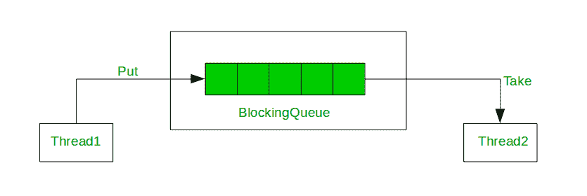
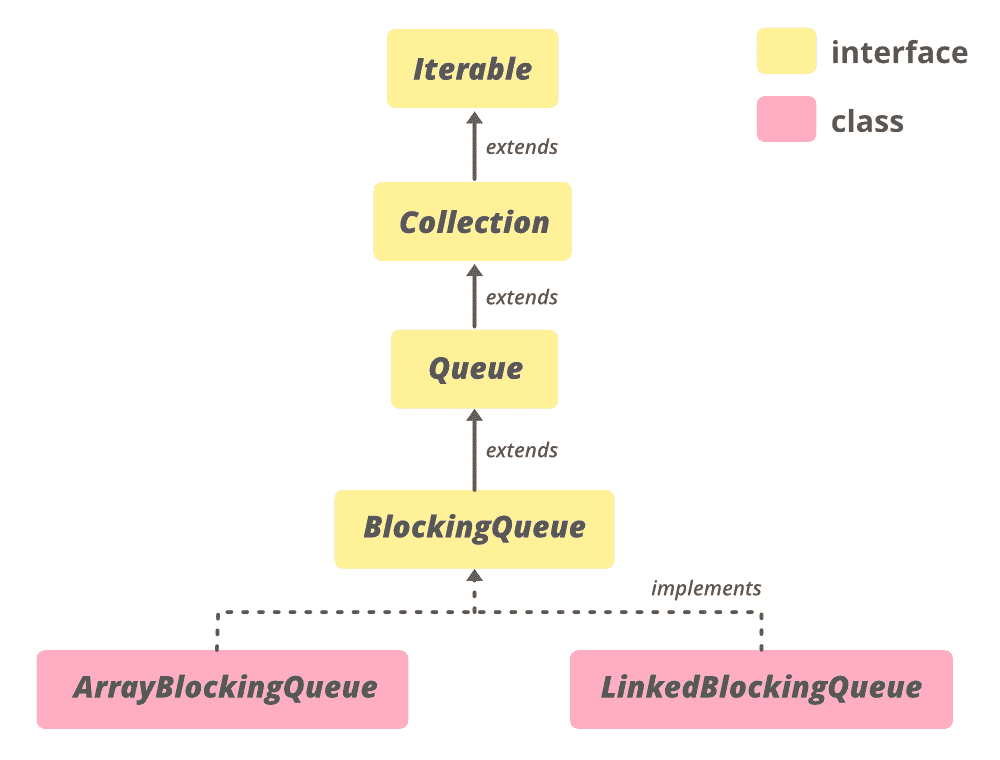

# Java 中的阻塞队列接口

> 原文:[https://www . geesforgeks . org/blocking queue-interface-in-Java/](https://www.geeksforgeeks.org/blockingqueue-interface-in-java/)

Java 中的**阻塞队列接口**是在 Java 1.5 中与其他各种并发实用程序类一起添加的，如[并发 HashMap](https://www.geeksforgeeks.org/concurrenthashmap-in-java/) 、**计数信号量**、[copy onwriterarrraylis](https://www.geeksforgeeks.org/copyonwritearraylist-in-java/)t 等。BlockingQueue 接口通过在 BlockingQueue 已满或为空时引入阻塞来支持流量控制(除了队列之外)。试图将一个元素排入完整队列的线程被阻塞，直到其他线程通过将一个或多个元素排出队列或完全清除队列而在队列中腾出空间。类似地，它会阻止试图从空队列中删除的线程，直到其他线程插入一个项目。阻塞队列不接受空值。如果我们试图将空项入队，那么它会抛出**空指针异常**。
Java 提供了几种阻塞队列实现，如 [LinkedBlockingQueue](https://www.geeksforgeeks.org/linkedblockingqueue-class-in-java/) 、 [ArrayBlockingQueue](https://www.geeksforgeeks.org/arrayblockingqueue-class-in-java/) 、 [PriorityBlockingQueue](https://www.geeksforgeeks.org/priorityblockingqueue-class-in-java/#:~:text=PriorityBlockingQueue%20is%20an%20unbounded%20blocking,resource%20exhaustion%20resulting%20in%20OutOfMemoryError.) 、 **SynchronousQueue** 等。Java BlockingQueue 接口实现是线程安全的。阻塞队列的所有方法本质上都是原子的，并且使用内部锁或其他形式的并发控制。Java 5 附带了 **java.util.concurrent 包**中的 BlockingQueue 实现。

**封锁队列的用法**



生产者(放入)线程和消费者(取入)线程访问的阻塞队列

**阻塞队列的层次结构**



**申报**

```
public interface BlockingQueue<E> extends Queue<E>
```

这里， **E** 是集合中存储的元素类型。

### 实现阻塞队列的类

我们不能直接提供阻塞队列的实例，因为它是一个接口，所以要利用阻塞队列的功能，我们需要利用实现它的类。此外，要在代码中使用 BlockingQueue，请使用以下导入语句。

```
import java.util.concurrent.BlockingQueue;
                    (or)
import java.util.concurrent.*;
```

*   链接块队列
*   [数组块队列](https://www.geeksforgeeks.org/arrayblockingqueue-class-in-java/)

BlockingDeque 的实现类是 linkedblockingrequest。这个类是阻塞请求和链表数据结构的实现。LinkedBlockingDeque 可以选择性地使用构造函数进行绑定，但是，如果容量未指定，则它是整数。默认情况下为最大值。节点在插入时按照容量限制动态添加。

**创建对象的语法:**

```
BlockingQueue<?> objectName = new LinkedBlockingDeque<?>();   
                         (or)
LinkedBlockingDeque<?> objectName = new LinkedBlockingDeque<?>();
```

示例:在下面给出的代码中，我们对 linkedblockingrequest 执行一些基本操作，比如创建对象、添加元素、删除元素，以及使用迭代器遍历 linkedblockingrequest。

### 阻塞队列类型

阻塞队列有两种类型:

**1。无界队列:**阻塞队列的容量将设置为整数。最大值。在无界阻塞队列的情况下，该队列永远不会阻塞，因为它可能会增长到非常大的大小。当您添加元素时，它的大小会增加。

**语法:**

```
BlockingQueue blockingQueue = new LinkedBlockingDeque();
```

**2。有界队列:**第二类队列是有界队列。对于有界队列，您可以在队列构造函数中创建一个传递队列容量的队列:

**语法:**

```
// Creates a Blocking Queue with capacity 5
BlockingQueue blockingQueue = new LinkedBlockingDeque(5);
```

***使用阻塞队列*** 实现有界信号量

## Java 语言(一种计算机语言，尤用于创建网站)

```
// Java program that explains the internal
// implementation of BlockingQueue

import java.io.*;
import java.util.*;

class BlockingQueue<E> {

    // BlockingQueue using LinkedList structure
    // with a constraint on capacity
    private List<E> queue = new LinkedList<E>();

    // limit variable to define capacity
    private int limit = 10;

    // constructor of BlockingQueue
    public BlockingQueue(int limit) { this.limit = limit; }

    // enqueue method that throws Exception
    // when you try to insert after the limit
    public synchronized void enqueue(E item)
        throws InterruptedException
    {
        while (this.queue.size() == this.limit) {
            wait();
        }
        if (this.queue.size() == 0) {
            notifyAll();
        }
        this.queue.add(item);
    }

    // dequeue methods that throws Exception
    // when you try to remove element from an
    // empty queue
    public synchronized E dequeue()
        throws InterruptedException
    {
        while (this.queue.size() == 0) {
            wait();
        }
        if (this.queue.size() == this.limit) {
            notifyAll();
        }

        return this.queue.remove(0);
    }

    public static void main(String []args)
    {
    }
}
```

**例:**

## Java 语言(一种计算机语言，尤用于创建网站)

```
// Java Program to demonstrate usuage of BlockingQueue

import java.util.concurrent.*;
import java.util.*;

public class GFG {

    public static void main(String[] args)
        throws InterruptedException
    {

        // define capacity of ArrayBlockingQueue
        int capacity = 5;

        // create object of ArrayBlockingQueue
        BlockingQueue<String> queue
            = new ArrayBlockingQueue<String>(capacity);

        // Add elements to ArrayBlockingQueue using put
        // method
        queue.put("StarWars");
        queue.put("SuperMan");
        queue.put("Flash");
        queue.put("BatMan");
        queue.put("Avengers");

        // print Queue
        System.out.println("queue contains " + queue);

        // remove some elements
        queue.remove();
        queue.remove();

        // Add elements to ArrayBlockingQueue
        // using put method
        queue.put("CaptainAmerica");
        queue.put("Thor");

        System.out.println("queue contains " + queue);
    }
}
```

**Output:** 

```
queue contains [StarWars, SuperMan, Flash, BatMan, Avengers]
queue contains [Flash, BatMan, Avengers, CaptainAmerica, Thor]
```

### 基本操作

**1。添加元素**

元素可以以不同的方式添加到 LinkedBlockedDeque 中，这取决于我们试图将其用作的结构类型。最常见的方法是 add()方法，我们可以使用它在 deque 的末尾添加元素。我们还可以使用 addAll()方法(它是 Collection 接口的一个方法)将整个集合添加到 linkedblockingrequest 中。如果我们希望使用 deque 作为队列，我们可以使用 add()和 put()。

## Java 语言(一种计算机语言，尤用于创建网站)

```
// Java Program Demonstrate add()
// method of BlockingQueue

import java.util.concurrent.LinkedBlockingDeque;
import java.util.concurrent.BlockingQueue;
import java.util.*;

public class GFG {

    public static void main(String[] args)
        throws IllegalStateException
    {

        // create object of BlockingQueue
        BlockingQueue<Integer> BQ
            = new LinkedBlockingDeque<Integer>();

        // Add numbers to the BlockingQueue
        BQ.add(7855642);
        BQ.add(35658786);
        BQ.add(5278367);
        BQ.add(74381793);

        // before removing print BlockingQueue
        System.out.println("Blocking Queue: " + BQ);
    }
}
```

**Output**

```
Blocking Queue: [7855642, 35658786, 5278367, 74381793]
```

**2。访问元素**

可以使用 contains()，element()，peek()，poll()访问 LinkedBlockingDeque 的元素。这些方法也有不同的版本，在上面的表格中给出了它们的描述。

## Java 语言(一种计算机语言，尤用于创建网站)

```
// Java Program for Accessing the elements of a
// LinkedBlockingDeque

import java.util.concurrent.*;

public class AccessingElements {

    public static void main(String[] args)
    {

        // Instantiate an object of LinkedBlockingDeque
        // named lbdq
        BlockingQueue<Integer> lbdq
            = new LinkedBlockingDeque<Integer>();

        // Add elements using add()
        lbdq.add(22);
        lbdq.add(125);
        lbdq.add(723);
        lbdq.add(172);
        lbdq.add(100);

        // Print the elements of lbdq on the console
        System.out.println(
            "The LinkedBlockingDeque, lbdq contains:");
        System.out.println(lbdq);

        // To check if the deque contains 22
        if (lbdq.contains(22))
            System.out.println(
                "The LinkedBlockingDeque, lbdq contains 22");
        else
            System.out.println("No such element exists");

        // Using element() to retrieve the head of the deque
        int head = lbdq.element();
        System.out.println("The head of lbdq: " + head);
    }
}
```

**Output**

```
The LinkedBlockingDeque, lbdq contains:
[22, 125, 723, 172, 100]
The LinkedBlockingDeque, lbdq contains 22
The head of lbdq: 22
```

**3。删除元素**

可以使用 remove()从链接锁定请求中删除元素。其他方法如 take()和 poll()也可以用来移除第一个和最后一个元素。

## Java 语言(一种计算机语言，尤用于创建网站)

```
// Java Program for removing elements from a
// LinkedBlockingDeque

import java.util.concurrent.*;

public class RemovingElements {

    public static void main(String[] args)
    {

        // Instantiate an object of LinkedBlockingDeque
        // named lbdq
        BlockingQueue<Integer> lbdq
            = new LinkedBlockingDeque<Integer>();

        // Add elements using add()
        lbdq.add(75);
        lbdq.add(86);
        lbdq.add(13);
        lbdq.add(44);
        lbdq.add(10);

        // Print the elements of lbdq on the console
        System.out.println(
            "The LinkedBlockingDeque, lbdq contains:");
        System.out.println(lbdq);

        // Remove elements using remove();
        lbdq.remove(86);
        lbdq.remove(44);

        // Trying to remove an element
        // that doesn't exist
        // in the LinkedBlockingDeque
        lbdq.remove(1);

        // Print the elements of lbdq on the console
        System.out.println(
            "\nThe LinkedBlockingDeque, lbdq contains:");
        System.out.println(lbdq);
    }
}
```

**Output**

```
The LinkedBlockingDeque, lbdq contains:
[75, 86, 13, 44, 10]

The LinkedBlockingDeque, lbdq contains:
[75, 13, 10]
```

**4。迭代元素**

为了遍历 LinkedBlockingDeque 的元素，我们可以创建一个迭代器，并使用 Iterable 接口的方法来访问元素，Iterable 接口是 Java 集合框架的根。Iterable 的 next()方法返回任何集合的元素。

## Java 语言(一种计算机语言，尤用于创建网站)

```
// Java Program to iterate
// through the LinkedBlockingDeque
import java.util.Iterator;
import java.util.concurrent.*;

public class IteratingThroughElements {

    public static void main(String[] args) {

        // Instantiate an object of LinkedBlockingDeque named lbdq
        BlockingQueue<Integer> lbdq = new LinkedBlockingDeque<Integer>();

        // Add elements using add()
        lbdq.add(166);
        lbdq.add(246);
        lbdq.add(66);
        lbdq.add(292);
        lbdq.add(98);

        // Create an iterator to traverse lbdq
        Iterator<Integer> lbdqIter = lbdq.iterator();

        // Print the elements of lbdq on to the console
        System.out.println("The LinkedBlockingDeque, lbdq contains:");

        for(int i = 0; i<lbdq.size(); i++)
        {
            System.out.print(lbdqIter.next() + " ");
        }       
    }

}
```

**Output**

```
The LinkedBlockingDeque, lbdq contains:
166 246 66 292 98 
```

### 阻塞队列的方法

<figure class="table">

| 

方法

 | 

描述

 |
| --- | --- |
| [加(E e)](https://www.google.com/url?client=internal-element-cse&cx=009682134359037907028:tj6eafkv_be&q=https://www.geeksforgeeks.org/blockingqueue-add-in-java-with-examples/&sa=U&ved=2ahUKEwiH8r7zjO3rAhXxheYKHZGWBxAQFjAJegQIBRAB&usg=AOvVaw0lalEAVVD0ljY1gR1Vw5BM) | 如果可以在不违反容量限制的情况下立即将指定的元素插入到该队列中，成功时返回 true，如果当前没有可用空间，则抛出 IllegalStateException。 |
| [包含(对象 o)](https://www.google.com/url?client=internal-element-cse&cx=009682134359037907028:tj6eafkv_be&q=https://www.geeksforgeeks.org/blockingqueue-contains-method-in-java-with-examples/&sa=U&ved=2ahUKEwiH8r7zjO3rAhXxheYKHZGWBxAQFjAGegQIAxAC&usg=AOvVaw07Ey-6hKgq0RsLhXU-tCKg) | 如果此队列包含指定的元素，则返回 true。 |
| [沥水图(收藏<？超 E > c)](https://www.google.com/url?client=internal-element-cse&cx=009682134359037907028:tj6eafkv_be&q=https://www.geeksforgeeks.org/blockingqueue-drainto-method-in-java-with-examples/&sa=U&ved=2ahUKEwiH8r7zjO3rAhXxheYKHZGWBxAQFjAEegQIAhAC&usg=AOvVaw3jjNf-CrzTRAOznt-sySep) | 从此队列中移除所有可用元素，并将它们添加到给定集合中。 |
| [沥水图(收藏<？超 E > c，int maxElements)](https://www.google.com/url?client=internal-element-cse&cx=009682134359037907028:tj6eafkv_be&q=https://www.geeksforgeeks.org/blockingqueue-drainto-method-in-java-with-examples/&sa=U&ved=2ahUKEwiH8r7zjO3rAhXxheYKHZGWBxAQFjAEegQIAhAC&usg=AOvVaw3jjNf-CrzTRAOznt-sySep) | 从该队列中最多移除给定数量的可用元素，并将它们添加到给定集合中。 |
| [报价(E e)](https://www.google.com/url?client=internal-element-cse&cx=009682134359037907028:tj6eafkv_be&q=https://www.geeksforgeeks.org/blockingqueue-offer-method-in-java-with-examples/&sa=U&ved=2ahUKEwiH8r7zjO3rAhXxheYKHZGWBxAQFjADegQIBxAC&usg=AOvVaw0TWLH55etDDTUM4IuXa-hj) | 如果可以在不违反容量限制的情况下立即将指定的元素插入到该队列中，则在成功时返回 true，如果当前没有可用空间，则返回 false。 |
| [报价(E e，长超时，时间单位单位)](https://www.google.com/url?client=internal-element-cse&cx=009682134359037907028:tj6eafkv_be&q=https://www.geeksforgeeks.org/blockingqueue-offer-method-in-java-with-examples/&sa=U&ved=2ahUKEwiH8r7zjO3rAhXxheYKHZGWBxAQFjADegQIBxAC&usg=AOvVaw0TWLH55etDDTUM4IuXa-hj) | 将指定的元素插入到该队列中，如果需要空间变得可用，等待指定的等待时间。 |
| [轮询(长超时，时间单位单位)](https://www.google.com/url?client=internal-element-cse&cx=009682134359037907028:tj6eafkv_be&q=https://www.geeksforgeeks.org/blockingqueue-poll-method-in-java-with-examples/&sa=U&ved=2ahUKEwiH8r7zjO3rAhXxheYKHZGWBxAQFjACegQICBAB&usg=AOvVaw3kWMXpoSA1qoZXtY-YsbdZ) | 检索并删除该队列的头，如果需要某个元素变得可用，则等待指定的等待时间。 |
| [放(E e)](https://www.google.com/url?client=internal-element-cse&cx=009682134359037907028:tj6eafkv_be&q=https://www.geeksforgeeks.org/blockingqueue-put-method-in-java-with-examples/&sa=U&ved=2ahUKEwiH8r7zjO3rAhXxheYKHZGWBxAQFjAHegQIBBAC&usg=AOvVaw2_F6-qEEVdUHAiH3LAlA1O) | 将指定的元素插入到该队列中，必要时等待空间变得可用。 |
| [剩余容量()](https://www.google.com/url?client=internal-element-cse&cx=009682134359037907028:tj6eafkv_be&q=https://www.geeksforgeeks.org/blockingqueue-remainingcapacity-method-in-java-with-examples/&sa=U&ved=2ahUKEwiH8r7zjO3rAhXxheYKHZGWBxAQFjAFegQIARAC&usg=AOvVaw0jguEYga8Zpg594VJIsmZD) | 返回该队列在没有阻塞的情况下(在没有内存或资源限制的情况下)可以理想地接受的附加元素的数量，或整数。如果没有内在限制，则为最大值。 |
| [移除(物体 o)](https://www.google.com/url?client=internal-element-cse&cx=009682134359037907028:tj6eafkv_be&q=https://www.geeksforgeeks.org/blockingqueue-remove-method-in-java-with-examples/&sa=U&ved=2ahUKEwiH8r7zjO3rAhXxheYKHZGWBxAQFjAIegQIBhAC&usg=AOvVaw1i9WpGRhfri71kFldYLhdQ) | 从该队列中移除指定元素的单个实例(如果存在)。 |
| [取()](https://www.google.com/url?client=internal-element-cse&cx=009682134359037907028:tj6eafkv_be&q=https://www.geeksforgeeks.org/blockingqueue-take-method-in-java-with-examples/&sa=U&ved=2ahUKEwiH8r7zjO3rAhXxheYKHZGWBxAQFjABegQICRAC&usg=AOvVaw1wR1N67HxtNJXmKOHn73uF) | 检索并移除该队列的头，如有必要，等待直到某个元素变得可用。 |

</figure>

### 接口 java.util.Collection 中声明的方法

<figure class="table">

| 

方法

 | 

描述

 |
| --- | --- |
| [addAll(收藏<？延伸 E > c)](https://www.google.com/url?client=internal-element-cse&cx=009682134359037907028:tj6eafkv_be&q=https://www.geeksforgeeks.org/collection-addall-method-in-java-with-examples/&sa=U&ved=2ahUKEwitvNPJje3rAhWW73MBHa1BC9I4ChAWMAJ6BAgIEAI&usg=AOvVaw2xR9z67AO1NmXiMixsYCRH) | 将指定集合中的所有元素添加到此集合中(可选操作)。 |
| [晴()](https://www.google.com/url?client=internal-element-cse&cx=009682134359037907028:tj6eafkv_be&q=https://www.geeksforgeeks.org/collection-clear-method-in-java-with-examples/&sa=U&ved=2ahUKEwitvNPJje3rAhWW73MBHa1BC9I4ChAWMAN6BAgHEAI&usg=AOvVaw3b20olhneSrvsfRp4FNmxn) | 从此集合中移除所有元素(可选操作)。 |
| 包含所有(集合> c) | 如果此集合包含指定集合中的所有元素，则返回 true。 |
| 等于(对象 0) | 将指定的对象与此集合进行比较，看是否相等。 |
| hashCode() | 返回此集合的哈希代码值。 |
| isEmpty() | 如果此集合不包含元素，则返回 true。 |
| 迭代器() | 返回集合中元素的迭代器。 |
| 并行流() | 以此集合为源返回一个可能并行的流。 |
| 移除所有(集合> c) | 移除此集合中也包含在指定集合中的所有元素(可选操作)。 |
| 移除 If(谓词 super E>过滤器) | 移除此集合中满足给定谓词的所有元素。 |
| 零售(集合> c) | 仅保留此集合中包含在指定集合中的元素(可选操作)。 |
| 大小() | 返回此集合中的元素数量。 |
| 拆分器() | 在此集合中的元素上创建一个[拆分器](https://www.geeksforgeeks.org/java-util-interface-spliterator-java8/)。 |
| 流() | 返回以此集合为源的顺序流。 |
| toarray() | 返回包含此集合中所有元素的数组。 |
| toArray (IntFunction <t>生成器)</t> | 使用提供的生成器函数分配返回的数组，返回包含此集合中所有元素的数组。 |
| toaarray(t[]a) | 返回包含此集合中所有元素的数组；返回数组的运行时类型是指定数组的运行时类型。 |

</figure>

### 在接口 java.lang.Iterable 中声明的方法

<figure class="table">

| 

方法

 | 

描述

 |
| --- | --- |
| [forEach(消费者<？超 T >动作)](https://www.geeksforgeeks.org/iterable-foreach-method-in-java-with-examples/#:~:text=One%20of%20them%20is%20forEach,the%20elements%20inside%20the%20collection.) | 对 Iterable 的每个元素执行给定的操作，直到所有元素都被处理完或者该操作引发异常。 |

</figure>

### 接口 java.util.Queue 中声明的方法

<figure class="table">

| 

方法

 | 

描述

 |
| --- | --- |
| [元素()](https://www.geeksforgeeks.org/queue-element-method-in-java/#:~:text=The%20element()%20method%20of,if%20this%20queue%20is%20empty.) | 检索但不移除该队列的头。 |
| [peek()](https://www.geeksforgeeks.org/queue-peek-method-in-java/#:~:text=The%20peek()%20method%20of,empty%2C%20it%20returns%20null%20instead.) | 检索但不移除该队列的头，如果该队列为空，则返回 null。 |
| [投票()](https://www.geeksforgeeks.org/queue-poll-method-in-java/) | 检索并删除该队列的头，如果该队列为空，则返回 null。 |
|  | 检索并删除该队列的头。 |

</figure>

### 阻塞队列方法的行为

以下是 BlockingQueue 为插入、移除和检查队列操作提供的方法。如果所请求的操作没有立即得到满足，这四组方法中的每一组都会有不同的行为。

*   **抛出异常:**如果没有立即满足请求的操作，将抛出异常。
*   **特殊值:**如果不立即满足操作，则返回特殊值。
*   **阻塞:**如果尝试的操作没有立即得到满足，方法调用将被阻塞，它将一直等待直到执行。
*   **超时:**返回一个特殊值，告知操作是否成功。如果无法立即执行请求的操作，方法调用将一直阻塞，直到执行为止，但等待时间不会超过给定的超时时间。

<figure class="table">

| 操作 | 引发异常 | 特殊价值 | 阻碍 | 暂停 |
| --- | --- | --- | --- | --- |
| *插入* | [增加(e)](https://www.geeksforgeeks.org/blockingqueue-add-in-java-with-examples/#:~:text=The%20add(E%20e)%20method,insertion%2C%20it%20returns%20an%20IllegalStateException.) | [报价(e)](https://www.geeksforgeeks.org/blockingqueue-offer-method-in-java-with-examples/) | 放(e) | [报价(e，时间，单位)](https://www.geeksforgeeks.org/blockingqueue-offer-method-in-java-with-examples/) |
| *移除* | [移除()](https://www.geeksforgeeks.org/blockingqueue-remove-method-in-java-with-examples/#:~:text=The%20remove(Object%20obj)%20method,more%20instance%20of%20element%20e.) | [投票()](https://www.geeksforgeeks.org/blockingqueue-poll-method-in-java-with-examples/) | [取()](https://www.geeksforgeeks.org/blockingqueue-take-method-in-java-with-examples/#:~:text=The%20take()%20method%20of,using%20BlockingQueue%20in%20that%20process.) | [投票(时间、单位)](https://www.geeksforgeeks.org/blockingqueue-poll-method-in-java-with-examples/) |
| *检查* | 元素() | peek() | 不适用 | 不适用 |

</figure>

**参考:**[https://docs . Oracle . com/en/Java/javase/11/docs/API/Java . base/Java/util/concurrent/blockingqueue . html](https://docs.oracle.com/en/java/javase/11/docs/api/java.base/java/util/concurrent/BlockingQueue.html)