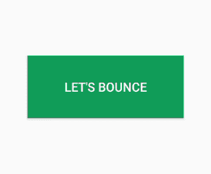

# 安卓中的弹跳动画

> 原文:[https://www.geeksforgeeks.org/bounce-animation-in-android/](https://www.geeksforgeeks.org/bounce-animation-in-android/)

为了使安卓应用程序更有吸引力，我们添加了许多东西，动画是最好的东西之一，它使应用程序更有吸引力，并让用户参与应用程序。因此在本文中，我们将为**按钮**添加一个**弹跳**动画。可以使用本教程将**弹跳动画**添加到安卓工作室的任意**视图**中，如[**ImageView**](https://www.geeksforgeeks.org/imageview-in-kotlin/)**[**TextView**](https://www.geeksforgeeks.org/textview-widget-in-android-using-java-with-examples/)**[**EditText**](https://www.geeksforgeeks.org/edittext-widget-in-android-using-java-with-examples/)**等。下面给出一个 GIF 示例，来了解一下在本文中我们要做什么。******

************

### ******创建弹跳动画的步骤******

********步骤 1:创建新项目********

****要在安卓工作室创建新项目，请参考[如何在安卓工作室创建/启动新项目](https://www.geeksforgeeks.org/android-how-to-create-start-a-new-project-in-android-studio/)。请注意，选择 [Java](https://www.geeksforgeeks.org/java/) 作为语言，尽管我们要用 Java 语言实现这个项目。****

******第二步:设计 UI******

*   ****进入 **app - > res** 右键点击 **res** 文件夹，然后**新建- >安卓资源目录**，创建**动漫**目录。****
*   ****然后右击**动画**文件夹，然后转到**新建- >动画资源文件**并创建一个 **bounce.xml** 文件。****
*   ******bounce.xml** 文件包含动画，该动画用于在下一步制作 [**按钮**](https://www.geeksforgeeks.org/button-in-kotlin/) 的动画。 **bounce.xml** 的完整代码如下。****

## ****bounce.xml****

```
**<?xml version="1.0" encoding="utf-8"?>
<set 
    xmlns:android="http://schemas.android.com/apk/res/android"
    android:fillAfter="true"
    android:interpolator="@android:anim/bounce_interpolator">

    <scale
        android:pivotX="50%"
        android:pivotY="50%"
        android:fromXScale="0.5"
        android:toXScale="1.0"
        android:fromYScale="0.5"
        android:toYScale="1.0"
        android:duration="500"/>
</set>**
```

*   ****现在转到 **app - > res - >布局- > activity_main.xml** 文件，并添加一个简单的[按钮](https://www.geeksforgeeks.org/button-in-kotlin/)，我们想要制作动画。这是**活动文件的代码。******

## ****activity_main.xml****

```
**<?xml version="1.0" encoding="utf-8"?>
<RelativeLayout
    xmlns:android="http://schemas.android.com/apk/res/android"
    xmlns:tools="http://schemas.android.com/tools"
    android:layout_width="match_parent"
    android:layout_height="match_parent"
    tools:context=".MainActivity">

<!-- Button with Bounce Animation -->
<Button
    android:id="@+id/button"
    android:layout_centerInParent="true"
    android:background="@color/colorPrimary"
    android:textColor="#ffffff"
    android:text="Let's Bounce"
    android:layout_width="200dp"
    android:layout_height="80dp"/>

</RelativeLayout>**
```

******第三步:使用 MainActivity.java 文件******

*   ****打开**MainActivity.java**调用，在 **onCreate()** 方法中，从**动画**文件夹中获取动画。****

> ****//从加载动画****
> 
> ****最终动画= animation utils . load animation(this，r . animation . move)：****

*   ****获取我们在 **activity_main.xml** 文件中创建的按钮的引用****

> ****//从 activity_main.xml 文件中获取按钮****
> 
> ****最终按钮按钮= findwiewbyid(r . id . Button)；****

*   ****为**按钮**和**在 **onClick()** 内创建 **OnClickListener** 。******

> **//单击按钮的监听器**
> 
> **button . setonclicklistener(新视图)。onclicklistener()& gt**
> 
> **@覆盖**
> 
> **公共空间单击(查看视图){ 0**
> 
> **//开始动画**
> 
> **button .启动动画(动画)；**
> 
> **}**
> 
> **});**

*   ****MainActivity.java**文件的完整代码如下。**

## **MainActivity.java**

```
import android.os.Bundle;
import android.view.View;
import android.view.animation.Animation;
import android.view.animation.AnimationUtils;
import android.widget.Button;
import androidx.appcompat.app.AppCompatActivity;

public class MainActivity extends AppCompatActivity {

    @Override
    protected void onCreate(Bundle savedInstanceState) {
        super.onCreate(savedInstanceState);
        setContentView(R.layout.activity_main);

        // loading Animation from
        final Animation animation = AnimationUtils.loadAnimation(this, R.anim.bounce);

        // getting the Button from activity_main.xml file
        final Button button = findViewById(R.id.button);
        button.setOnClickListener(new View.OnClickListener() {
            @Override
            public void onClick(View view) {
                // start the animation
                button.startAnimation(animation);
            }
        });
    }
}
```

### ****输出:在仿真器上运行****

**<video class="wp-video-shortcode" id="video-485053-1" width="640" height="360" preload="metadata" controls=""><source type="video/mp4" src="https://media.geeksforgeeks.org/wp-content/uploads/20200913005044/bounce-animation-in-android-studio.mp4?_=1">[https://media.geeksforgeeks.org/wp-content/uploads/20200913005044/bounce-animation-in-android-studio.mp4](https://media.geeksforgeeks.org/wp-content/uploads/20200913005044/bounce-animation-in-android-studio.mp4)</video>**

****资源:****

*   **从 [Github](https://github.com/olyklohan/bounce-animation-in-android-studio) 下载完整项目**
*   **下载 [Apk 文件](https://github.com/olyklohan/bounce-animation-in-android-studio/blob/master/geeksforgeeks_bounce_animation/bounce%20animation%20in%20android%20studio.apk)**