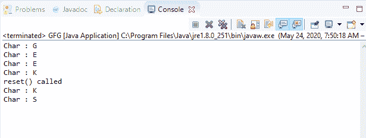
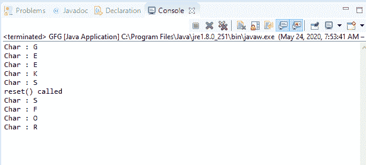

# Java 中的 BufferedInputStream reset()方法，示例

> 原文:[https://www . geeksforgeeks . org/bufferedinputstream-reset-method-in-Java-with-examples/](https://www.geeksforgeeks.org/bufferedinputstream-reset-method-in-java-with-examples/)

Java 中 **BufferedInputStream** 类的 **reset()** 方法用于将流的位置重置为上次调用 mark 方法时的位置。它与同一类的 mark()方法组合使用。

**总承包:**
有两种情况:

1.  如果支持 mark()和 reset()，即如果 markSupported 返回 true，
    *   如果自创建输入流后未调用 mark()或者自上次调用 mark()方法后从输入流中读取的字节数大于上次调用 mark 方法时的参数，则可能会引发 IOException。
    *   如果未引发 IOException，则输入流将重置为这样一种状态，即在最近一次调用 mark()后读取的所有字节都将再次提供给 read()的后续调用方。接下来是调用 reset()时的字节数。
2.  如果不支持 mark()和 reset()，即如果 markSupported 返回 false，
    *   调用 reset()方法可能会引发 IOException。
    *   如果没有抛出 IOException，那么输入流将被重置为固定状态，这取决于输入流的特定类型。为 read()的后续调用方提供的字节取决于输入流的特定类型。

**语法:**

```
public void reset()
```

**覆盖:**该方法覆盖 FilterInputStream 中的重置类。

**参数:**此方法不接受任何参数。

**返回值:**此方法不返回值。

**异常:**如果此流未被标记或标记已被无效，或输入流已通过调用 close()方法关闭，或出现输入/输出错误，此方法将抛出 **IOException** 。

下面的程序说明了 IO 包中 BufferedInputStream 类的 reset()方法:

**程序 1:** 假设存在文件“c:/demo.txt”。

```
// Java program to illustrate
// BufferedInputStream reset() method
import java.io.*;
public class GFG {
    public static void main(String[] args)
    {

        // Create input stream 'demo.txt'
        // for reading containing text "GEEKS"
        FileInputStream inputStream
            = new FileInputStream(
                "c:/demo.txt");

        // Convert inputStream to
        // bufferedInputStream
        BufferedInputStream buffInputStr
            = new BufferedInputStream(
                inputStream);

        // Read and print characters one by one
        System.out.println(
            "Char : "
            + (char)buffInputStr.read());
        System.out.println(
            "Char : "
            + (char)buffInputStr.read());
        System.out.println(
            "Char : "
            + (char)buffInputStr.read());

        // Mark is set on the input stream
        buffInputStr.mark(0);

        System.out.println(
            "Char : "
            + (char)buffInputStr.read());

        System.out.println(
            "reset() called");

        // Reset() is invoked
        buffInputStr.reset();

        // Read and print characters
        System.out.println(
            "Char : "
            + (char)buffInputStr.read());
        System.out.println(
            "Char : "
            + (char)buffInputStr.read());
    }
}
```

**Input:****Output:**

**程序 2:** 假设存在文件“c:/demo.txt”。

```
// Java program to illustrate
// BufferedInputStream reset() method
import java.io.*;
public class GFG {
    public static void main(String[] args)
    {

        // Create input stream 'demo.txt'
        // for reading containing text
        // "GEEKSFORGEEKS"
        FileInputStream inputStream
            = new FileInputStream(
                "c:/demo.txt");

        // Convert inputStream to
        // bufferedInputStream
        BufferedInputStream buffInputStr
            = new BufferedInputStream(
                inputStream);

        // Read and print characters one by one
        System.out.println(
            "Char : "
            + (char)buffInputStr.read());
        System.out.println(
            "Char : "
            + (char)buffInputStr.read());
        System.out.println(
            "Char : "
            + (char)buffInputStr.read());
        System.out.println(
            "Char : "
            + (char)buffInputStr.read());

        // Mark is set on the input stream
        buffInputStr.mark(0);

        System.out.println(
            "Char : "
            + (char)buffInputStr.read());

        System.out.println(
            "reset() called");

        // Reset() is invoked
        buffInputStr.reset();

        // Read and print characters
        System.out.println(
            "Char : "
            + (char)buffInputStr.read());
        System.out.println(
            "Char : "
            + (char)buffInputStr.read());
        System.out.println(
            "Char : "
            + (char)buffInputStr.read());
        System.out.println(
            "Char : "
            + (char)buffInputStr.read());
    }
}
```

**Input:****Output:**

**参考文献:**
[https://docs . Oracle . com/javase/10/docs/API/Java/io/bufferedinputstream . html # reset()](https://docs.oracle.com/javase/10/docs/api/java/io/BufferedInputStream.html#reset())