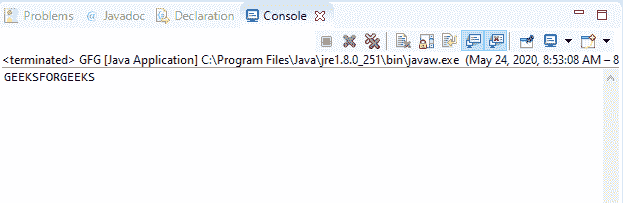
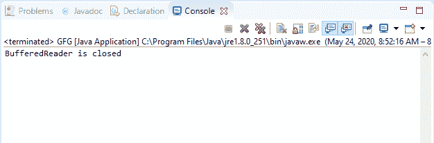

# Java 中的 BufferedReader close()方法，示例

> 原文:[https://www . geeksforgeeks . org/bufferedeer-close-method-in-Java-with-examples/](https://www.geeksforgeeks.org/bufferedreader-close-method-in-java-with-examples/)

Java 中**buffere reader**类的 **close()** 方法用于关闭流并释放与流操作相关的所有系统资源。

**语法:**

```java
public void close() 
            throws IOException

```

**参数:**此方法不接受任何参数。

**返回值:**此方法不返回值。

**异常:**如果出现输入输出错误，该方法抛出**异常**。

下面的程序说明了 IO 包中 BufferedReader 类中的 close()方法:

**程序 1:** 假设文件“c:/demo.txt”的存在。

```java
// Java program to illustrate
// BufferedReader close() method

import java.io.*;
public class GFG {
    public static void main(String[] args)
        throws IOException
    {

        // Read stream file 'demo.txt'
        // containing text "GEEKSFORGEEKS"
        FileReader fileReader
            = new FileReader(
                "c:/demo.txt");

        // Convert fileReader to
        // bufferedReader
        BufferedReader buffReader
            = new BufferedReader(
                fileReader);

        // Call read() method
        while (buffReader.ready()) {
            System.out.print(
                (char)buffReader.read());
        }

        // Call close() method
        buffReader.close();
    }
}
```

**Input:****Output:**

**程序 2:** 假设文件“c:/demo.txt”的存在。

```java
// Java program to illustrate
// BufferedReader close() method

import java.io.*;
public class GFG {
    public static void main(String[] args)
        throws IOException
    {
        try {

            // Read stream file 'demo.txt'
            // containing text "GEEKSFORGEEKS"
            FileReader fileReader
                = new FileReader(
                    "c:/demo.txt");

            // Convert fileReader to
            // bufferedReader
            BufferedReader buffReader
                = new BufferedReader(
                    fileReader);

            // Call close() method
            buffReader.close();

            // Call read() method
            System.out.print(
                (char)buffReader.read());
        }
        catch (IOException e) {
            // Exception is thrown
            System.out.println(
                "BufferedReader is closed");
        }
    }
}
```

**Input:****Output:**

**参考:**[https://docs . Oracle . com/javase/7/docs/API/Java/io/bufferedreader . html # close()](https://docs.oracle.com/javase/7/docs/api/java/io/BufferedReader.html#close())