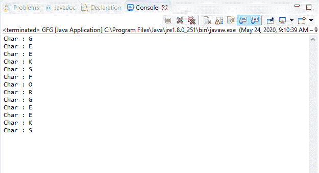
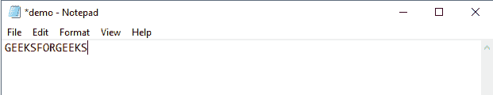
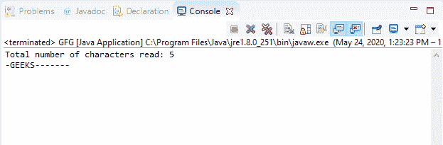

# Java 中的 BufferedReader read()方法，示例

> 原文:[https://www . geeksforgeeks . org/bufferedeeler-用示例读取 java 方法/](https://www.geeksforgeeks.org/bufferedreader-read-method-in-java-with-examples/)

Java 中**buffere reader**类的 **read()** 方法有两种类型:

1.Java 中**buffere reader**类的 **read()** 方法用于从给定的缓冲读取器中读取单个字符。此 read()方法一次从缓冲流中读取一个字符，并将其作为整数值返回。

**语法:**

```java
public int read() 
          throws IOException

```

**覆盖:**覆盖**阅读器**类的 read()方法。

**参数:**此方法不接受任何参数。

**返回值:**该方法以整数形式返回该方法读取的字符。如果缓冲流已经结束，并且没有要读取的字符，则该方法返回-1。

**异常:**如果出现输入输出错误，该方法抛出**异常**。

下面的程序说明了 IO 包中 BufferedReader 类的 read()方法:

**程序:**假设文件“c:/demo.txt”的存在。

```java
// Java program to illustrate
// BufferedReader read() method

import java.io.*;

public class GFG {
    public static void main(String[] args)
    {

        // Read the stream 'demo.txt'
        // containing text "GEEKSFORGEEKS"
        FileReader fileReader
            = new FileReader(
                "c:/demo.txt");

        // Convert fileReader to
        // bufferedReader
        BufferedReader buffReader
            = new BufferedReader(
                fileReader);

        while (buffReader.ready()) {
            // Read and print characters one by one
            // by converting into character
            System.out.println("Char :"
                               + (char)buffReader.read());
        }
    }
}
```

**Input:****Output:**

2.Java 中**buffere reader**类的 **read(char[ ]，int，int)** 方法用于读取特定数组的一部分中的字符。

**总承包:**
本读()法总承包如下:

*   它通过反复调用主流的 read()方法来读取最大可能的字符数。
*   它一直持续到读取指定数量的字符，或者直到文件结束，或者直到 ready()方法返回 false。

**指定者:**此方法由**阅读器**类的 read()方法指定。

**语法:**

```java
public int read(char[] cbuf,
                int offset,
                int length)
         throws IOException

```

**参数:**该方法接受三个参数:

*   **cbuf**–表示目的缓冲区。
*   **偏移量**–表示存储字符的起点。
*   **长度**–表示要读取的最大字符数。

**返回值:**该方法返回该方法读取的字符数。如果缓冲流已经结束，并且没有要读取的字符，则该方法返回-1。

**异常:**如果出现输入输出错误，该方法抛出**异常**。

下面的程序举例说明了 IO 包中 BufferedReader 类的 read(char，int，int)方法:

**程序:**假设文件“c:/demo.txt”的存在。

```java
// Java program to illustrate
// BufferedReader read(char, int, int) method

import java.io.*;

public class GFG {
    public static void main(String[] args)
    {

        // Read the stream 'demo.txt'
        // containing text "GEEKSFORGEEKS"
        FileReader fileReader
            = new FileReader(
                "c:/demo.txt");

        // Convert fileReader to
        // bufferedReader
        BufferedReader buffReader
            = new BufferedReader(
                fileReader);

        // Create a character array
        char[] cbuf = new char[13];

        // Initialize and declare
        // offset and length
        int offset = 2;
        int length = 5;

        // Calling read() method
        // on buffer reader
        System.out.println(
            "Total number of characters read: "
            + buffReader.read(
                  cbuf, offset, length));

        // For each char in cbuf
        for (char c : cbuf) {
            if (c == (char)0)
                c = '-';
            System.out.print((char)c);
        }
    }
}
```

**Input:****Output:**

**参考文献:**
[https://docs . Oracle . com/javase/10/docs/API/Java/io/bufferedeer . html # read()](https://docs.oracle.com/javase/10/docs/api/java/io/BufferedReader.html#read())
[https://docs . Oracle . com/javase/10/docs/API/Java/io/bufferedeer . html # read(char % 5B % 5D，int，int)](https://docs.oracle.com/javase/10/docs/api/java/io/BufferedReader.html#read(char%5B%5D, int, int))