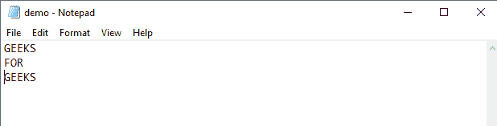
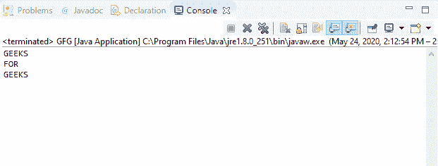
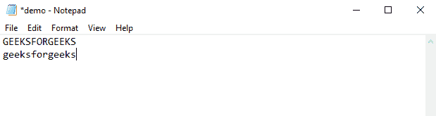
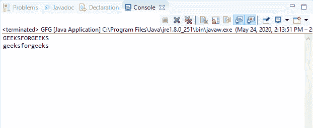

# Java 中的 BufferedReader readLine()方法，带示例

> 原文:[https://www . geeksforgeeks . org/bufferedeeler-readline-method-in-Java-with-examples/](https://www.geeksforgeeks.org/bufferedreader-readline-method-in-java-with-examples/)

Java 中**buffere reader**类的 **readLine()** 方法用于一次读取一行文本。行尾要用“\n”或“\r”或 EOF 来表示。

**语法:**

```java
public String readLine() 
          throws IOException

```

**参数:**此方法不接受任何参数。

**返回值:**该方法返回由该方法读取的**字符串**，并排除任何可用的终止符号。如果缓冲流已经结束，并且没有要读取的行，则该方法返回空值。

**异常:**如果出现输入输出错误，该方法抛出**异常**。

下面的程序说明了 IO 包中 BufferedReader 类的 readLine()方法:

**程序 1:** 假设文件“c:/demo.txt”的存在。

```java
// Java program to illustrate
// BufferedReader readLine() method

import java.io.*;

public class GFG {
    public static void main(String[] args)
    {

        // Read the stream 'demo.txt'
        // containing text
        // "GEEKS"
        // "FOR"
        // "GEEKS"
        FileReader fileReader
            = new FileReader(
                "c:/demo.txt");

        // Convert fileReader to
        // bufferedReader
        BufferedReader buffReader
            = new BufferedReader(
                fileReader);

        while (buffReader.ready()) {
            System.out.println(
                buffReader.readLine());
        }
    }
}
```

**Input:****Output:**

**程序 2:** 假设文件“c:/demo.txt”的存在。

```java
// Java program to illustrate
// BufferedReader readLine() method

import java.io.*;

public class GFG {
    public static void main(String[] args)
    {

        // Read the stream 'demo.txt'
        // containing text
        // "GEEKSFORGEEKS"
        // "geeksforgeeks"
        FileReader fileReader
            = new FileReader(
                "c:/demo.txt");

        // Convert fileReader to
        // bufferedReader
        BufferedReader buffReader
            = new BufferedReader(
                fileReader);

        while (buffReader.ready()) {
            System.out.println(
                buffReader.readLine());
        }
    }
}
```

**Input:****Output:**

**参考文献:**
[https://docs . Oracle . com/javase/10/docs/API/Java/io/bufferedreader . html # readLine()](https://docs.oracle.com/javase/10/docs/api/java/io/BufferedReader.html#readLine())