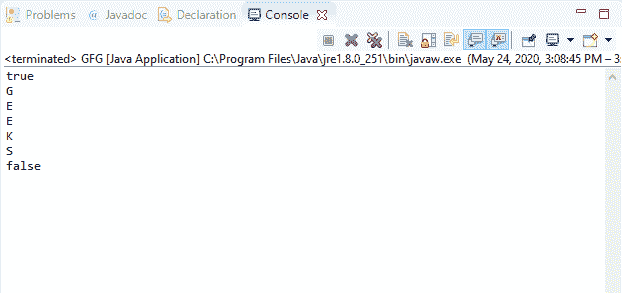
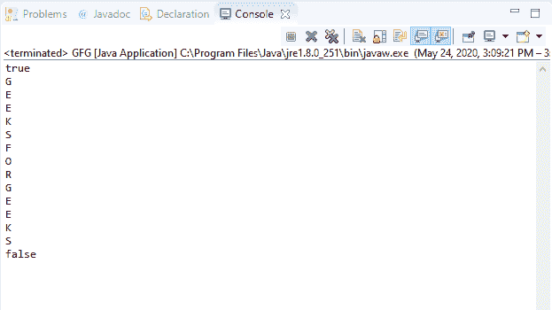

# Java 中的 BufferedReader ready()方法，示例

> 原文:[https://www . geeksforgeeks . org/bufferedeer-ready-in-method-in-Java-with-examples/](https://www.geeksforgeeks.org/bufferedreader-ready-method-in-java-with-examples/)

Java 中**buffere reader**类的 **ready()** 方法用于验证缓冲流是否准备好被读取。在两种情况下，缓冲区流被称为就绪，即缓冲区不为空或主流就绪。

**语法:**

```java
public boolean ready() 
          throws IOException

```

**覆盖:**该方法覆盖**阅读器**类的 ready()方法。

**参数:**此方法不接受任何参数。

**返回值:**如果流准备好被读取，该方法返回*真*，否则返回*假*。

**异常:**如果出现输入输出错误，该方法抛出**异常**。

下面的程序说明了 IO 包中 BufferedReader 类中的 ready()方法:

**程序 1:** 假设文件“c:/demo.txt”的存在。

```java
// Java program to illustrate
// BufferedReader ready() method

import java.io.*;

public class GFG {
    public static void main(String[] args)
    {

        // Read the stream 'demo.txt'
        // containing text "GEEKS"
        FileReader fileReader
            = new FileReader(
                "c:/demo.txt");

        // Convert fileReader to
        // bufferedReader
        BufferedReader buffReader
            = new BufferedReader(
                fileReader);

        boolean b = buffReader.ready();

        System.out.println(b);

        while (b) {
            System.out.println(
                (char)buffReader.read());
            b = buffReader.ready();
        }

        System.out.println(b);
    }
}
```

**Input:****Output:**

**程序 2:** 假设文件“c:/demo.txt”的存在。

```java
// Java program to illustrate
// BufferedReader ready() method

import java.io.*;

public class GFG {
    public static void main(String[] args)
    {

        // Read the stream 'demo.txt'
        // containing text "GEEKSFORGEEKS"
        FileReader fileReader
            = new FileReader(
                "c:/demo.txt");

        // Convert fileReader to
        // bufferedReader
        BufferedReader buffReader
            = new BufferedReader(
                fileReader);

        boolean b = buffreader.ready();

        System.out.println(b);

        while (b) {
            System.out.println(
                (char)buffReader.read());
            b = buffReader.ready();
        }

        System.out.println(b);
    }
}
```

**Input:****Output:**

**参考文献:**[https://docs . Oracle . com/javase/10/docs/API/Java/io/bufferedreader . html # ready()](https://docs.oracle.com/javase/10/docs/api/java/io/BufferedReader.html#ready())